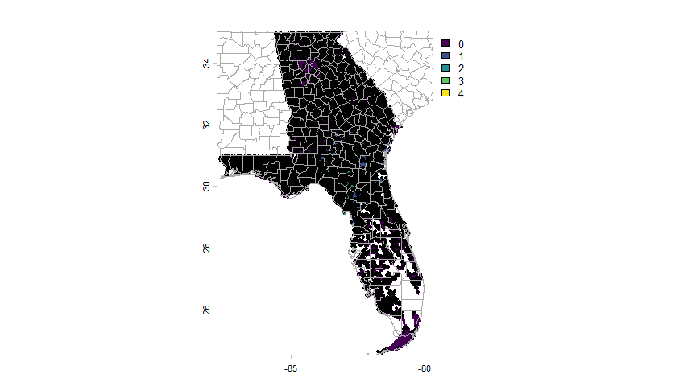
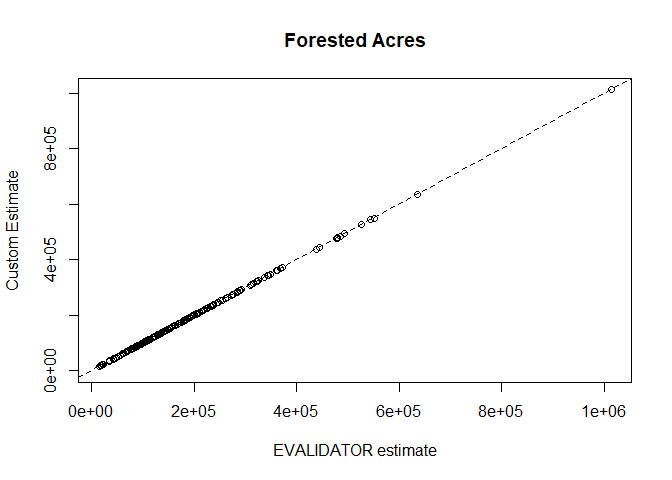
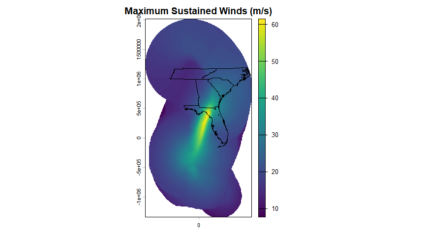
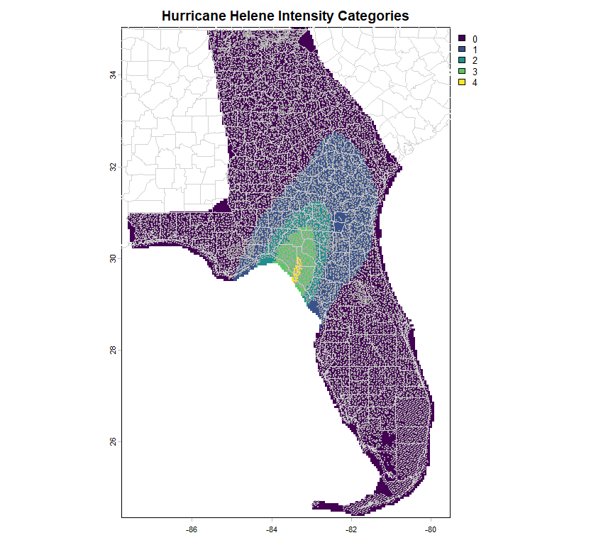

FIA-Post-Hurricane-Assessment
================
Ben Branoff & Andrés Baeza-Castro
2026-08-10

# FIA-Post-Hurricane-Assessment

The below workflow demonstrates how custom estimates might be produced
for incomplete evaluations and/or for custom strata. This is primarily
being developed to produce hurricane damage/loss estimates from
collected plots after storms. These estimates need to come from specific
wind intensity zones and in the case of mortality or biomass/volume
loss, should only include plots collected after the storm(s). FIA and or
EVALIDATOR dont typically offer this functionality out-of-the-box as
everything is designed to around a complete evaluation that includes all
plots and all strata.

Here, we demonstrate how to use tables from fiadb and replicate some of
the analysis functions with modified variables that more accurately
reflect the partial evaluations and/or the custom strata.

We are using hurricane Helene from 2024 as an example, but the idea is
that this workflow could be used for any storm and or other custom
disturbance areas. Hurricane Helene made landfall in the Florida big
bend area and impacted that area of the state as well as Georgia, South
Carolina, North Carolina and Tennessee. For this demonstration, we focus
on Florida and Georgia.

- [Load Plots](#Load-Plots-From-FIAdb)
- [EXPNS Approximation](#EXPNS-Factor-Breakdown)
- [Custom Evalidate Function](#Custom-Evalidate-Function)
- [Test 1: Full Evaluation](#Test-1-Full-Evaluation)
- [Test 2: Partial Evaluation](#Test-2-Partial-Evaluation)
- [Test 3: Custom Strata-Counties](#Test-3-Custom-Strata-Counties)
- [Hurricane Helene Wind Zones](#Hurricane-Helene-Wind-Zones)
- [Test 4: Custom Strata-Wind Zones](#Test-4-Custom-Strata-Wind-Zones)
- [Test 5: Custom Strata-County & Wind
  Zones](#Test-5-Custom-Strata-County--Wind-Zones)
- [Test 6: Partial Evaluation With Custom Strata-County & Wind
  Zones](#Test-6-Partial-Evaluation-With-Custom-Strata-County--Wind-Zones)
- [SQL Code](#SQL-CustomFunction)

# Load Plots From FIAdb

Start by loading the plots from nims_srs_db. Here, using the DBI
library, which requires some initial setup for successful credentialed
connections to the db. Once setup, can connect to the “fiadb01p” data
base and access any tables you are authorized to access. Then, we can
use SQL queries passed as string arguments to retrieve the desired data.
Here we are asking for the Florida (132024, 132025) and Georgia (122024,
122025) evaluations since hurricane Helene. For now, we are only asking
for the plots, their conditions, and their associated strata variables.
Their trees and reference tables will be joined later.

``` r
library(DBI)
library(sf)
library(knitr)
library(kableExtra)
myconn <- dbConnect(odbc::odbc(), "fiadb01p", timeout = 10) # function change w/DBI
vars = paste0("select p.cn,p.prev_plt_cn,p.plot_status_cd,p.invyr,p.eval_grp,p.statecd,p.countycd,p.measyear,p.measmon,p.measday,pa.actual_lat,pa.actual_lon,",
                    "c.condid,c.cond_status_cd,c.owncd,c.fortypcd,c.condprop_unadj,c.prop_basis,",
              "ps.evalid,ps.estn_unit_cn,ps.adj_factor_macr,ps.adj_factor_subp,ps.expns,ps.P1POINTCNT,ps.P2POINTCNT,",
              "pps.stratum_cn,pc.totplots,pc2.nplots,",
              "PEU.p1pntcnt_eu,PEU.area_used ")
tabs = "from fs_nims_fiadb_srs.plotsnap p,fs_nims_fiadb_srs.sds_plot pa,fs_nims_fiadb_srs.cond c,fs_nims_fiadb_srs.pop_stratum ps,fs_nims_fiadb_srs.pop_plot_stratum_assgn pps,(select evalid,count(cn) as totplots from fs_nims_fiadb_srs.pop_plot_stratum_assgn where evalid in (122401,132401) group by evalid) pc,(select stratum_cn,count(cn) as nplots from fs_nims_fiadb_srs.pop_plot_stratum_assgn where evalid in (122401,132401) group by stratum_cn) pc2,fs_nims_fiadb_srs.POP_ESTN_UNIT PEU "
filts = paste0("where p.eval_grp in (122024,132024) 
and ps.evalid in (122401,132401)
and c.plt_cn = p.cn
and pa.plt_cn = p.cn
and pps.stratum_cn = ps.cn
and pps.plt_cn = p.cn
and pc.evalid=pps.evalid
and pc2.stratum_cn=ps.cn
and PEU.CN = PS.ESTN_UNIT_CN")
#and to_date(p.measyear || '-' || LPAD(p.measmon, 2, '0') || '-' || LPAD(p.measday, 2, '0')
#               default null on conversion error,
#               'YYYY-MM-DD') >= date '2024-09-26'") 
plots = dbGetQuery(myconn,paste0(vars,tabs,filts))
##  also, convert the plots to a spatial object
plots_geo <- st_as_sf(plots,coords=c("ACTUAL_LON","ACTUAL_LAT"),crs=4326)
plots |> head() |>
  kable(format='html')|>
  kable_styling() |>
  scroll_box(width='100%')
```

<div style="border: 1px solid #ddd; padding: 5px; overflow-x: scroll; width:100%; ">

<table class="table" style="margin-left: auto; margin-right: auto;">

<thead>

<tr>

<th style="text-align:left;">

CN
</th>

<th style="text-align:left;">

PREV_PLT_CN
</th>

<th style="text-align:right;">

PLOT_STATUS_CD
</th>

<th style="text-align:right;">

INVYR
</th>

<th style="text-align:right;">

EVAL_GRP
</th>

<th style="text-align:right;">

STATECD
</th>

<th style="text-align:right;">

COUNTYCD
</th>

<th style="text-align:right;">

MEASYEAR
</th>

<th style="text-align:right;">

MEASMON
</th>

<th style="text-align:right;">

MEASDAY
</th>

<th style="text-align:right;">

ACTUAL_LAT
</th>

<th style="text-align:right;">

ACTUAL_LON
</th>

<th style="text-align:right;">

CONDID
</th>

<th style="text-align:right;">

COND_STATUS_CD
</th>

<th style="text-align:right;">

OWNCD
</th>

<th style="text-align:right;">

FORTYPCD
</th>

<th style="text-align:right;">

CONDPROP_UNADJ
</th>

<th style="text-align:left;">

PROP_BASIS
</th>

<th style="text-align:right;">

EVALID
</th>

<th style="text-align:left;">

ESTN_UNIT_CN
</th>

<th style="text-align:right;">

ADJ_FACTOR_MACR
</th>

<th style="text-align:right;">

ADJ_FACTOR_SUBP
</th>

<th style="text-align:right;">

EXPNS
</th>

<th style="text-align:right;">

P1POINTCNT
</th>

<th style="text-align:right;">

P2POINTCNT
</th>

<th style="text-align:left;">

STRATUM_CN
</th>

<th style="text-align:right;">

TOTPLOTS
</th>

<th style="text-align:right;">

NPLOTS
</th>

<th style="text-align:right;">

P1PNTCNT_EU
</th>

<th style="text-align:right;">

AREA_USED
</th>

</tr>

</thead>

<tbody>

<tr>

<td style="text-align:left;">

718561940290487
</td>

<td style="text-align:left;">

282502348489998
</td>

<td style="text-align:right;">

1
</td>

<td style="text-align:right;">

2020
</td>

<td style="text-align:right;">

132024
</td>

<td style="text-align:right;">

13
</td>

<td style="text-align:right;">

305
</td>

<td style="text-align:right;">

2021
</td>

<td style="text-align:right;">

2
</td>

<td style="text-align:right;">

2
</td>

<td style="text-align:right;">

31.57431
</td>

<td style="text-align:right;">

-82.02492
</td>

<td style="text-align:right;">

1
</td>

<td style="text-align:right;">

1
</td>

<td style="text-align:right;">

46
</td>

<td style="text-align:right;">

161
</td>

<td style="text-align:right;">

1.0
</td>

<td style="text-align:left;">

SUBP
</td>

<td style="text-align:right;">

132401
</td>

<td style="text-align:left;">

1898604851290487
</td>

<td style="text-align:right;">

0
</td>

<td style="text-align:right;">

1.000345
</td>

<td style="text-align:right;">

5774.485
</td>

<td style="text-align:right;">

18824636
</td>

<td style="text-align:right;">

725
</td>

<td style="text-align:left;">

1898560244290487
</td>

<td style="text-align:right;">

6581
</td>

<td style="text-align:right;">

725
</td>

<td style="text-align:right;">

50285509
</td>

<td style="text-align:right;">

11183238
</td>

</tr>

<tr>

<td style="text-align:left;">

718604827290487
</td>

<td style="text-align:left;">

218219198020004
</td>

<td style="text-align:right;">

2
</td>

<td style="text-align:right;">

2019
</td>

<td style="text-align:right;">

122024
</td>

<td style="text-align:right;">

12
</td>

<td style="text-align:right;">

11
</td>

<td style="text-align:right;">

2019
</td>

<td style="text-align:right;">

6
</td>

<td style="text-align:right;">

1
</td>

<td style="text-align:right;">

25.97728
</td>

<td style="text-align:right;">

-80.31519
</td>

<td style="text-align:right;">

1
</td>

<td style="text-align:right;">

2
</td>

<td style="text-align:right;">

NA
</td>

<td style="text-align:right;">

NA
</td>

<td style="text-align:right;">

1.0
</td>

<td style="text-align:left;">

SUBP
</td>

<td style="text-align:right;">

122401
</td>

<td style="text-align:left;">

1970917148290487
</td>

<td style="text-align:right;">

0
</td>

<td style="text-align:right;">

1.005272
</td>

<td style="text-align:right;">

5987.087
</td>

<td style="text-align:right;">

3849700
</td>

<td style="text-align:right;">

143
</td>

<td style="text-align:left;">

1970895162290487
</td>

<td style="text-align:right;">

7033
</td>

<td style="text-align:right;">

143
</td>

<td style="text-align:right;">

49438780
</td>

<td style="text-align:right;">

10994930
</td>

</tr>

<tr>

<td style="text-align:left;">

718604321290487
</td>

<td style="text-align:left;">

218218725020004
</td>

<td style="text-align:right;">

2
</td>

<td style="text-align:right;">

2019
</td>

<td style="text-align:right;">

122024
</td>

<td style="text-align:right;">

12
</td>

<td style="text-align:right;">

103
</td>

<td style="text-align:right;">

2019
</td>

<td style="text-align:right;">

6
</td>

<td style="text-align:right;">

1
</td>

<td style="text-align:right;">

27.96771
</td>

<td style="text-align:right;">

-82.79016
</td>

<td style="text-align:right;">

1
</td>

<td style="text-align:right;">

2
</td>

<td style="text-align:right;">

NA
</td>

<td style="text-align:right;">

NA
</td>

<td style="text-align:right;">

1.0
</td>

<td style="text-align:left;">

SUBP
</td>

<td style="text-align:right;">

122401
</td>

<td style="text-align:left;">

1970917150290487
</td>

<td style="text-align:right;">

0
</td>

<td style="text-align:right;">

1.001068
</td>

<td style="text-align:right;">

6074.194
</td>

<td style="text-align:right;">

19200797
</td>

<td style="text-align:right;">

703
</td>

<td style="text-align:left;">

1970895157290487
</td>

<td style="text-align:right;">

7033
</td>

<td style="text-align:right;">

703
</td>

<td style="text-align:right;">

52745653
</td>

<td style="text-align:right;">

11730361
</td>

</tr>

<tr>

<td style="text-align:left;">

718561310290487
</td>

<td style="text-align:left;">

282501718489998
</td>

<td style="text-align:right;">

1
</td>

<td style="text-align:right;">

2020
</td>

<td style="text-align:right;">

132024
</td>

<td style="text-align:right;">

13
</td>

<td style="text-align:right;">

243
</td>

<td style="text-align:right;">

2020
</td>

<td style="text-align:right;">

11
</td>

<td style="text-align:right;">

4
</td>

<td style="text-align:right;">

31.67421
</td>

<td style="text-align:right;">

-84.77421
</td>

<td style="text-align:right;">

1
</td>

<td style="text-align:right;">

1
</td>

<td style="text-align:right;">

46
</td>

<td style="text-align:right;">

161
</td>

<td style="text-align:right;">

0.5
</td>

<td style="text-align:left;">

SUBP
</td>

<td style="text-align:right;">

132401
</td>

<td style="text-align:left;">

1898604855290487
</td>

<td style="text-align:right;">

0
</td>

<td style="text-align:right;">

1.000000
</td>

<td style="text-align:right;">

6151.155
</td>

<td style="text-align:right;">

10952851
</td>

<td style="text-align:right;">

396
</td>

<td style="text-align:left;">

1898560252290487
</td>

<td style="text-align:right;">

6581
</td>

<td style="text-align:right;">

396
</td>

<td style="text-align:right;">

47313009
</td>

<td style="text-align:right;">

10522169
</td>

</tr>

<tr>

<td style="text-align:left;">

718561310290487
</td>

<td style="text-align:left;">

282501718489998
</td>

<td style="text-align:right;">

1
</td>

<td style="text-align:right;">

2020
</td>

<td style="text-align:right;">

132024
</td>

<td style="text-align:right;">

13
</td>

<td style="text-align:right;">

243
</td>

<td style="text-align:right;">

2020
</td>

<td style="text-align:right;">

11
</td>

<td style="text-align:right;">

4
</td>

<td style="text-align:right;">

31.67421
</td>

<td style="text-align:right;">

-84.77421
</td>

<td style="text-align:right;">

2
</td>

<td style="text-align:right;">

1
</td>

<td style="text-align:right;">

46
</td>

<td style="text-align:right;">

161
</td>

<td style="text-align:right;">

0.5
</td>

<td style="text-align:left;">

SUBP
</td>

<td style="text-align:right;">

132401
</td>

<td style="text-align:left;">

1898604855290487
</td>

<td style="text-align:right;">

0
</td>

<td style="text-align:right;">

1.000000
</td>

<td style="text-align:right;">

6151.155
</td>

<td style="text-align:right;">

10952851
</td>

<td style="text-align:right;">

396
</td>

<td style="text-align:left;">

1898560252290487
</td>

<td style="text-align:right;">

6581
</td>

<td style="text-align:right;">

396
</td>

<td style="text-align:right;">

47313009
</td>

<td style="text-align:right;">

10522169
</td>

</tr>

<tr>

<td style="text-align:left;">

718562080290487
</td>

<td style="text-align:left;">

282502488489998
</td>

<td style="text-align:right;">

2
</td>

<td style="text-align:right;">

2020
</td>

<td style="text-align:right;">

132024
</td>

<td style="text-align:right;">

13
</td>

<td style="text-align:right;">

103
</td>

<td style="text-align:right;">

2020
</td>

<td style="text-align:right;">

12
</td>

<td style="text-align:right;">

1
</td>

<td style="text-align:right;">

32.12864
</td>

<td style="text-align:right;">

-81.36919
</td>

<td style="text-align:right;">

1
</td>

<td style="text-align:right;">

2
</td>

<td style="text-align:right;">

NA
</td>

<td style="text-align:right;">

NA
</td>

<td style="text-align:right;">

1.0
</td>

<td style="text-align:left;">

SUBP
</td>

<td style="text-align:right;">

132401
</td>

<td style="text-align:left;">

1898604851290487
</td>

<td style="text-align:right;">

0
</td>

<td style="text-align:right;">

1.000345
</td>

<td style="text-align:right;">

5774.485
</td>

<td style="text-align:right;">

18824636
</td>

<td style="text-align:right;">

725
</td>

<td style="text-align:left;">

1898560244290487
</td>

<td style="text-align:right;">

6581
</td>

<td style="text-align:right;">

725
</td>

<td style="text-align:right;">

50285509
</td>

<td style="text-align:right;">

11183238
</td>

</tr>

</tbody>

</table>

</div>

The above is a small subset, but there are around 8000 plots that have
been collected since the storm in Georgia and Florida. To be able to
make most estimate calculations from the plot data, the expansion factor
(EXPNS) is critical. It essentially portrays how many acres a particular
plot represents. This acreage is based on which strata the plot belongs
too (ownership class, size class, etc.) as well as the size of the
estimation unit and the number of plots in the same strata. Essentially,
it takes the expansion factor for the entire estimation unit and then
attributes portions of that expansion factor to all strata within. To
calculate our own expansion factor, it is key that the estimation unit
expansion value stays the same, but the strata values will be different
(but still individually represent the estimation unit value). In the
database, the expansion factor relies on a pixel ratio for calculation.
This is the ratio of pixels in the strata over those in the estimation
unit. Unfortunately, the source of these pixels is not available for
on-the-fly calculations and also would likely change if the strata
boundaries were to change. A major part of the challenge for these
calculations is thus finding a way to approximate this ratio.

# EXPNS Factor Breakdown

The below calculations demonstrates how plot numbers do a fair job of
this. The ratio of plots in the strata over those in the estimation unit
is a fair approximation and allows for close, but not perfect, matches
to the expansion factors.

``` r
plots_cust <- plots |>
  ##  the official ratio for the EXPNS factor
  ##  P1POINTCNT is the number of pixels in the stratum
  ##  P1PNTCNT_EU is the number of pixels in the estimation unit
  mutate(PixelRatio=P1POINTCNT/P1PNTCNT_EU)|>
  group_by(ESTN_UNIT_CN)|>
  ##  an estimated ratio from the plots uses the total number of plots in the estimation unit
  ##  here, we take the database given value of P2POINTCNT
  ##  but we also calculate it ourselves as the number of unique CNs in the estimation unit
  ##  it's important to show that these two values are the same, so we can use our own custom calculation when necessary
  mutate(nplots_EU = sum(P2POINTCNT[!duplicated(STRATUM_CN)]),
         nplots_EU2 = length(unique(CN)))|>
  ungroup()|>
  ###  need the plot numbers by stratum
  group_by(STRATUM_CN)|>
  mutate(nplots=length(unique(CN)),
         plotratio = nplots/nplots_EU2, 
         EXPNS2 = plotratio*(AREA_USED/nplots))

par(mfrow=c(3,1),mar=c(5,5,0,0))
plot(plots_cust$nplots_EU,plots_cust$nplots_EU2,xlab="FIAdb n plots",ylab="custom n plots")
abline(a=0,b=1,lty=2)
plot(plots_cust$PixelRatio,plots_cust$plotratio,xlab="Pixel Ratio",ylab="Plot Ratio")
abline(a=0,b=1,lty=2)
###  this is the key to approximating the EXPNS
plot(plots_cust$EXPNS,plots_cust$EXPNS2,xlab="FIAdb EXPNS",ylab="custom EXPNS")
abline(a=0,b=1,lty=2)
```

<figure>

<figcaption aria-hidden="true">Fig 3. Hurricane Helene’s wind zones with
the plots overlayed. Plots are assigned their respective wind zones and
their expansion factors come from the total area of each wind zone
divided by the number of plots in each zone.</figcaption>
</figure>

The above demonstrates that we can approximate the expansion factor from
the number of plots in the strata. When estimating from a full
evaluation, this is pretty straightforward because the number of plots
in the strata doesn’t change. But when estimating partial evaluations,
for example from only one evaluation year or for plots that were only
measured after a certain event, the calculation is more complicated.

When working with less than a full evaluation, the expansion factors for
should increase to make up for the lack of plots. However, we dont have
anything to compare them against because the database does not include
any basis for comparison for partial evaluations. Therefore, we will try
to estimate forested acreage based on a partial evaluation and compare
it to the full evaluation. This assumes that forested acreage does not
change much from one year to the next. We should expect the estimate for
forested acres to be close but probably not the same, and the variance
and sampling error estimates should increase for a partial evaluation.

# Custom Evalidate Function

As a proof of concept, we use the original expansion factor (EXPNS) and
sum everything within an EVAL_GRP. This should be equivalent to what is
computed by EVALIDATOR. To check, we use the API to retrieve the
EVALIDATOR estimate and compare it to ours. We also do the same
calculation for a full evaluation but using our custom EXPNS value.
Finally, we do it for a partial evaluation using the custom EXPNS and
compare it to the full evaluations. Again, if we have done it right, the
estimate for forested acres from a partial evaluation should be close to
that from a full evaluation.

To avoid repeating the same code every time, the below section
demonstrates how these calculations are done and it saves the method as
a custom function called ‘Custom_Evalidate’, which we can call anytime
we want to do it. This function is interpreted from the SQL_QUERY value
of the REF_POP_ATTRIBUTE table. This is provided at [the bottom of this
page](#SQL-Code). By doing it this way, we are getting as close as
possible to the method employed by FIA.

``` r
###  first, define our custom function
###  This will do all of the work
Custom_Evalidate <- function(plts,grps=NULL,EVALGRPS,EVALIDS){
###  in case a spatial object was provided
###  drop it, it is not needed and slows everything down
###  filter out the unwanted evaluations
plts <- plts |>
  st_drop_geometry()|>
  filter(EVAL_GRP %in% EVALGRPS,EVALID %in% EVALIDS)

###  first need the plot ratio for the expansion factor
plts <- plts |>
  mutate(PixelRatio=P1POINTCNT/P1PNTCNT_EU)|>
  group_by(ESTN_UNIT_CN)|>
  ##  an estimated ratio from the plots uses the total number of plots in the estimation unit
  mutate(nplots_EU = sum(P2POINTCNT[!duplicated(STRATUM_CN)]),
         nplots_EU2 = length(unique(CN)))|>
  ungroup()|>
  group_by(STRATUM_CN)|>
  mutate(nplots=length(unique(CN)),
         plotratio = nplots/nplots_EU2, 
         EXPNS2 = PixelRatio*(AREA_USED/nplots),
         EXPNS3 = EXPNS2/(plotratio/PixelRatio)) 

###  now, simulating the SQL query from ref_pop_attribute
###  first, the plot level adjustment factors
plot_summary_cust <- plts |>
  filter(COND_STATUS_CD == 1,!is.null(CONDPROP_UNADJ))|>
  mutate(Y_HID_ADJUSTED = if_else(PROP_BASIS=="MACR",CONDPROP_UNADJ*ADJ_FACTOR_MACR,CONDPROP_UNADJ*ADJ_FACTOR_SUBP))|>
  ####  here is where our custom strata groups are important
  ####  we include the any_of qualifier to include any custom groups that were desired
  group_by(EVAL_GRP,EVALID,ESTN_UNIT_CN, STRATUM_CN, CN,across(any_of(grps)))|>
  summarise(Y_HID_ADJUSTED=sum(Y_HID_ADJUSTED))|>
  ungroup()

phase_summary_cust <- plot_summary_cust |>
  ###  now sum up to the strata level
  group_by(EVAL_GRP,STRATUM_CN, ESTN_UNIT_CN, EVALID,across(any_of(grps)))|>
  summarise(YSUM_HD=sum(Y_HID_ADJUSTED),
          YSUM_HD_SQR=sum(Y_HID_ADJUSTED*Y_HID_ADJUSTED),
          plots_in_domain=n(),
          non_zero_plots=sum(!is.null(Y_HID_ADJUSTED)|Y_HID_ADJUSTED>0))

###  will need the original official stratum for the appropriate plot counts
###  here, our custom strata are not included
phase1_summary_cust <- plts |>
  st_drop_geometry()|>
  distinct(STRATUM_CN,.keep_all=TRUE)|>
  group_by(EVAL_GRP,EVALID,ESTN_UNIT_CN)|>
  mutate(W_H=P1POINTCNT/sum(P1POINTCNT),
          total_area=unique(AREA_USED),
         ### here its important not to use the hard-coded variables, as these will change with the partial evaluation
         ### P2POINTCNT is the number of plots in a complete strata, but we have impartial strata, so use 'nplots' instead  
          #N=sum(P2POINTCNT), ### this is all N in the estimation unit, not just the Stratum. This is why cant summarise by stratum
          N=sum(nplots),
          #N_H=P2POINTCNT,
          N_H=nplots)|>
  ungroup()|>
  select(EVAL_GRP,EVALID,ESTN_UNIT_CN,STRATUM_CN,W_H,total_area,N,N_H,EXPNS,EXPNS2)

###  now join the plot and custom strata summaries to the official strata numbers
phase_join_cust <- phase1_summary_cust |>
  left_join(phase_summary_cust,by=join_by(STRATUM_CN,EVAL_GRP,EVALID,ESTN_UNIT_CN))

###  from here, we can estimate the totals, variances and SE values
estimate <-phase_join_cust |>
  mutate(YSUM_HD=if_else(is.na(YSUM_HD),0,YSUM_HD),
         YSUM_HD_SQR=if_else(is.na(YSUM_HD_SQR),0,YSUM_HD_SQR)) |>
  group_by(EVAL_GRP,EVALID,ESTN_UNIT_CN,total_area,N,across(any_of(grps))) |>
  summarise(estimate=sum(YSUM_HD*EXPNS),
            estimate_cust=sum(YSUM_HD*EXPNS2),
            total_plots=unique(N),
            domain_plots=sum(plots_in_domain,na.rm=TRUE),
            non_zero_plots=sum(non_zero_plots,na.rm=TRUE),
            var_of_estimate = unique(total_area) * unique(total_area) / total_plots*
               ((sum(W_H * N_H *
                     (((YSUM_HD_SQR / N_H) -
                     ((YSUM_HD / N_H) *
                     ((YSUM_HD / N_H)))) /
                     (N_H - 1)))) +
               1 / total_plots *
               (sum((1 - W_H) * N_H *
                     (((YSUM_HD_SQR / N_H) -
                     ((YSUM_HD / N_H) *
                     (YSUM_HD / N_H))) /
                     (N_H - 1))))))|>
  ungroup()|>
  group_by(EVAL_GRP,across(any_of(grps)))|>
  summarise(estimate_orig=sum(estimate),
          estimate_cust=sum(estimate_cust),
          variance_cust=sum(var_of_estimate),
          se_cust = sqrt(variance_cust),
          SEperc_cust = 100*se_cust/estimate_cust)
estimate |>ungroup()
}
```

# Test 1: Full Evaluation

Now that we have the methods saved as a custom function, we can use it
to compare against EVALIDATOR. Below, we calculate the full Florida and
Georgia evaluations from 2024. These evaluations include plots that were
measured roughly anytime in the previous five years (2017-2025). For
reference, Hurricane Helene hit these states in 2024, so querying plots
after it hit will be a partial evaluation. First though, a full
evaluation to test the custom calculation.

To compare our estimates with ‘official’ numbers from FIA, we use the
FIA EVALIDATOR API. These functions (fiadb_api_GET) are are taken
directly from the [FIA EVALIDATOR API
instructions](https://apps.fs.usda.gov/fiadb-api/).

``` r
##  to load the functions necessary for the EVALIDATOR API
##  source them directly from the Github repository for this package
##  They can also be copied from: https://apps.fs.usda.gov/fiadb-api/
source("https://github.com/BBranoff/FIA-Post-Hurricane-Assessment/raw/refs/heads/main/data/EVALIDATOR%20API.R")

####  Now we can try
####  First, with no grouping, just get the whole evaluation
CustomEstimate <- Custom_Evalidate(plots,EVALGRPS = c(122024,132024),EVALIDS=c(122401,132401))

###  Get the official EVALIDATOR estimate for the EVAL_GRPs
EVALID_122024 <- fiadb_api_GET(url="https://apps.fs.usda.gov/fiadb-api/fullreport?snum=02&wc=122024&outputFormat=NJSON")
EVALID_132024 <- fiadb_api_GET(url="https://apps.fs.usda.gov/fiadb-api/fullreport?snum=02&wc=132024&outputFormat=NJSON")

###  compare our custom estimate with the EVALIDATOR estimate
CustomEstimate |>
  mutate(estimate_EVALIDATOR = as.numeric(c(EVALID_122024$totals$ESTIMATE,EVALID_132024$totals$ESTIMATE)),
         variance_EVALIDATOR= as.numeric(c(EVALID_122024$totals$VARIANCE,EVALID_132024$totals$VARIANCE)),
         SEperc_EVALIDATOR= as.numeric(c(EVALID_122024$totals$SE_PERCENT,EVALID_132024$totals$SE_PERCENT)))|>
  select(EVAL_GRP,estimate_orig,estimate_cust,estimate_EVALIDATOR,variance_cust,variance_EVALIDATOR,SEperc_cust,SEperc_EVALIDATOR)|>
  kable(format='html')|>
  kable_styling() |>
  scroll_box(width='100%',height='100%')
```

<div style="border: 1px solid #ddd; padding: 0px; overflow-y: scroll; height:100%; overflow-x: scroll; width:100%; ">

<table class="table" style="margin-left: auto; margin-right: auto;">

<thead>

<tr>

<th style="text-align:right;position: sticky; top:0; background-color: #FFFFFF;">

EVAL_GRP
</th>

<th style="text-align:right;position: sticky; top:0; background-color: #FFFFFF;">

estimate_orig
</th>

<th style="text-align:right;position: sticky; top:0; background-color: #FFFFFF;">

estimate_cust
</th>

<th style="text-align:right;position: sticky; top:0; background-color: #FFFFFF;">

estimate_EVALIDATOR
</th>

<th style="text-align:right;position: sticky; top:0; background-color: #FFFFFF;">

variance_cust
</th>

<th style="text-align:right;position: sticky; top:0; background-color: #FFFFFF;">

variance_EVALIDATOR
</th>

<th style="text-align:right;position: sticky; top:0; background-color: #FFFFFF;">

SEperc_cust
</th>

<th style="text-align:right;position: sticky; top:0; background-color: #FFFFFF;">

SEperc_EVALIDATOR
</th>

</tr>

</thead>

<tbody>

<tr>

<td style="text-align:right;">

122024
</td>

<td style="text-align:right;">

16679484
</td>

<td style="text-align:right;">

16679484
</td>

<td style="text-align:right;">

16679484
</td>

<td style="text-align:right;">

22576857060
</td>

<td style="text-align:right;">

22576857060
</td>

<td style="text-align:right;">

0.9008430
</td>

<td style="text-align:right;">

0.9008430
</td>

</tr>

<tr>

<td style="text-align:right;">

132024
</td>

<td style="text-align:right;">

24088910
</td>

<td style="text-align:right;">

24088910
</td>

<td style="text-align:right;">

24088910
</td>

<td style="text-align:right;">

18771758533
</td>

<td style="text-align:right;">

18771758533
</td>

<td style="text-align:right;">

0.5687682
</td>

<td style="text-align:right;">

0.5687682
</td>

</tr>

</tbody>

</table>

</div>

We can see from the above table that our custom values are fairly close
to the official numbers. Here, ’\_orig” values are those calculated
using the original EXPNS factor, ’\_custom’ values are those calculated
using the custom EXPNS value, and ’\_EVALIDATOR’ values are retrieved
directly from the API.

Any deviations in the above table are a direct result of substituting
the plot ratio for the pixel ratio in the expansion factor calculation.

# Test 2: Partial Evaluation

Now, we can try a partial evaluation. Here, we start by only including
plots that were measured one year before Helene. We do this by inventory
year (INVYR) because each INVYR should have a nice even representation
across the strata. Previous attempts to do this by exact dates did not
work well because the strata were unevenly represented.

There is no reason to think acreage would change substantially before or
after Helene, but we want to demonstrate whether calculations from a
partial evaluation can get close to those from a full EVALIDATOR
evaluation.

``` r
####  First, remove plots from before the hurricane
plots_partial <- plots |> mutate(measdate = as.Date(paste(MEASYEAR,MEASMON,MEASDAY,sep="-")))|>
  filter(INVYR==2024)
  #filter(measdate>=as.Date("2024-09-26"))
###  calculate based on the reduced evaluation
CustomEstimate <- Custom_Evalidate(plots_partial,EVALGRPS = c(122024,132024),EVALIDS=c(122401,132401))

###  compare our custom estimate with the EVALIDATOR estimate
CustomEstimate |>
  mutate(estimate_EVALIDATOR = as.numeric(c(EVALID_122024$totals$ESTIMATE,EVALID_132024$totals$ESTIMATE)),
         variance_EVALIDATOR= as.numeric(c(EVALID_122024$totals$VARIANCE,EVALID_132024$totals$VARIANCE)),
         SEperc_EVALIDATOR= as.numeric(c(EVALID_122024$totals$SE_PERCENT,EVALID_132024$totals$SE_PERCENT)))|>
  mutate(estimate_percentdiff = 100*(estimate_cust-estimate_EVALIDATOR)/estimate_EVALIDATOR)|>
  select(EVAL_GRP,estimate_cust,estimate_EVALIDATOR,estimate_percentdiff,variance_cust,variance_EVALIDATOR,SEperc_cust,SEperc_EVALIDATOR)|>
  kable(format='html')|>
  kable_styling() |>
  scroll_box(width='100%')
```

<div style="border: 1px solid #ddd; padding: 5px; overflow-x: scroll; width:100%; ">

<table class="table" style="margin-left: auto; margin-right: auto;">

<thead>

<tr>

<th style="text-align:right;">

EVAL_GRP
</th>

<th style="text-align:right;">

estimate_cust
</th>

<th style="text-align:right;">

estimate_EVALIDATOR
</th>

<th style="text-align:right;">

estimate_percentdiff
</th>

<th style="text-align:right;">

variance_cust
</th>

<th style="text-align:right;">

variance_EVALIDATOR
</th>

<th style="text-align:right;">

SEperc_cust
</th>

<th style="text-align:right;">

SEperc_EVALIDATOR
</th>

</tr>

</thead>

<tbody>

<tr>

<td style="text-align:right;">

122024
</td>

<td style="text-align:right;">

16157978
</td>

<td style="text-align:right;">

16679484
</td>

<td style="text-align:right;">

-3.126633
</td>

<td style="text-align:right;">

145435595597
</td>

<td style="text-align:right;">

22576857060
</td>

<td style="text-align:right;">

2.360197
</td>

<td style="text-align:right;">

0.9008430
</td>

</tr>

<tr>

<td style="text-align:right;">

132024
</td>

<td style="text-align:right;">

23692023
</td>

<td style="text-align:right;">

24088910
</td>

<td style="text-align:right;">

-1.647590
</td>

<td style="text-align:right;">

95875902648
</td>

<td style="text-align:right;">

18771758533
</td>

<td style="text-align:right;">

1.306931
</td>

<td style="text-align:right;">

0.5687682
</td>

</tr>

</tbody>

</table>

</div>

Again, our estimate is close. So, we have now demonstrated that we can
use the Custom_Evalidate function to provide a close estimate of a full
or even partial evaluation by using the plot ratio instead of the pixel
ratio for the expansion factor.

# Test 3: Custom Strata-Counties

We can now attempt to do this for partial or custom strata. This will be
useful for providing estimates in areas that are otherwise not
demarcated within fiadb, such as hurricane wind intensity zones, burned
areas, or other disturbance zones.

To start, we use a commonly requested grouping that is already in the
database: Counties. Primarily as a check to make sure the
‘Custom_Evalidate()’ function will work with a specific grouping and
whether it will match EVALIDATOR.

``` r
###  start with COUNTYCD, because this is something that is already returned by EVALIDATOR
CustomEstimate <- Custom_Evalidate(plots,grps="COUNTYCD",EVALGRPS = c(122024,132024),EVALIDS=c(122401,132401))

###  Get the official EVALIDATOR estimate for the EVAL_GRPs and the counties
###  notice how county is coded directly into the URL
EVALID_122024_COUNTYCD <- fiadb_api_GET(url="https://apps.fs.usda.gov/fiadb-api/fullreport?snum=02&wc=122024&cselected=County%20code%20and%20name&outputFormat=NJSON")
EVALID_122024_COUNTYCD  <-  EVALID_122024_COUNTYCD$estimates|>
                      mutate(COUNTYCD=as.numeric(substr(GRP1,4,6)),
                             STATECD=12)
EVALID_132024_COUNTYCD <- fiadb_api_GET(url="https://apps.fs.usda.gov/fiadb-api/fullreport?snum=02&wc=132024&cselected=County%20code%20and%20name&outputFormat=NJSON")
EVALID_132024_COUNTYCD  <-  EVALID_132024_COUNTYCD$estimates|>
                      mutate(COUNTYCD=as.numeric(substr(GRP1,4,6)),
                             STATECD=13)
###  Join the two evaluations together
EVALID_COUNTYCD <- rbind(EVALID_122024_COUNTYCD,
                         EVALID_132024_COUNTYCD)|>
  mutate(ESTIMATE=as.numeric(ESTIMATE),VARIANCE=as.numeric(VARIANCE),SE_PERCENT=as.numeric(SE_PERCENT))|>
  rename(estimate_EVALIDATOR=ESTIMATE,variance_EVALIDATOR=VARIANCE,SEperc_EVALIDATOR=SE_PERCENT)

###  compare to our estimates
CustomEstimate |>
  mutate(STATECD=as.numeric(substr(EVAL_GRP,1,2)))|>
  left_join(EVALID_COUNTYCD,by=join_by(STATECD,COUNTYCD))|>
  select(STATECD,COUNTYCD,EVAL_GRP,estimate_orig,estimate_cust,estimate_EVALIDATOR,variance_cust,variance_EVALIDATOR,SEperc_cust,SEperc_EVALIDATOR)|>
  kable()|>head()
```

    ## [1] "| STATECD| COUNTYCD| EVAL_GRP| estimate_orig| estimate_cust| estimate_EVALIDATOR| variance_cust| variance_EVALIDATOR| SEperc_cust| SEperc_EVALIDATOR|"
    ## [2] "|-------:|--------:|--------:|-------------:|-------------:|-------------------:|-------------:|-------------------:|-----------:|-----------------:|"
    ## [3] "|      12|        1|   122024|     292913.72|     292913.72|           292913.72|    1597919425|          1597919425|   13.647017|         13.647017|"
    ## [4] "|      12|        3|   122024|     283784.07|     283784.07|           283784.07|    1255824330|          1255824330|   12.487527|         12.487527|"
    ## [5] "|      12|        5|   122024|     323565.53|     323565.53|           323565.53|    1775719603|          1775719603|   13.023417|         13.023417|"
    ## [6] "|      12|        7|   122024|     149334.86|     149334.86|           149334.86|     866301998|           866301998|   19.709402|         19.709402|"

<details>

<summary>

Show full table
</summary>

| STATECD | COUNTYCD | EVAL_GRP | estimate_orig | estimate_cust | estimate_EVALIDATOR | variance_cust | variance_EVALIDATOR | SEperc_cust | SEperc_EVALIDATOR |
|---:|---:|---:|---:|---:|---:|---:|---:|---:|---:|
| 12 | 1 | 122024 | 292913.72 | 292913.72 | 292913.72 | 1597919425 | 1597919425 | 13.647017 | 13.647017 |
| 12 | 3 | 122024 | 283784.07 | 283784.07 | 283784.07 | 1255824330 | 1255824330 | 12.487527 | 12.487527 |
| 12 | 5 | 122024 | 323565.53 | 323565.53 | 323565.53 | 1775719603 | 1775719603 | 13.023417 | 13.023417 |
| 12 | 7 | 122024 | 149334.86 | 149334.86 | 149334.86 | 866301998 | 866301998 | 19.709402 | 19.709402 |
| 12 | 9 | 122024 | 223976.34 | 223976.34 | 223976.34 | 1186127638 | 1186127638 | 15.376715 | 15.376715 |
| 12 | 13 | 122024 | 322656.47 | 322656.47 | 322656.47 | 1697346777 | 1697346777 | 12.768648 | 12.768648 |
| 12 | 15 | 122024 | 164844.63 | 164844.63 | 164844.63 | 905589414 | 905589414 | 18.255379 | 18.255379 |
| 12 | 17 | 122024 | 218938.10 | 218938.10 | 218938.10 | 1169881597 | 1169881597 | 15.622466 | 15.622466 |
| 12 | 19 | 122024 | 272970.61 | 272970.61 | 272970.61 | 1584700324 | 1584700324 | 14.583363 | 14.583363 |
| 12 | 21 | 122024 | 1012911.85 | 1012911.85 | 1012911.85 | 3265905894 | 3265905894 | 5.641962 | 5.641962 |
| 12 | 23 | 122024 | 360367.90 | 360367.90 | 360367.90 | 1755596337 | 1755596337 | 11.626962 | 11.626962 |
| 12 | 25 | 122024 | 144061.39 | 144061.39 | 144061.39 | 884128918 | 884128918 | 20.640024 | 20.640024 |
| 12 | 27 | 122024 | 76039.44 | 76039.44 | 76039.44 | 376252477 | 376252477 | 25.509432 | 25.509432 |
| 12 | 29 | 122024 | 362771.50 | 362771.50 | 362771.50 | 2057636315 | 2057636315 | 12.504063 | 12.504063 |
| 12 | 31 | 122024 | 220641.87 | 220641.87 | 220641.87 | 1269404899 | 1269404899 | 16.147755 | 16.147755 |
| 12 | 33 | 122024 | 217732.87 | 217732.87 | 217732.87 | 1179144939 | 1179144939 | 15.771013 | 15.771013 |
| 12 | 35 | 122024 | 183208.52 | 183208.52 | 183208.52 | 1068704902 | 1068704902 | 17.843631 | 17.843631 |
| 12 | 37 | 122024 | 311458.06 | 311458.06 | 311458.06 | 1650801047 | 1650801047 | 13.045111 | 13.045111 |
| 12 | 39 | 122024 | 233380.28 | 233380.28 | 233380.28 | 1280337195 | 1280337195 | 15.331972 | 15.331972 |
| 12 | 41 | 122024 | 100577.54 | 100577.54 | 100577.54 | 583953859 | 583953859 | 24.026376 | 24.026376 |
| 12 | 43 | 122024 | 164302.56 | 164302.56 | 164302.56 | 900722827 | 900722827 | 18.266328 | 18.266328 |
| 12 | 45 | 122024 | 284322.50 | 284322.50 | 284322.50 | 1524440946 | 1524440946 | 13.732325 | 13.732325 |
| 12 | 47 | 122024 | 220614.06 | 220614.06 | 220614.06 | 1285503949 | 1285503949 | 16.251877 | 16.251877 |
| 12 | 49 | 122024 | 104759.58 | 104759.58 | 104759.58 | 577158843 | 577158843 | 22.932633 | 22.932633 |
| 12 | 51 | 122024 | 103461.65 | 103461.65 | 103461.65 | 588464823 | 588464823 | 23.446652 | 23.446652 |
| 12 | 53 | 122024 | 183417.55 | 183417.55 | 183417.55 | 1027290013 | 1027290013 | 17.474535 | 17.474535 |
| 12 | 55 | 122024 | 108207.83 | 108207.83 | 108207.83 | 605196266 | 605196266 | 22.734710 | 22.734710 |
| 12 | 57 | 122024 | 140378.23 | 140378.23 | 140378.23 | 683307039 | 683307039 | 18.621222 | 18.621222 |
| 12 | 59 | 122024 | 192329.97 | 192329.97 | 192329.97 | 1033980416 | 1033980416 | 16.718957 | 16.718957 |
| 12 | 61 | 122024 | 35603.42 | 35603.42 | 35603.42 | 164567681 | 164567681 | 36.031354 | 36.031354 |
| 12 | 63 | 122024 | 372861.34 | 372861.34 | 372861.34 | 1928910525 | 1928910525 | 11.779007 | 11.779007 |
| 12 | 65 | 122024 | 291306.39 | 291306.39 | 291306.39 | 1582904359 | 1582904359 | 13.657692 | 13.657692 |
| 12 | 67 | 122024 | 275376.17 | 275376.17 | 275376.17 | 1541623677 | 1541623677 | 14.258139 | 14.258139 |
| 12 | 69 | 122024 | 255120.10 | 255120.10 | 255120.10 | 1102379322 | 1102379322 | 13.014301 | 13.014301 |
| 12 | 71 | 122024 | 166946.84 | 166946.84 | 166946.84 | 925617893 | 925617893 | 18.223746 | 18.223746 |
| 12 | 73 | 122024 | 316627.51 | 316627.51 | 316627.51 | 1460574186 | 1460574186 | 12.070164 | 12.070164 |
| 12 | 75 | 122024 | 477460.22 | 477460.22 | 477460.22 | 2630899198 | 2630899198 | 10.742736 | 10.742736 |
| 12 | 77 | 122024 | 493947.37 | 493947.37 | 493947.37 | 1912305058 | 1912305058 | 8.853152 | 8.853152 |
| 12 | 79 | 122024 | 342681.66 | 342681.66 | 342681.66 | 1936534989 | 1936534989 | 12.841679 | 12.841679 |
| 12 | 81 | 122024 | 97358.79 | 97358.79 | 97358.79 | 522581454 | 522581454 | 23.480201 | 23.480201 |
| 12 | 83 | 122024 | 544192.89 | 544192.89 | 544192.89 | 2104390122 | 2104390122 | 8.429664 | 8.429664 |
| 12 | 85 | 122024 | 66474.97 | 66474.97 | 66474.97 | 338564438 | 338564438 | 27.679773 | 27.679773 |
| 12 | 87 | 122024 | 107106.53 | 107106.53 | 107106.53 | 651423199 | 651423199 | 23.829540 | 23.829540 |
| 12 | 89 | 122024 | 292747.07 | 292747.07 | 292747.07 | 1655396793 | 1655396793 | 13.898198 | 13.898198 |
| 12 | 91 | 122024 | 478819.10 | 478819.10 | 478819.10 | 2606729250 | 2606729250 | 10.662928 | 10.662928 |
| 12 | 93 | 122024 | 57112.73 | 57112.73 | 57112.73 | 302757734 | 302757734 | 30.465948 | 30.465948 |
| 12 | 95 | 122024 | 180453.38 | 180453.38 | 180453.38 | 966291845 | 966291845 | 17.226186 | 17.226186 |
| 12 | 97 | 122024 | 255393.93 | 255393.93 | 255393.93 | 1326210732 | 1326210732 | 14.259218 | 14.259218 |
| 12 | 99 | 122024 | 114360.97 | 114360.97 | 114360.97 | 700579074 | 700579074 | 23.144656 | 23.144656 |
| 12 | 101 | 122024 | 184783.11 | 184783.11 | 184783.11 | 981066638 | 981066638 | 16.950675 | 16.950675 |
| 12 | 103 | 122024 | 15214.28 | 15214.28 | 15214.28 | 66621230 | 66621230 | 53.648155 | 53.648155 |
| 12 | 105 | 122024 | 344934.98 | 344934.98 | 344934.98 | 1815329396 | 1815329396 | 12.352091 | 12.352091 |
| 12 | 107 | 122024 | 337768.01 | 337768.01 | 337768.01 | 1884788260 | 1884788260 | 12.853245 | 12.853245 |
| 12 | 109 | 122024 | 205459.03 | 205459.03 | 205459.03 | 1167195977 | 1167195977 | 16.628254 | 16.628254 |
| 12 | 111 | 122024 | 48749.66 | 48749.66 | 48749.66 | 238577854 | 238577854 | 31.684255 | 31.684255 |
| 12 | 113 | 122024 | 485611.23 | 485611.23 | 485611.23 | 2499392516 | 2499392516 | 10.295051 | 10.295051 |
| 12 | 115 | 122024 | 89919.76 | 89919.76 | 89919.76 | 467936898 | 467936898 | 24.056837 | 24.056837 |
| 12 | 117 | 122024 | 70487.05 | 70487.05 | 70487.05 | 387583011 | 387583011 | 27.930137 | 27.930137 |
| 12 | 119 | 122024 | 131104.22 | 131104.22 | 131104.22 | 742669552 | 742669552 | 20.786489 | 20.786489 |
| 12 | 121 | 122024 | 237223.74 | 237223.74 | 237223.74 | 1331228017 | 1331228017 | 15.380416 | 15.380416 |
| 12 | 123 | 122024 | 636003.91 | 636003.91 | 636003.91 | 3545475499 | 3545475499 | 9.362190 | 9.362190 |
| 12 | 125 | 122024 | 135229.26 | 135229.26 | 135229.26 | 807140083 | 807140083 | 21.008923 | 21.008923 |
| 12 | 127 | 122024 | 445239.23 | 445239.23 | 445239.23 | 2463781376 | 2463781376 | 11.148275 | 11.148275 |
| 12 | 129 | 122024 | 309109.05 | 309109.05 | 309109.05 | 1207598366 | 1207598366 | 11.242154 | 11.242154 |
| 12 | 131 | 122024 | 526803.36 | 526803.36 | 526803.36 | 2806056347 | 2806056347 | 10.055407 | 10.055407 |
| 12 | 133 | 122024 | 275963.45 | 275963.45 | 275963.45 | 1497589636 | 1497589636 | 14.023126 | 14.023126 |
| 12 | NA | 122024 | 0.00 | 0.00 | NA | 0 | NA | NaN | NA |
| 13 | 1 | 132024 | 226316.20 | 226316.20 | 226316.20 | 1282454666 | 1282454666 | 15.823602 | 15.823602 |
| 13 | 3 | 132024 | 158234.21 | 158234.21 | 158234.21 | 898102715 | 898102715 | 18.939243 | 18.939243 |
| 13 | 5 | 132024 | 100623.15 | 100623.15 | 100623.15 | 559997400 | 559997400 | 23.517715 | 23.517715 |
| 13 | 7 | 132024 | 123756.28 | 123756.28 | 123756.28 | 668591423 | 668591423 | 20.893595 | 20.893595 |
| 13 | 9 | 132024 | 124990.49 | 124990.49 | 124990.49 | 695741651 | 695741651 | 21.103137 | 21.103137 |
| 13 | 11 | 132024 | 89580.42 | 89580.42 | 89580.42 | 478089154 | 478089154 | 24.408514 | 24.408514 |
| 13 | 13 | 132024 | 42156.70 | 42156.70 | 42156.70 | 198081407 | 198081407 | 33.385295 | 33.385295 |
| 13 | 15 | 132024 | 146712.72 | 146712.72 | 146712.72 | 786200900 | 786200900 | 19.111686 | 19.111686 |
| 13 | 17 | 132024 | 87296.93 | 87296.93 | 87296.93 | 494166157 | 494166157 | 25.464639 | 25.464639 |
| 13 | 19 | 132024 | 148709.95 | 148709.95 | 148709.95 | 812654154 | 812654154 | 19.169591 | 19.169591 |
| 13 | 21 | 132024 | 76415.16 | 76415.16 | 76415.16 | 440957094 | 440957094 | 27.480121 | 27.480121 |
| 13 | 23 | 132024 | 76590.59 | 76590.59 | 76590.59 | 450831857 | 450831857 | 27.722468 | 27.722468 |
| 13 | 25 | 132024 | 254761.84 | 254761.84 | 254761.84 | 1464714492 | 1464714492 | 15.022497 | 15.022497 |
| 13 | 27 | 132024 | 182080.86 | 182080.86 | 182080.86 | 926345064 | 926345064 | 16.715605 | 16.715605 |
| 13 | 29 | 132024 | 205443.46 | 205443.46 | 205443.46 | 1184246831 | 1184246831 | 16.750539 | 16.750539 |
| 13 | 31 | 132024 | 287947.82 | 287947.82 | 287947.82 | 1555670729 | 1555670729 | 13.697618 | 13.697618 |
| 13 | 33 | 132024 | 321054.47 | 321054.47 | 321054.47 | 1761980255 | 1761980255 | 13.074401 | 13.074401 |
| 13 | 35 | 132024 | 76087.41 | 76087.41 | 76087.41 | 425316707 | 425316707 | 27.104626 | 27.104626 |
| 13 | 37 | 132024 | 88041.41 | 88041.41 | 88041.41 | 488567961 | 488567961 | 25.105883 | 25.105883 |
| 13 | 39 | 132024 | 264900.57 | 264900.57 | 264900.57 | 1487178962 | 1487178962 | 14.557900 | 14.557900 |
| 13 | 43 | 132024 | 62842.96 | 62842.96 | 62842.96 | 355615561 | 355615561 | 30.007773 | 30.007773 |
| 13 | 45 | 132024 | 162375.81 | 162375.81 | 162375.81 | 802006079 | 802006079 | 17.440844 | 17.440844 |
| 13 | 47 | 132024 | 43349.66 | 43349.66 | 43349.66 | 233820150 | 233820150 | 35.274048 | 35.274048 |
| 13 | 49 | 132024 | 437783.81 | 437783.81 | 437783.81 | 2314821966 | 2314821966 | 10.990036 | 10.990036 |
| 13 | 51 | 132024 | 80260.46 | 80260.46 | 80260.46 | 416226079 | 416226079 | 25.419265 | 25.419265 |
| 13 | 53 | 132024 | 135919.91 | 135919.91 | 135919.91 | 788941068 | 788941068 | 20.665180 | 20.665180 |
| 13 | 55 | 132024 | 182843.18 | 182843.18 | 182843.18 | 889297289 | 889297289 | 16.309653 | 16.309653 |
| 13 | 57 | 132024 | 143724.27 | 143724.27 | 143724.27 | 737255560 | 737255560 | 18.892042 | 18.892042 |
| 13 | 59 | 132024 | 24144.97 | 24144.97 | 24144.97 | 117555091 | 117555091 | 44.904938 | 44.904938 |
| 13 | 61 | 132024 | 69525.43 | 69525.43 | 69525.43 | 390137026 | 390137026 | 28.409587 | 28.409587 |
| 13 | 63 | 132024 | 19658.07 | 19658.07 | 19658.07 | 108940269 | 108940269 | 53.094955 | 53.094955 |
| 13 | 65 | 132024 | 551095.92 | 551095.92 | 551095.92 | 3117734421 | 3117734421 | 10.131934 | 10.131934 |
| 13 | 67 | 132024 | 18316.27 | 18316.27 | 18316.27 | 84537338 | 84537338 | 50.198096 | 50.198096 |
| 13 | 69 | 132024 | 207205.60 | 207205.60 | 207205.60 | 1153053749 | 1153053749 | 16.387899 | 16.387899 |
| 13 | 71 | 132024 | 152577.91 | 152577.91 | 152577.91 | 808041434 | 808041434 | 18.630528 | 18.630528 |
| 13 | 73 | 132024 | 90789.58 | 90789.58 | 90789.58 | 491672336 | 491672336 | 24.423162 | 24.423162 |
| 13 | 75 | 132024 | 79199.25 | 79199.25 | 79199.25 | 424238447 | 424238447 | 26.006621 | 26.006621 |
| 13 | 77 | 132024 | 150261.51 | 150261.51 | 150261.51 | 781502095 | 781502095 | 18.604471 | 18.604471 |
| 13 | 79 | 132024 | 180275.14 | 180275.14 | 180275.14 | 1029373144 | 1029373144 | 17.797155 | 17.797155 |
| 13 | 81 | 132024 | 80599.73 | 80599.73 | 80599.73 | 433980256 | 433980256 | 25.846479 | 25.846479 |
| 13 | 83 | 132024 | 72859.83 | 72859.83 | 72859.83 | 396317884 | 396317884 | 27.323333 | 27.323333 |
| 13 | 85 | 132024 | 102915.40 | 102915.40 | 102915.40 | 551509630 | 551509630 | 22.818979 | 22.818979 |
| 13 | 87 | 132024 | 210282.91 | 210282.91 | 210282.91 | 1100740836 | 1100740836 | 15.777513 | 15.777513 |
| 13 | 89 | 132024 | 46106.89 | 46106.89 | 46106.89 | 222113396 | 222113396 | 32.323738 | 32.323738 |
| 13 | 91 | 132024 | 236686.71 | 236686.71 | 236686.71 | 1309582817 | 1309582817 | 15.289476 | 15.289476 |
| 13 | 93 | 132024 | 95619.95 | 95619.95 | 95619.95 | 511914961 | 511914961 | 23.661943 | 23.661943 |
| 13 | 95 | 132024 | 129878.43 | 129878.43 | 129878.43 | 706960727 | 706960727 | 20.472015 | 20.472015 |
| 13 | 97 | 132024 | 81672.09 | 81672.09 | 81672.09 | 431790218 | 431790218 | 25.442673 | 25.442673 |
| 13 | 99 | 132024 | 185028.87 | 185028.87 | 185028.87 | 999763448 | 999763448 | 17.088704 | 17.088704 |
| 13 | 101 | 132024 | 245027.94 | 245027.94 | 245027.94 | 1441879793 | 1441879793 | 15.497046 | 15.497046 |
| 13 | 103 | 132024 | 224024.79 | 224024.79 | 224024.79 | 1250269690 | 1250269690 | 15.783589 | 15.783589 |
| 13 | 105 | 132024 | 135951.92 | 135951.92 | 135951.92 | 739444354 | 739444354 | 20.001723 | 20.001723 |
| 13 | 107 | 132024 | 315161.23 | 315161.23 | 315161.23 | 1773895661 | 1773895661 | 13.363840 | 13.363840 |
| 13 | 109 | 132024 | 88939.26 | 88939.26 | 88939.26 | 501588132 | 501588132 | 25.181415 | 25.181415 |
| 13 | 111 | 132024 | 194752.33 | 194752.33 | 194752.33 | 644132403 | 644132403 | 13.031815 | 13.031815 |
| 13 | 113 | 132024 | 21931.52 | 21931.52 | 21931.52 | 107927158 | 107927158 | 47.369273 | 47.369273 |
| 13 | 115 | 132024 | 198675.28 | 198675.28 | 198675.28 | 978561091 | 978561091 | 15.745271 | 15.745271 |
| 13 | 117 | 132024 | 52388.51 | 52388.51 | 52388.51 | 250192640 | 250192640 | 30.192650 | 30.192650 |
| 13 | 119 | 132024 | 79963.19 | 79963.19 | 79963.19 | 418021868 | 418021868 | 25.568745 | 25.568745 |
| 13 | 121 | 132024 | 113500.71 | 113500.71 | 113500.71 | 578984210 | 578984210 | 21.199947 | 21.199947 |
| 13 | 123 | 132024 | 233624.97 | 233624.97 | 233624.97 | 1036270703 | 1036270703 | 13.778989 | 13.778989 |
| 13 | 125 | 132024 | 70809.39 | 70809.39 | 70809.39 | 386362954 | 386362954 | 27.759195 | 27.759195 |
| 13 | 127 | 132024 | 144878.08 | 144878.08 | 144878.08 | 820917024 | 820917024 | 19.776387 | 19.776387 |
| 13 | 129 | 132024 | 107482.72 | 107482.72 | 107482.72 | 520633352 | 520633352 | 21.228894 | 21.228894 |
| 13 | 131 | 132024 | 164186.61 | 164186.61 | 164186.61 | 886596096 | 886596096 | 18.135318 | 18.135318 |
| 13 | 133 | 132024 | 189609.61 | 189609.61 | 189609.61 | 975625189 | 975625189 | 16.473321 | 16.473321 |
| 13 | 135 | 132024 | 62203.70 | 62203.70 | 62203.70 | 309561615 | 309561615 | 28.285076 | 28.285076 |
| 13 | 137 | 132024 | 120055.41 | 120055.41 | 120055.41 | 480900077 | 480900077 | 18.266094 | 18.266094 |
| 13 | 139 | 132024 | 95403.21 | 95403.21 | 95403.21 | 503332778 | 503332778 | 23.516063 | 23.516063 |
| 13 | 141 | 132024 | 272805.87 | 272805.87 | 272805.87 | 1535898089 | 1535898089 | 14.365723 | 14.365723 |
| 13 | 143 | 132024 | 112010.65 | 112010.65 | 112010.65 | 586964454 | 586964454 | 21.629504 | 21.629504 |
| 13 | 145 | 132024 | 237642.62 | 237642.62 | 237642.62 | 1310707438 | 1310707438 | 15.234512 | 15.234512 |
| 13 | 147 | 132024 | 68674.97 | 68674.97 | 68674.97 | 367802302 | 367802302 | 27.926001 | 27.926001 |
| 13 | 149 | 132024 | 112226.73 | 112226.73 | 112226.73 | 605481709 | 605481709 | 21.925737 | 21.925737 |
| 13 | 151 | 132024 | 83493.37 | 83493.37 | 83493.37 | 426861651 | 426861651 | 24.745236 | 24.745236 |
| 13 | 153 | 132024 | 129370.58 | 129370.58 | 129370.58 | 718474704 | 718474704 | 20.719068 | 20.719068 |
| 13 | 155 | 132024 | 110555.06 | 110555.06 | 110555.06 | 571547366 | 571547366 | 21.624570 | 21.624570 |
| 13 | 157 | 132024 | 96726.10 | 96726.10 | 96726.10 | 532000053 | 532000053 | 23.845814 | 23.845814 |
| 13 | 159 | 132024 | 189824.50 | 189824.50 | 189824.50 | 998697204 | 998697204 | 16.648099 | 16.648099 |
| 13 | 161 | 132024 | 132342.49 | 132342.49 | 132342.49 | 753431139 | 753431139 | 20.740656 | 20.740656 |
| 13 | 163 | 132024 | 245280.51 | 245280.51 | 245280.51 | 1372672316 | 1372672316 | 15.104988 | 15.104988 |
| 13 | 165 | 132024 | 156114.86 | 156114.86 | 156114.86 | 871380351 | 871380351 | 18.908612 | 18.908612 |
| 13 | 167 | 132024 | 154442.94 | 154442.94 | 154442.94 | 895688259 | 895688259 | 19.378064 | 19.378064 |
| 13 | 169 | 132024 | 205525.15 | 205525.15 | 205525.15 | 1068878800 | 1068878800 | 15.907402 | 15.907402 |
| 13 | 171 | 132024 | 103858.22 | 103858.22 | 103858.22 | 596622320 | 596622320 | 23.518459 | 23.518459 |
| 13 | 173 | 132024 | 92545.98 | 92545.98 | 92545.98 | 507843494 | 507843494 | 24.350473 | 24.350473 |
| 13 | 175 | 132024 | 367980.31 | 367980.31 | 367980.31 | 2059598195 | 2059598195 | 12.332941 | 12.332941 |
| 13 | 177 | 132024 | 154257.49 | 154257.49 | 154257.49 | 818619660 | 818619660 | 18.547904 | 18.547904 |
| 13 | 179 | 132024 | 224049.21 | 224049.21 | 224049.21 | 1280325263 | 1280325263 | 15.970435 | 15.970435 |
| 13 | 181 | 132024 | 109391.72 | 109391.72 | 109391.72 | 619188000 | 619188000 | 22.747140 | 22.747140 |
| 13 | 183 | 132024 | 231583.98 | 231583.98 | 231583.98 | 1332957834 | 1332957834 | 15.765207 | 15.765207 |
| 13 | 185 | 132024 | 204613.78 | 204613.78 | 204613.78 | 1050555247 | 1050555247 | 15.840707 | 15.840707 |
| 13 | 187 | 132024 | 149014.73 | 149014.73 | 149014.73 | 607687396 | 607687396 | 16.542872 | 16.542872 |
| 13 | 189 | 132024 | 119173.94 | 119173.94 | 119173.94 | 658897085 | 658897085 | 21.539097 | 21.539097 |
| 13 | 191 | 132024 | 154036.16 | 154036.16 | 154036.16 | 866551129 | 866551129 | 19.110603 | 19.110603 |
| 13 | 193 | 132024 | 145739.33 | 145739.33 | 145739.33 | 850461303 | 850461303 | 20.010157 | 20.010157 |
| 13 | 195 | 132024 | 78453.16 | 78453.16 | 78453.16 | 432460808 | 432460808 | 26.507145 | 26.507145 |
| 13 | 197 | 132024 | 175763.78 | 175763.78 | 175763.78 | 1002323337 | 1002323337 | 18.012522 | 18.012522 |
| 13 | 199 | 132024 | 260409.83 | 260409.83 | 260409.83 | 1410788612 | 1410788612 | 14.423598 | 14.423598 |
| 13 | 201 | 132024 | 78036.61 | 78036.61 | 78036.61 | 412326713 | 412326713 | 26.020901 | 26.020901 |
| 13 | 205 | 132024 | 128741.48 | 128741.48 | 128741.48 | 708898689 | 708898689 | 20.681097 | 20.681097 |
| 13 | 207 | 132024 | 170008.06 | 170008.06 | 170008.06 | 920186921 | 920186921 | 17.843026 | 17.843026 |
| 13 | 209 | 132024 | 135383.93 | 135383.93 | 135383.93 | 783357800 | 783357800 | 20.673450 | 20.673450 |
| 13 | 211 | 132024 | 153997.61 | 153997.61 | 153997.61 | 852817765 | 852817765 | 18.963310 | 18.963310 |
| 13 | 213 | 132024 | 141762.21 | 141762.21 | 141762.21 | 587065276 | 587065276 | 17.091600 | 17.091600 |
| 13 | 215 | 132024 | 62608.94 | 62608.94 | 62608.94 | 339112638 | 339112638 | 29.412752 | 29.412752 |
| 13 | 217 | 132024 | 71175.78 | 71175.78 | 71175.78 | 361466822 | 361466822 | 26.711730 | 26.711730 |
| 13 | 219 | 132024 | 60982.34 | 60982.34 | 60982.34 | 336565728 | 336565728 | 30.083671 | 30.083671 |
| 13 | 221 | 132024 | 224673.75 | 224673.75 | 224673.75 | 1216759818 | 1216759818 | 15.525661 | 15.525661 |
| 13 | 223 | 132024 | 105997.20 | 105997.20 | 105997.20 | 550447687 | 550447687 | 22.134191 | 22.134191 |
| 13 | 225 | 132024 | 34551.76 | 34551.76 | 34551.76 | 201039339 | 201039339 | 41.036504 | 41.036504 |
| 13 | 227 | 132024 | 108216.29 | 108216.29 | 108216.29 | 566302951 | 566302951 | 21.990332 | 21.990332 |
| 13 | 229 | 132024 | 104092.13 | 104092.13 | 104092.13 | 577401038 | 577401038 | 23.084521 | 23.084521 |
| 13 | 231 | 132024 | 100733.42 | 100733.42 | 100733.42 | 565091081 | 565091081 | 23.598568 | 23.598568 |
| 13 | 233 | 132024 | 136862.26 | 136862.26 | 136862.26 | 753484513 | 753484513 | 20.056422 | 20.056422 |
| 13 | 235 | 132024 | 87354.93 | 87354.93 | 87354.93 | 471410961 | 471410961 | 24.854923 | 24.854923 |
| 13 | 237 | 132024 | 148832.78 | 148832.78 | 148832.78 | 725968103 | 725968103 | 18.103402 | 18.103402 |
| 13 | 239 | 132024 | 91155.08 | 91155.08 | 91155.08 | 532903777 | 532903777 | 25.324655 | 25.324655 |
| 13 | 241 | 132024 | 208211.55 | 208211.55 | 208211.55 | 623847416 | 623847416 | 11.995943 | 11.995943 |
| 13 | 243 | 132024 | 187907.05 | 187907.05 | 187907.05 | 1055778726 | 1055778726 | 17.291926 | 17.291926 |
| 13 | 245 | 132024 | 123840.51 | 123840.51 | 123840.51 | 687434396 | 687434396 | 21.171562 | 21.171562 |
| 13 | 247 | 132024 | 16102.22 | 16102.22 | 16102.22 | 81087493 | 81087493 | 55.923083 | 55.923083 |
| 13 | 249 | 132024 | 124100.94 | 124100.94 | 124100.94 | 726515267 | 726515267 | 21.719373 | 21.719373 |
| 13 | 251 | 132024 | 325305.06 | 325305.06 | 325305.06 | 1769066762 | 1769066762 | 12.929487 | 12.929487 |
| 13 | 253 | 132024 | 43874.15 | 43874.15 | 43874.15 | 250061667 | 250061667 | 36.042492 | 36.042492 |
| 13 | 255 | 132024 | 79035.94 | 79035.94 | 79035.94 | 408883512 | 408883512 | 25.584396 | 25.584396 |
| 13 | 257 | 132024 | 84446.89 | 84446.89 | 84446.89 | 364076081 | 364076081 | 22.595004 | 22.595004 |
| 13 | 259 | 132024 | 228915.92 | 228915.92 | 228915.92 | 1329274567 | 1329274567 | 15.926904 | 15.926904 |
| 13 | 261 | 132024 | 191659.76 | 191659.76 | 191659.76 | 1072149895 | 1072149895 | 17.084285 | 17.084285 |
| 13 | 263 | 132024 | 214448.29 | 214448.29 | 214448.29 | 1214304883 | 1214304883 | 16.249548 | 16.249548 |
| 13 | 265 | 132024 | 122511.17 | 122511.17 | 122511.17 | 702524187 | 702524187 | 21.634904 | 21.634904 |
| 13 | 267 | 132024 | 189055.56 | 189055.56 | 189055.56 | 1025454616 | 1025454616 | 16.938259 | 16.938259 |
| 13 | 269 | 132024 | 245638.26 | 245638.26 | 245638.26 | 1399099937 | 1399099937 | 15.227491 | 15.227491 |
| 13 | 271 | 132024 | 247934.90 | 247934.90 | 247934.90 | 1416365687 | 1416365687 | 15.179240 | 15.179240 |
| 13 | 273 | 132024 | 156005.07 | 156005.07 | 156005.07 | 876627712 | 876627712 | 18.978806 | 18.978806 |
| 13 | 275 | 132024 | 197779.96 | 197779.96 | 197779.96 | 1052997020 | 1052997020 | 16.407080 | 16.407080 |
| 13 | 277 | 132024 | 75694.25 | 75694.25 | 75694.25 | 408133146 | 408133146 | 26.689354 | 26.689354 |
| 13 | 279 | 132024 | 158722.57 | 158722.57 | 158722.57 | 902707666 | 902707666 | 18.929314 | 18.929314 |
| 13 | 281 | 132024 | 86694.88 | 86694.88 | 86694.88 | 266614414 | 266614414 | 18.834251 | 18.834251 |
| 13 | 283 | 132024 | 110774.38 | 110774.38 | 110774.38 | 632328571 | 632328571 | 22.700325 | 22.700325 |
| 13 | 285 | 132024 | 201477.41 | 201477.41 | 201477.41 | 1089878511 | 1089878511 | 16.385613 | 16.385613 |
| 13 | 287 | 132024 | 68984.85 | 68984.85 | 68984.85 | 332971691 | 332971691 | 26.451477 | 26.451477 |
| 13 | 289 | 132024 | 184424.47 | 184424.47 | 184424.47 | 1046966190 | 1046966190 | 17.544774 | 17.544774 |
| 13 | 291 | 132024 | 145626.22 | 145626.22 | 145626.22 | 418103226 | 418103226 | 14.041134 | 14.041134 |
| 13 | 293 | 132024 | 155434.35 | 155434.35 | 155434.35 | 870136477 | 870136477 | 18.977836 | 18.977836 |
| 13 | 295 | 132024 | 169955.40 | 169955.40 | 169955.40 | 816291465 | 816291465 | 16.810772 | 16.810772 |
| 13 | 297 | 132024 | 128938.07 | 128938.07 | 128938.07 | 720218463 | 720218463 | 20.813780 | 20.813780 |
| 13 | 299 | 132024 | 479667.04 | 479667.04 | 479667.04 | 2549747510 | 2549747510 | 10.527099 | 10.527099 |
| 13 | 301 | 132024 | 162375.99 | 162375.99 | 162375.99 | 916167032 | 916167032 | 18.640841 | 18.640841 |
| 13 | 303 | 132024 | 322257.50 | 322257.50 | 322257.50 | 1817703444 | 1817703444 | 13.229959 | 13.229959 |
| 13 | 305 | 132024 | 348473.56 | 348473.56 | 348473.56 | 1980577872 | 1980577872 | 12.771036 | 12.771036 |
| 13 | 307 | 132024 | 89512.47 | 89512.47 | 89512.47 | 503703590 | 503703590 | 25.072867 | 25.072867 |
| 13 | 309 | 132024 | 151544.64 | 151544.64 | 151544.64 | 862117458 | 862117458 | 19.375042 | 19.375042 |
| 13 | 311 | 132024 | 122796.41 | 122796.41 | 122796.41 | 486466333 | 486466333 | 17.961422 | 17.961422 |
| 13 | 313 | 132024 | 85073.84 | 85073.84 | 85073.84 | 424054757 | 424054757 | 24.205549 | 24.205549 |
| 13 | 315 | 132024 | 187012.32 | 187012.32 | 187012.32 | 1012527904 | 1012527904 | 17.015052 | 17.015052 |
| 13 | 317 | 132024 | 238259.24 | 238259.24 | 238259.24 | 1359451116 | 1359451116 | 15.475049 | 15.475049 |
| 13 | 319 | 132024 | 252380.37 | 252380.37 | 252380.37 | 1440629138 | 1440629138 | 15.039054 | 15.039054 |
| 13 | 321 | 132024 | 178909.96 | 178909.96 | 178909.96 | 935502620 | 935502620 | 17.095743 | 17.095743 |

</details>

``` r
test <- CustomEstimate |>
  mutate(STATECD=as.numeric(substr(EVAL_GRP,1,2)))|>
  left_join(EVALID_COUNTYCD,by=join_by(STATECD,COUNTYCD))|>
  select(STATECD,COUNTYCD,EVAL_GRP,estimate_orig,estimate_cust,estimate_EVALIDATOR,variance_cust,variance_EVALIDATOR,SEperc_cust,SEperc_EVALIDATOR)
plot(test$estimate_EVALIDATOR,test$estimate_cust,ylab="Custom Estimate",xlab="EVALIDATOR estimate",main="Forested Acres")
abline(a=0,b=1,lty=2)
```

<!-- -->

In the above table and the plot, we see that county by county, our
evaluation is close to that returned by EVALIDATOR, but there are some
counties whose values deviate significantly. Its not clear at this time
why this deviation is so large, but future work may focus on these
counties.

# Hurricane Helene Wind Zones

We can now try to use a completely custom strata, such as hurricane wind
intensity zones. To do this, we use the Cyclones package to recreate the
winds for Helene and create wind intensity zones. For now, Cyclones is
only available on Github, so an extra package (“remotes”) is required to
install it. For this workflow, the hurricane wind information is
provided as part of the download and there is no need to recalculate,
but the process is demonstrated anyways.

Below demonstrates how the above hurricane data was obtained. First the
Cyclones package is downloaded and installed and it is used to ingest
the necessary data and process into the wind fields we need.

Now, calculate the wind field. Here we just use a theoretical (Boose)
equation based on the maximum wind speed. We calculate the wind onto a
grid with a spatial resolution of 5km.

``` r
##  install, only needed once
# install.packages('remotes')
# remotes::install_github("BBranoff/Cyclones@development")

library(Cyclones)
##  get the storm information
Helene <- get_storms(name="HELENE",season=2024,erddap=FALSE)
Helene$HELENE_2024_NA_2024268N17278
###  first, interpolate the spatial wind information to every 30 mins
Helene_extents <- make_extents(Helene,t_res=30)
###  then interpolate spatially as a raster
Helene_winds <- get_wind(Helene_extents,method="Boose",agg=TRUE,s_res=5000)

##  get some boundaries, mostly for display
##  county boundaries
counties <- read_sf("/vsizip//vsicurl/https://naciscdn.org/naturalearth/10m/cultural/ne_10m_admin_2_counties.zip",
                        layer = "ne_10m_admin_2_counties")
States <- counties|>filter(REGION_COD %in% c(12,13,47,45,37))|>group_by(REGION_COD)|>summarise()
```

``` r
library(terra)
plot(Helene_winds$max_msw,main="Maximum Sustained Winds (m/s)")
plot(st_geometry(st_transform(States,crs(Helene_winds$max_msw))),add=TRUE)
```

<figure>

<figcaption aria-hidden="true">Fig 1. Hurricane Helene’s maximum
sustained winds in meters per second.</figcaption>
</figure>

We can then categorize the wind into the familiar Saffir-Simpson scale.
These categories will be our intensity zones and they will be the
on-the-fly strata that we use to calculate partial evaluation estimates.

``` r
###  classify the maximum wind speed into the Saffir-Simpson scale
Helene_Cat <- as.factor(classify(Helene_winds$max_msw,
                       matrix(c(0,33,0,
                                33,43,1,
                                43,50,2,
                                50,60,3,
                                60,70,4,
                                70,Inf,5),ncol=3,byrow=TRUE),include.lowest=TRUE))
###  first, mask out the areas outside of our interest
Helene_Cat <- trim(mask(Helene_Cat,st_transform(st_concave_hull(plots_geo|>st_union()|>st_as_sf(),ratio=.1),crs(Helene_Cat))))
###  project onto geographic coordinates
Helene_Cat <- project(Helene_Cat,"epsg:4326")
par(mfrow=c(1,1),mar=c(5.1, 4.1, 4.1, 2.1))
plot(Helene_Cat,main="Hurricane Helene Intensity Categories")
###  overlay the plots
plot(st_geometry(plots_geo|>distinct(geometry)),add=TRUE,pch=19,cex=0.01,col="darkgrey")
plot(st_geometry(counties),add=TRUE,border="lightgrey")
```

<figure>

<figcaption aria-hidden="true">Fig 2. Hurricane Helene’s wind field,
categorized into intensity zones.</figcaption>
</figure>

The Helene hurricane data is now processed and ready for overlays with
the plots.

With the hurricane intensity areas defined, we can assign them to each
plot. We also need to define the area of each wind zone. These will be
our artificial ‘strata’, and we will need to know the total area in
order to calculate the expansion factors. This is done two ways. The
first is using vectors (shapefiles) of the strata and the ‘st_area()’
function to calculate the areas. The second is using the raster image
and counting the number of pixels in each strata, then multiplying by
the resolution to get total area.

# Test 4: Custom Strata-Wind Zones

We now have the plots and the areas associated with each wind zone. From
here, we can begin to assemble the necessary tables and calculate the
desired estimates.

Beginning with assembling the necessary tables. Forested area is likely
the most straight forward. We will get the forested acreage of each plot
and, using a custom expansion factor, estimate the total forested
acreage in each wind zone.

Now, extract the wind zones at each plot and use those zones as one of
the grouping variables to compute the forested area for each zone.

However, because wind zones from the hurricane are not in fiadb, its not
so easy to compare against EVALIDATOR. But EVALIDATOR does allow for
assigning custom “zones” to individual plots. To do this, we use the
“r1” argument as described in the [FIA EVALIDATOR API
instructions](https://apps.fs.usda.gov/fiadb-api/). We supply a single
list of plot control numbers (CN), each one followed by its “zone”, like
this:

1507891300290487,0,1507891300290487,0,1507891358290487,2,1507891358290487,4,1507890806290487…
etc.

``` r
###  first, join the total 'strata' (wind zone) areas to the plot table
plots_geo$WindZone <- extract(Helene_Cat,plots_geo)$max_msw

##  now get our custom estimate
##  this time we include both the county and the wind zone
CustomEstimate <- Custom_Evalidate(plots_geo,grps=c("WindZone"),EVALGRPS = c(122024,132024),EVALIDS=c(122401,132401))

###  Now for the EVALIDATOR numbers
###  here, we cant use a simple API call because we need to send individual plots with their wind zone 
###  assign the custom zone to each plot, here it is a combination of the county and the wind zone
CNs122024 <- plots_geo|>filter(EVAL_GRP==122024)|>distinct(CN,.keep_all=TRUE)|>mutate(CNs=paste(CN,WindZone,sep=","))|>pull(CNs)
CNs122024 <- paste0(CNs122024,collapse=",")
CNs132024 <- plots_geo|>filter(EVAL_GRP==132024)|>distinct(CN,.keep_all=TRUE)|>mutate(CNs=paste(CN,WindZone,sep=","))|>pull(CNs)
CNs132024 <- paste0(CNs132024,collapse=",")

##  the argument list must have some sort of grouping beside the custom groups, not sure why
argList122024 = list(snum = 2, rselected="County code and name", wc = 122024, r1=CNs122024, outputFormat = 'NJSON')
argList132024 = list(snum = 2,rselected="County code and name",wc = 132024,r1=CNs132024,outputFormat = 'NJSON')
EVALIDATOR_122024 = fiadb_api_POST("https://apps.fs.usda.gov/fiadb-api/fullreport" , argList122024)
EVALIDATOR_132024 = fiadb_api_POST("https://apps.fs.usda.gov/fiadb-api/fullreport" , argList132024)

###  clean up the results and make them compatible with our table
EVALIDATOR <- rbind(EVALIDATOR_122024$estimates|>
                      mutate(WindZone=gsub("Custom ","",sapply(strsplit(GRP1,"_"),"[[",1)),
                             STATECD=12),
                    EVALIDATOR_132024$estimates|>
                      mutate(WindZone=gsub("Custom ","",sapply(strsplit(GRP1,"_"),"[[",1)),
                             STATECD=13))|>
  rename(estimate_EVALIDATOR=ESTIMATE,variance_EVALIDATOR=VARIANCE,SEperc_EVALIDATOR=SE_PERCENT)

##  join to our values and compare
CustomEstimate |> 
  mutate(STATECD=as.numeric(substr(EVAL_GRP,1,2)))|>
  left_join(EVALIDATOR,by=join_by(STATECD,WindZone))|>
  mutate(estimate_percentdiff = 100*(estimate_cust-estimate_EVALIDATOR)/estimate_EVALIDATOR)|>
  select(EVAL_GRP,WindZone,PLOT_COUNT,estimate_cust,estimate_EVALIDATOR,estimate_percentdiff,variance_cust,variance_EVALIDATOR,SEperc_cust,SEperc_EVALIDATOR)|>
  kable(format='html')|>
  kable_styling() |>
  scroll_box(width='100%',height='400px')
```

<div style="border: 1px solid #ddd; padding: 0px; overflow-y: scroll; height:400px; overflow-x: scroll; width:100%; ">

<table class="table" style="margin-left: auto; margin-right: auto;">

<thead>

<tr>

<th style="text-align:right;position: sticky; top:0; background-color: #FFFFFF;">

EVAL_GRP
</th>

<th style="text-align:left;position: sticky; top:0; background-color: #FFFFFF;">

WindZone
</th>

<th style="text-align:right;position: sticky; top:0; background-color: #FFFFFF;">

PLOT_COUNT
</th>

<th style="text-align:right;position: sticky; top:0; background-color: #FFFFFF;">

estimate_cust
</th>

<th style="text-align:right;position: sticky; top:0; background-color: #FFFFFF;">

estimate_EVALIDATOR
</th>

<th style="text-align:right;position: sticky; top:0; background-color: #FFFFFF;">

estimate_percentdiff
</th>

<th style="text-align:right;position: sticky; top:0; background-color: #FFFFFF;">

variance_cust
</th>

<th style="text-align:right;position: sticky; top:0; background-color: #FFFFFF;">

variance_EVALIDATOR
</th>

<th style="text-align:right;position: sticky; top:0; background-color: #FFFFFF;">

SEperc_cust
</th>

<th style="text-align:right;position: sticky; top:0; background-color: #FFFFFF;">

SEperc_EVALIDATOR
</th>

</tr>

</thead>

<tbody>

<tr>

<td style="text-align:right;">

122024
</td>

<td style="text-align:left;">

0
</td>

<td style="text-align:right;">

2081
</td>

<td style="text-align:right;">

10787964.32
</td>

<td style="text-align:right;">

10787964.32
</td>

<td style="text-align:right;">

0
</td>

<td style="text-align:right;">

26347088663
</td>

<td style="text-align:right;">

26347088663
</td>

<td style="text-align:right;">

1.5046199
</td>

<td style="text-align:right;">

1.5046199
</td>

</tr>

<tr>

<td style="text-align:right;">

122024
</td>

<td style="text-align:left;">

1
</td>

<td style="text-align:right;">

628
</td>

<td style="text-align:right;">

3088591.68
</td>

<td style="text-align:right;">

3088591.68
</td>

<td style="text-align:right;">

0
</td>

<td style="text-align:right;">

12571834499
</td>

<td style="text-align:right;">

12571834499
</td>

<td style="text-align:right;">

3.6302692
</td>

<td style="text-align:right;">

3.6302692
</td>

</tr>

<tr>

<td style="text-align:right;">

122024
</td>

<td style="text-align:left;">

2
</td>

<td style="text-align:right;">

205
</td>

<td style="text-align:right;">

1123070.19
</td>

<td style="text-align:right;">

1123070.19
</td>

<td style="text-align:right;">

0
</td>

<td style="text-align:right;">

5944889353
</td>

<td style="text-align:right;">

5944889353
</td>

<td style="text-align:right;">

6.8653864
</td>

<td style="text-align:right;">

6.8653864
</td>

</tr>

<tr>

<td style="text-align:right;">

122024
</td>

<td style="text-align:left;">

3
</td>

<td style="text-align:right;">

262
</td>

<td style="text-align:right;">

1501751.55
</td>

<td style="text-align:right;">

1501751.55
</td>

<td style="text-align:right;">

0
</td>

<td style="text-align:right;">

7064927228
</td>

<td style="text-align:right;">

7064927228
</td>

<td style="text-align:right;">

5.5970058
</td>

<td style="text-align:right;">

5.5970058
</td>

</tr>

<tr>

<td style="text-align:right;">

122024
</td>

<td style="text-align:left;">

4
</td>

<td style="text-align:right;">

29
</td>

<td style="text-align:right;">

161479.89
</td>

<td style="text-align:right;">

161479.89
</td>

<td style="text-align:right;">

0
</td>

<td style="text-align:right;">

919305169
</td>

<td style="text-align:right;">

919305169
</td>

<td style="text-align:right;">

18.7763605
</td>

<td style="text-align:right;">

18.7763605
</td>

</tr>

<tr>

<td style="text-align:right;">

122024
</td>

<td style="text-align:left;">

NA
</td>

<td style="text-align:right;">

NA
</td>

<td style="text-align:right;">

16626.62
</td>

<td style="text-align:right;">

NA
</td>

<td style="text-align:right;">

NA
</td>

<td style="text-align:right;">

94356515
</td>

<td style="text-align:right;">

NA
</td>

<td style="text-align:right;">

58.4227455
</td>

<td style="text-align:right;">

NA
</td>

</tr>

<tr>

<td style="text-align:right;">

132024
</td>

<td style="text-align:left;">

0
</td>

<td style="text-align:right;">

3489
</td>

<td style="text-align:right;">

16685646.11
</td>

<td style="text-align:right;">

16685646.11
</td>

<td style="text-align:right;">

0
</td>

<td style="text-align:right;">

23202397441
</td>

<td style="text-align:right;">

23202397441
</td>

<td style="text-align:right;">

0.9129004
</td>

<td style="text-align:right;">

0.9129004
</td>

</tr>

<tr>

<td style="text-align:right;">

132024
</td>

<td style="text-align:left;">

1
</td>

<td style="text-align:right;">

1134
</td>

<td style="text-align:right;">

6261893.73
</td>

<td style="text-align:right;">

6261893.73
</td>

<td style="text-align:right;">

0
</td>

<td style="text-align:right;">

16724396975
</td>

<td style="text-align:right;">

16724396975
</td>

<td style="text-align:right;">

2.0652353
</td>

<td style="text-align:right;">

2.0652353
</td>

</tr>

<tr>

<td style="text-align:right;">

132024
</td>

<td style="text-align:left;">

2
</td>

<td style="text-align:right;">

195
</td>

<td style="text-align:right;">

1082076.03
</td>

<td style="text-align:right;">

1082076.03
</td>

<td style="text-align:right;">

0
</td>

<td style="text-align:right;">

5770335968
</td>

<td style="text-align:right;">

5770335968
</td>

<td style="text-align:right;">

7.0200915
</td>

<td style="text-align:right;">

7.0200915
</td>

</tr>

<tr>

<td style="text-align:right;">

132024
</td>

<td style="text-align:left;">

3
</td>

<td style="text-align:right;">

10
</td>

<td style="text-align:right;">

59293.64
</td>

<td style="text-align:right;">

59293.64
</td>

<td style="text-align:right;">

0
</td>

<td style="text-align:right;">

342901102
</td>

<td style="text-align:right;">

342901102
</td>

<td style="text-align:right;">

31.2303124
</td>

<td style="text-align:right;">

31.2303124
</td>

</tr>

</tbody>

</table>

</div>

Again, our values for the plots in each wind zone and in each county is
very similar to that returned by EVALIDATOR. We can also include county
in the grouping, but here we have to be a little tricky in how we
construct the “zones” for the EVALIDATOR API call. To do this, we
combine wind zone and county into one grup title, separated by a “\_“.

# Test 5: Custom Strata-County & Wind Zones

``` r
##  now get our custom estimate
##  this time we include both the county and the wind zone
CustomEstimate <- Custom_Evalidate(plots_geo,grps=c("WindZone","COUNTYCD"),EVALGRPS = c(122024,132024),EVALIDS=c(122401,132401))

###  Now for the EVALIDATOR numbers
###  here, we cant use a simple API call because we need to send individual plots with their wind zone 
###  assign the custom zone to each plot, here it is a combination of the county and the wind zone
CNs122024 <- plots_geo|>filter(EVAL_GRP==122024)|>distinct(CN,.keep_all=TRUE)|>mutate(CNs=paste(CN,paste(WindZone,COUNTYCD,sep="_"),sep=","))|>pull(CNs)
CNs122024 <- paste0(CNs122024,collapse=",")
CNs132024 <- plots_geo|>filter(EVAL_GRP==132024)|>distinct(CN,.keep_all=TRUE)|>mutate(CNs=paste(CN,paste(WindZone,COUNTYCD,sep="_"),sep=","))|>pull(CNs)
CNs132024 <- paste0(CNs132024,collapse=",")
argList122024 = list(snum = 2, rselected="County code and name", wc = 122024, r1=CNs122024, outputFormat = 'NJSON')
argList132024 = list(snum = 2,rselected="County code and name",wc = 132024,r1=CNs132024,outputFormat = 'NJSON')
EVALIDATOR_122024 = fiadb_api_POST("https://apps.fs.usda.gov/fiadb-api/fullreport" , argList122024)
EVALIDATOR_132024 = fiadb_api_POST("https://apps.fs.usda.gov/fiadb-api/fullreport" , argList132024)


###  clean up the results and make them compatible with our table
EVALIDATOR <- rbind(EVALIDATOR_122024$estimates|>
                      mutate(WindZone=gsub("Custom ","",sapply(strsplit(GRP1,"_"),"[[",1)),
                             COUNTYCD=as.numeric(sapply(strsplit(GRP1,"_"),"[[",2)),
                             STATECD=12),
                    EVALIDATOR_132024$estimates|>
                      mutate(WindZone=gsub("Custom ","",sapply(strsplit(GRP1,"_"),"[[",1)),
                             COUNTYCD=as.numeric(sapply(strsplit(GRP1,"_"),"[[",2)),
                             STATECD=13))|>
  rename(estimate_EVALIDATOR=ESTIMATE,variance_EVALIDATOR=VARIANCE,SEperc_EVALIDATOR=SE_PERCENT)

##  join to our values and compare
CustomEstimate |> 
  mutate(STATECD=as.numeric(substr(EVAL_GRP,1,2)))|>
  left_join(EVALIDATOR,by=join_by(STATECD,COUNTYCD,WindZone))|>
  mutate(estimate_percentdiff = 100*(estimate_cust-estimate_EVALIDATOR)/estimate_EVALIDATOR)|>
  select(EVAL_GRP,WindZone,COUNTYCD,PLOT_COUNT,estimate_cust,estimate_EVALIDATOR,estimate_percentdiff,variance_cust,variance_EVALIDATOR,SEperc_cust,SEperc_EVALIDATOR)|>head()|>
  kable()
```

| EVAL_GRP | WindZone | COUNTYCD | PLOT_COUNT | estimate_cust | estimate_EVALIDATOR | estimate_percentdiff | variance_cust | variance_EVALIDATOR | SEperc_cust | SEperc_EVALIDATOR |
|---:|:---|---:|---:|---:|---:|---:|---:|---:|---:|---:|
| 122024 | 0 | 1 | 2 | 12619.49 | 12619.49 | 0 | 78653286 | 78653286 | 70.27754 | 70.27754 |
| 122024 | 0 | 5 | 59 | 323565.53 | 323565.53 | 0 | 1775719603 | 1775719603 | 13.02342 | 13.02342 |
| 122024 | 0 | 9 | 44 | 223976.34 | 223976.34 | 0 | 1186127638 | 1186127638 | 15.37671 | 15.37671 |
| 122024 | 0 | 13 | 60 | 322656.47 | 322656.47 | 0 | 1697346777 | 1697346777 | 12.76865 | 12.76865 |
| 122024 | 0 | 15 | 36 | 164844.63 | 164844.63 | 0 | 905589414 | 905589414 | 18.25538 | 18.25538 |
| 122024 | 0 | 17 | 34 | 185116.32 | 185116.32 | 0 | 1008681108 | 1008681108 | 17.15664 | 17.15664 |

<details>

<summary>

Show full table
</summary>

| EVAL_GRP | WindZone | COUNTYCD | PLOT_COUNT | estimate_cust | estimate_EVALIDATOR | estimate_percentdiff | variance_cust | variance_EVALIDATOR | SEperc_cust | SEperc_EVALIDATOR |
|---:|:---|---:|---:|---:|---:|---:|---:|---:|---:|---:|
| 122024 | 0 | 1 | 2 | 12619.4932 | 12619.4932 | 0 | 78653285.8 | 78653285.8 | 70.277535 | 70.277535 |
| 122024 | 0 | 5 | 59 | 323565.5325 | 323565.5325 | 0 | 1775719602.9 | 1775719602.9 | 13.023417 | 13.023417 |
| 122024 | 0 | 9 | 44 | 223976.3433 | 223976.3433 | 0 | 1186127637.8 | 1186127637.8 | 15.376715 | 15.376715 |
| 122024 | 0 | 13 | 60 | 322656.4669 | 322656.4669 | 0 | 1697346777.4 | 1697346777.4 | 12.768648 | 12.768648 |
| 122024 | 0 | 15 | 36 | 164844.6306 | 164844.6306 | 0 | 905589414\.1 | 905589414\.1 | 18.255379 | 18.255379 |
| 122024 | 0 | 17 | 34 | 185116.3175 | 185116.3175 | 0 | 1008681107.7 | 1008681107.7 | 17.156640 | 17.156640 |
| 122024 | 0 | 19 | 6 | 29467.5169 | 29467.5169 | 0 | 172920649\.0 | 172920649\.0 | 44.625170 | 44.625170 |
| 122024 | 0 | 21 | 118 | 1012911.8520 | 1012911.8520 | 0 | 3265905894.4 | 3265905894.4 | 5.641962 | 5.641962 |
| 122024 | 0 | 25 | 19 | 144061.3917 | 144061.3917 | 0 | 884128918\.5 | 884128918\.5 | 20.640024 | 20.640024 |
| 122024 | 0 | 27 | 17 | 76039.4362 | 76039.4362 | 0 | 376252477\.2 | 376252477\.2 | 25.509432 | 25.509432 |
| 122024 | 0 | 31 | 8 | 48169.9867 | 48169.9867 | 0 | 291485537\.6 | 291485537\.6 | 35.443123 | 35.443123 |
| 122024 | 0 | 33 | 39 | 201106.2484 | 201106.2484 | 0 | 1091850575.7 | 1091850575.7 | 16.430699 | 16.430699 |
| 122024 | 0 | 35 | 33 | 183208.5205 | 183208.5205 | 0 | 1068704902.1 | 1068704902.1 | 17.843631 | 17.843631 |
| 122024 | 0 | 37 | 26 | 122641.3186 | 122641.3186 | 0 | 625933584\.6 | 625933584\.6 | 20.399866 | 20.399866 |
| 122024 | 0 | 39 | 32 | 173211.6557 | 173211.6557 | 0 | 964584717\.0 | 964584717\.0 | 17.930528 | 17.930528 |
| 122024 | 0 | 43 | 35 | 164302.5647 | 164302.5647 | 0 | 900722827\.3 | 900722827\.3 | 18.266328 | 18.266328 |
| 122024 | 0 | 45 | 53 | 284322.5006 | 284322.5006 | 0 | 1524440946.0 | 1524440946.0 | 13.732325 | 13.732325 |
| 122024 | 0 | 49 | 19 | 104759.5814 | 104759.5814 | 0 | 577158843\.4 | 577158843\.4 | 22.932633 | 22.932633 |
| 122024 | 0 | 51 | 22 | 103461.6514 | 103461.6514 | 0 | 588464823\.2 | 588464823\.2 | 23.446652 | 23.446652 |
| 122024 | 0 | 53 | 31 | 183417.5549 | 183417.5549 | 0 | 1027290013.0 | 1027290013.0 | 17.474535 | 17.474535 |
| 122024 | 0 | 55 | 20 | 108207.8312 | 108207.8312 | 0 | 605196265\.8 | 605196265\.8 | 22.734710 | 22.734710 |
| 122024 | 0 | 57 | 32 | 140378.2347 | 140378.2347 | 0 | 683307038\.9 | 683307038\.9 | 18.621222 | 18.621222 |
| 122024 | 0 | 59 | 41 | 192329.9704 | 192329.9704 | 0 | 1033980416.3 | 1033980416.3 | 16.718957 | 16.718957 |
| 122024 | 0 | 61 | 8 | 35603.4177 | 35603.4177 | 0 | 164567680\.9 | 164567680\.9 | 36.031354 | 36.031354 |
| 122024 | 0 | 63 | 75 | 372861.3424 | 372861.3424 | 0 | 1928910525.1 | 1928910525.1 | 11.779007 | 11.779007 |
| 122024 | 0 | 69 | 67 | 255120.1033 | 255120.1033 | 0 | 1102379321.6 | 1102379321.6 | 13.014301 | 13.014301 |
| 122024 | 0 | 71 | 35 | 166946.8415 | 166946.8415 | 0 | 925617893\.1 | 925617893\.1 | 18.223746 | 18.223746 |
| 122024 | 0 | 73 | 10 | 36155.9339 | 36155.9339 | 0 | 140522297\.5 | 140522297\.5 | 32.786347 | 32.786347 |
| 122024 | 0 | 77 | 118 | 446301.9509 | 446301.9509 | 0 | 1781334147.3 | 1781334147.3 | 9.456794 | 9.456794 |
| 122024 | 0 | 81 | 21 | 97358.7936 | 97358.7936 | 0 | 522581453\.7 | 522581453\.7 | 23.480201 | 23.480201 |
| 122024 | 0 | 83 | 141 | 509309.1863 | 509309.1863 | 0 | 1921938148.6 | 1921938148.6 | 8.607721 | 8.607721 |
| 122024 | 0 | 85 | 19 | 66474.9686 | 66474.9686 | 0 | 338564437\.6 | 338564437\.6 | 27.679773 | 27.679773 |
| 122024 | 0 | 87 | 16 | 107106.5297 | 107106.5297 | 0 | 651423198\.7 | 651423198\.7 | 23.829540 | 23.829540 |
| 122024 | 0 | 91 | 85 | 478819.1023 | 478819.1023 | 0 | 2606729250.2 | 2606729250.2 | 10.662928 | 10.662928 |
| 122024 | 0 | 93 | 12 | 57112.7309 | 57112.7309 | 0 | 302757734\.1 | 302757734\.1 | 30.465948 | 30.465948 |
| 122024 | 0 | 95 | 35 | 180453.3799 | 180453.3799 | 0 | 966291844\.5 | 966291844\.5 | 17.226186 | 17.226186 |
| 122024 | 0 | 97 | 50 | 255393.9310 | 255393.9310 | 0 | 1326210731.9 | 1326210731.9 | 14.259218 | 14.259218 |
| 122024 | 0 | 99 | 21 | 114360.9734 | 114360.9734 | 0 | 700579074\.4 | 700579074\.4 | 23.144656 | 23.144656 |
| 122024 | 0 | 101 | 35 | 184783.1093 | 184783.1093 | 0 | 981066638\.0 | 981066638\.0 | 16.950675 | 16.950675 |
| 122024 | 0 | 103 | 4 | 15214.2845 | 15214.2845 | 0 | 66621230.1 | 66621230.1 | 53.648155 | 53.648155 |
| 122024 | 0 | 105 | 66 | 344934.9828 | 344934.9828 | 0 | 1815329396.5 | 1815329396.5 | 12.352091 | 12.352091 |
| 122024 | 0 | 107 | 51 | 259247.9949 | 259247.9949 | 0 | 1424747286.7 | 1424747286.7 | 14.559736 | 14.559736 |
| 122024 | 0 | 109 | 37 | 201347.8130 | 201347.8130 | 0 | 1152968594.1 | 1152968594.1 | 16.864048 | 16.864048 |
| 122024 | 0 | 111 | 11 | 48749.6572 | 48749.6572 | 0 | 238577854\.1 | 238577854\.1 | 31.684255 | 31.684255 |
| 122024 | 0 | 113 | 90 | 485611.2279 | 485611.2279 | 0 | 2499392515.7 | 2499392515.7 | 10.295051 | 10.295051 |
| 122024 | 0 | 115 | 18 | 89919.7552 | 89919.7552 | 0 | 467936897\.6 | 467936897\.6 | 24.056837 | 24.056837 |
| 122024 | 0 | 117 | 13 | 70487.0452 | 70487.0452 | 0 | 387583010\.9 | 387583010\.9 | 27.930137 | 27.930137 |
| 122024 | 0 | 119 | 23 | 131104.2169 | 131104.2169 | 0 | 742669551\.9 | 742669551\.9 | 20.786489 | 20.786489 |
| 122024 | 0 | 127 | 79 | 445239.2319 | 445239.2319 | 0 | 2463781376.3 | 2463781376.3 | 11.148275 | 11.148275 |
| 122024 | 0 | 129 | 8 | 24402.4078 | 24402.4078 | 0 | 69809511.0 | 69809511.0 | 34.239280 | 34.239280 |
| 122024 | 0 | 131 | 95 | 526803.3551 | 526803.3551 | 0 | 2806056347.3 | 2806056347.3 | 10.055407 | 10.055407 |
| 122024 | 0 | 133 | 52 | 275963.4529 | 275963.4529 | 0 | 1497589636.5 | 1497589636.5 | 14.023126 | 14.023126 |
| 122024 | 1 | 1 | 53 | 280294.2272 | 280294.2272 | 0 | 1526322717.4 | 1526322717.4 | 13.938275 | 13.938275 |
| 122024 | 1 | 3 | 73 | 283784.0742 | 283784.0742 | 0 | 1255824330.0 | 1255824330.0 | 12.487527 | 12.487527 |
| 122024 | 1 | 7 | 26 | 149334.8619 | 149334.8619 | 0 | 866301997\.7 | 866301997\.7 | 19.709402 | 19.709402 |
| 122024 | 1 | 17 | 8 | 33821.7872 | 33821.7872 | 0 | 174603721\.1 | 174603721\.1 | 39.068811 | 39.068811 |
| 122024 | 1 | 19 | 42 | 243503.0964 | 243503.0964 | 0 | 1422551215.5 | 1422551215.5 | 15.489217 | 15.489217 |
| 122024 | 1 | 23 | 37 | 154331.3105 | 154331.3105 | 0 | 703231524\.0 | 703231524\.0 | 17.182847 | 17.182847 |
| 122024 | 1 | 31 | 31 | 172471.8844 | 172471.8844 | 0 | 990285943\.1 | 990285943\.1 | 18.245762 | 18.245762 |
| 122024 | 1 | 37 | 34 | 188015.7003 | 188015.7003 | 0 | 1063115585.4 | 1063115585.4 | 17.341878 | 17.341878 |
| 122024 | 1 | 39 | 12 | 60168.6273 | 60168.6273 | 0 | 336683422\.7 | 336683422\.7 | 30.495852 | 30.495852 |
| 122024 | 1 | 41 | 5 | 27940.0599 | 27940.0599 | 0 | 155317508\.6 | 155317508\.6 | 44.604931 | 44.604931 |
| 122024 | 1 | 65 | 3 | 17892.2970 | 17892.2970 | 0 | 107301475\.8 | 107301475\.8 | 57.894425 | 57.894425 |
| 122024 | 1 | 73 | 66 | 274681.2089 | 274681.2089 | 0 | 1300150089.9 | 1300150089.9 | 13.127070 | 13.127070 |
| 122024 | 1 | 75 | 63 | 365148.4851 | 365148.4851 | 0 | 2071523969.0 | 2071523969.0 | 12.464518 | 12.464518 |
| 122024 | 1 | 77 | 14 | 47645.4235 | 47645.4235 | 0 | 171819592\.7 | 171819592\.7 | 27.511556 | 27.511556 |
| 122024 | 1 | 83 | 7 | 34883.7077 | 34883.7077 | 0 | 193791125\.0 | 193791125\.0 | 39.906561 | 39.906561 |
| 122024 | 1 | 89 | 51 | 292747.0739 | 292747.0739 | 0 | 1655396792.7 | 1655396792.7 | 13.898198 | 13.898198 |
| 122024 | 1 | 107 | 13 | 78520.0129 | 78520.0129 | 0 | 482405707\.5 | 482405707\.5 | 27.972151 | 27.972151 |
| 122024 | 1 | 109 | 1 | 4111.2158 | 4111.2158 | 0 | 16249993.9 | 16249993.9 | 98.051972 | 98.051972 |
| 122024 | 1 | 125 | 23 | 135229.2573 | 135229.2573 | 0 | 807140083\.4 | 807140083\.4 | 21.008923 | 21.008923 |
| 122024 | 1 | 129 | 66 | 244067.3672 | 244067.3672 | 0 | 927849294\.6 | 927849294\.6 | 12.480414 | 12.480414 |
| 122024 | 2 | 23 | 42 | 206036.5882 | 206036.5882 | 0 | 1090215006.0 | 1090215006.0 | 16.025505 | 16.025505 |
| 122024 | 2 | 29 | 9 | 54988.4136 | 54988.4136 | 0 | 333180389\.8 | 333180389\.8 | 33.194683 | 33.194683 |
| 122024 | 2 | 37 | 1 | 801.0456 | 801.0456 | 0 | 631821.8 | 631821.8 | 99.229323 | 99.229323 |
| 122024 | 2 | 41 | 13 | 72637.4778 | 72637.4778 | 0 | 431187140\.6 | 431187140\.6 | 28.587235 | 28.587235 |
| 122024 | 2 | 47 | 19 | 111764.5378 | 111764.5378 | 0 | 665224322\.3 | 665224322\.3 | 23.077036 | 23.077036 |
| 122024 | 2 | 65 | 51 | 273414.0919 | 273414.0919 | 0 | 1483920961.2 | 1483920961.2 | 14.089140 | 14.089140 |
| 122024 | 2 | 67 | 1 | 6147.5328 | 6147.5328 | 0 | 38383032.3 | 38383032.3 | 100.778708 | 100.778708 |
| 122024 | 2 | 73 | 1 | 5790.3630 | 5790.3630 | 0 | 34734647.5 | 34734647.5 | 101.783096 | 101.783096 |
| 122024 | 2 | 75 | 21 | 112311.7370 | 112311.7370 | 0 | 629058192\.6 | 629058192\.6 | 22.331622 | 22.331622 |
| 122024 | 2 | 79 | 16 | 98307.0864 | 98307.0864 | 0 | 590702093\.1 | 590702093\.1 | 24.722901 | 24.722901 |
| 122024 | 2 | 121 | 14 | 78248.0584 | 78248.0584 | 0 | 465619717\.3 | 465619717\.3 | 27.576688 | 27.576688 |
| 122024 | 2 | 123 | 10 | 61983.9848 | 61983.9848 | 0 | 379359016\.2 | 379359016\.2 | 31.422860 | 31.422860 |
| 122024 | 2 | 129 | 7 | 40639.2733 | 40639.2733 | 0 | 238768800\.2 | 238768800\.2 | 38.022692 | 38.022692 |
| 122024 | 3 | 29 | 47 | 274564.9502 | 274564.9502 | 0 | 1587533300.5 | 1587533300.5 | 14.511634 | 14.511634 |
| 122024 | 3 | 47 | 19 | 108849.5235 | 108849.5235 | 0 | 640167042\.6 | 640167042\.6 | 23.244495 | 23.244495 |
| 122024 | 3 | 67 | 39 | 213691.8718 | 213691.8718 | 0 | 1195101268.7 | 1195101268.7 | 16.177610 | 16.177610 |
| 122024 | 3 | 79 | 43 | 244374.5737 | 244374.5737 | 0 | 1399613774.0 | 1399613774.0 | 15.309045 | 15.309045 |
| 122024 | 3 | 121 | 31 | 158975.6812 | 158975.6812 | 0 | 885484175\.1 | 885484175\.1 | 18.718011 | 18.718011 |
| 122024 | 3 | 123 | 83 | 501294.9457 | 501294.9457 | 0 | 2864167475.7 | 2864167475.7 | 10.675934 | 10.675934 |
| 122024 | 4 | 29 | 7 | 33218.1384 | 33218.1384 | 0 | 177009095\.3 | 177009095\.3 | 40.051843 | 40.051843 |
| 122024 | 4 | 67 | 9 | 55536.7639 | 55536.7639 | 0 | 332846774\.8 | 332846774\.8 | 32.850471 | 32.850471 |
| 122024 | 4 | 123 | 13 | 72724.9844 | 72724.9844 | 0 | 424051285\.8 | 424051285\.8 | 28.315586 | 28.315586 |
| 122024 | NA | 33 | NA | 16626.6205 | NA | NA | 94356514.7 | NA | 58.422745 | NA |
| 122024 | NA | NA | NA | 0.0000 | NA | NA | 0.0 | NA | NaN | NA |
| 132024 | 0 | 7 | 23 | 123756.2754 | 123756.2754 | 0 | 668591423\.4 | 668591423\.4 | 20.893595 | 20.893595 |
| 132024 | 0 | 9 | 25 | 124990.4923 | 124990.4923 | 0 | 695741651\.3 | 695741651\.3 | 21.103137 | 21.103137 |
| 132024 | 0 | 11 | 18 | 89580.4210 | 89580.4210 | 0 | 478089153\.9 | 478089153\.9 | 24.408514 | 24.408514 |
| 132024 | 0 | 13 | 11 | 42156.7033 | 42156.7033 | 0 | 198081406\.6 | 198081406\.6 | 33.385295 | 33.385295 |
| 132024 | 0 | 15 | 28 | 146712.7179 | 146712.7179 | 0 | 786200900\.1 | 786200900\.1 | 19.111686 | 19.111686 |
| 132024 | 0 | 17 | 4 | 19120.7652 | 19120.7652 | 0 | 109769281\.7 | 109769281\.7 | 54.794270 | 54.794270 |
| 132024 | 0 | 21 | 14 | 76415.1585 | 76415.1585 | 0 | 440957094\.3 | 440957094\.3 | 27.480121 | 27.480121 |
| 132024 | 0 | 23 | 13 | 76590.5895 | 76590.5895 | 0 | 450831857\.0 | 450831857\.0 | 27.722468 | 27.722468 |
| 132024 | 0 | 29 | 32 | 176648.2069 | 176648.2069 | 0 | 1021067769.1 | 1021067769.1 | 18.089145 | 18.089145 |
| 132024 | 0 | 31 | 48 | 231649.6772 | 231649.6772 | 0 | 1252196770.0 | 1252196770.0 | 15.275822 | 15.275822 |
| 132024 | 0 | 33 | 60 | 321054.4693 | 321054.4693 | 0 | 1761980254.8 | 1761980254.8 | 13.074401 | 13.074401 |
| 132024 | 0 | 35 | 15 | 76087.4090 | 76087.4090 | 0 | 425316706\.9 | 425316706\.9 | 27.104626 | 27.104626 |
| 132024 | 0 | 37 | 17 | 88041.4093 | 88041.4093 | 0 | 488567960\.7 | 488567960\.7 | 25.105883 | 25.105883 |
| 132024 | 0 | 39 | 1 | 5776.4774 | 5776.4774 | 0 | 35325498.7 | 35325498.7 | 102.891874 | 102.891874 |
| 132024 | 0 | 45 | 38 | 162375.8104 | 162375.8104 | 0 | 802006079\.2 | 802006079\.2 | 17.440844 | 17.440844 |
| 132024 | 0 | 47 | 9 | 43349.6571 | 43349.6571 | 0 | 233820150\.1 | 233820150\.1 | 35.274048 | 35.274048 |
| 132024 | 0 | 51 | 18 | 80260.4619 | 80260.4619 | 0 | 416226079\.4 | 416226079\.4 | 25.419265 | 25.419265 |
| 132024 | 0 | 53 | 23 | 135919.9117 | 135919.9117 | 0 | 788941068\.4 | 788941068\.4 | 20.665180 | 20.665180 |
| 132024 | 0 | 55 | 42 | 182843.1804 | 182843.1804 | 0 | 889297289\.1 | 889297289\.1 | 16.309653 | 16.309653 |
| 132024 | 0 | 57 | 29 | 143724.2725 | 143724.2725 | 0 | 737255559\.9 | 737255559\.9 | 18.892042 | 18.892042 |
| 132024 | 0 | 59 | 6 | 24144.9673 | 24144.9673 | 0 | 117555091\.1 | 117555091\.1 | 44.904938 | 44.904938 |
| 132024 | 0 | 61 | 13 | 69525.4276 | 69525.4276 | 0 | 390137026\.1 | 390137026\.1 | 28.409587 | 28.409587 |
| 132024 | 0 | 63 | 5 | 19658.0740 | 19658.0740 | 0 | 108940269\.1 | 108940269\.1 | 53.094955 | 53.094955 |
| 132024 | 0 | 67 | 5 | 18316.2702 | 18316.2702 | 0 | 84537337.8 | 84537337.8 | 50.198096 | 50.198096 |
| 132024 | 0 | 73 | 19 | 90789.5770 | 90789.5770 | 0 | 491672335\.5 | 491672335\.5 | 24.423162 | 24.423162 |
| 132024 | 0 | 77 | 32 | 150261.5059 | 150261.5059 | 0 | 781502095\.1 | 781502095\.1 | 18.604471 | 18.604471 |
| 132024 | 0 | 79 | 32 | 180275.1381 | 180275.1381 | 0 | 1029373143.6 | 1029373143.6 | 17.797155 | 17.797155 |
| 132024 | 0 | 81 | 15 | 80599.7324 | 80599.7324 | 0 | 433980255\.8 | 433980255\.8 | 25.846479 | 25.846479 |
| 132024 | 0 | 83 | 15 | 72859.8308 | 72859.8308 | 0 | 396317884\.2 | 396317884\.2 | 27.323333 | 27.323333 |
| 132024 | 0 | 85 | 21 | 102915.3950 | 102915.3950 | 0 | 551509629\.8 | 551509629\.8 | 22.818979 | 22.818979 |
| 132024 | 0 | 87 | 38 | 198706.4547 | 198706.4547 | 0 | 1037772343.4 | 1037772343.4 | 16.212092 | 16.212092 |
| 132024 | 0 | 89 | 12 | 46106.8866 | 46106.8866 | 0 | 222113395\.7 | 222113395\.7 | 32.323738 | 32.323738 |
| 132024 | 0 | 91 | 34 | 177665.9760 | 177665.9760 | 0 | 982722759\.3 | 982722759\.3 | 17.644577 | 17.644577 |
| 132024 | 0 | 93 | 18 | 95619.9496 | 95619.9496 | 0 | 511914961\.0 | 511914961\.0 | 23.661943 | 23.661943 |
| 132024 | 0 | 95 | 26 | 129878.4344 | 129878.4344 | 0 | 706960727\.3 | 706960727\.3 | 20.472015 | 20.472015 |
| 132024 | 0 | 97 | 16 | 81672.0877 | 81672.0877 | 0 | 431790217\.7 | 431790217\.7 | 25.442673 | 25.442673 |
| 132024 | 0 | 99 | 33 | 185028.8683 | 185028.8683 | 0 | 999763447\.7 | 999763447\.7 | 17.088704 | 17.088704 |
| 132024 | 0 | 103 | 42 | 224024.7937 | 224024.7937 | 0 | 1250269689.5 | 1250269689.5 | 15.783589 | 15.783589 |
| 132024 | 0 | 105 | 28 | 135951.9213 | 135951.9213 | 0 | 739444353\.6 | 739444353\.6 | 20.001723 | 20.001723 |
| 132024 | 0 | 107 | 11 | 60243.1867 | 60243.1867 | 0 | 350693546\.3 | 350693546\.3 | 31.085363 | 31.085363 |
| 132024 | 0 | 111 | 71 | 194752.3346 | 194752.3346 | 0 | 644132403\.3 | 644132403\.3 | 13.031815 | 13.031815 |
| 132024 | 0 | 113 | 6 | 21931.5158 | 21931.5158 | 0 | 107927158\.5 | 107927158\.5 | 47.369273 | 47.369273 |
| 132024 | 0 | 115 | 43 | 198675.2812 | 198675.2812 | 0 | 978561090\.7 | 978561090\.7 | 15.745271 | 15.745271 |
| 132024 | 0 | 117 | 13 | 52388.5085 | 52388.5085 | 0 | 250192639\.9 | 250192639\.9 | 30.192650 | 30.192650 |
| 132024 | 0 | 119 | 19 | 79963.1857 | 79963.1857 | 0 | 418021867\.7 | 418021867\.7 | 25.568745 | 25.568745 |
| 132024 | 0 | 121 | 26 | 113500.7133 | 113500.7133 | 0 | 578984209\.7 | 578984209\.7 | 21.199947 | 21.199947 |
| 132024 | 0 | 123 | 62 | 233624.9726 | 233624.9726 | 0 | 1036270703.1 | 1036270703.1 | 13.778989 | 13.778989 |
| 132024 | 0 | 125 | 14 | 70809.3941 | 70809.3941 | 0 | 386362953\.8 | 386362953\.8 | 27.759195 | 27.759195 |
| 132024 | 0 | 127 | 1 | 5621.1927 | 5621.1927 | 0 | 32045419.8 | 32045419.8 | 100.705806 | 100.705806 |
| 132024 | 0 | 129 | 26 | 107482.7164 | 107482.7164 | 0 | 520633351\.9 | 520633351\.9 | 21.228894 | 21.228894 |
| 132024 | 0 | 131 | 8 | 44380.6014 | 44380.6014 | 0 | 255265820\.7 | 255265820\.7 | 36.000054 | 36.000054 |
| 132024 | 0 | 133 | 42 | 189609.6103 | 189609.6103 | 0 | 975625188\.7 | 975625188\.7 | 16.473321 | 16.473321 |
| 132024 | 0 | 135 | 14 | 62203.6987 | 62203.6987 | 0 | 309561614\.6 | 309561614\.6 | 28.285076 | 28.285076 |
| 132024 | 0 | 137 | 37 | 120055.4132 | 120055.4132 | 0 | 480900077\.5 | 480900077\.5 | 18.266094 | 18.266094 |
| 132024 | 0 | 139 | 21 | 95403.2106 | 95403.2106 | 0 | 503332778\.3 | 503332778\.3 | 23.516063 | 23.516063 |
| 132024 | 0 | 141 | 49 | 272805.8687 | 272805.8687 | 0 | 1535898089.0 | 1535898089.0 | 14.365723 | 14.365723 |
| 132024 | 0 | 143 | 24 | 112010.6543 | 112010.6543 | 0 | 586964453\.7 | 586964453\.7 | 21.629504 | 21.629504 |
| 132024 | 0 | 145 | 45 | 237642.6203 | 237642.6203 | 0 | 1310707438.0 | 1310707438.0 | 15.234512 | 15.234512 |
| 132024 | 0 | 147 | 15 | 68674.9696 | 68674.9696 | 0 | 367802301\.8 | 367802301\.8 | 27.926001 | 27.926001 |
| 132024 | 0 | 149 | 24 | 112226.7291 | 112226.7291 | 0 | 605481709\.0 | 605481709\.0 | 21.925737 | 21.925737 |
| 132024 | 0 | 151 | 19 | 83493.3663 | 83493.3663 | 0 | 426861651\.4 | 426861651\.4 | 24.745236 | 24.745236 |
| 132024 | 0 | 153 | 25 | 129370.5769 | 129370.5769 | 0 | 718474704\.4 | 718474704\.4 | 20.719068 | 20.719068 |
| 132024 | 0 | 157 | 18 | 96726.1021 | 96726.1021 | 0 | 532000053\.3 | 532000053\.3 | 23.845814 | 23.845814 |
| 132024 | 0 | 159 | 42 | 189824.5025 | 189824.5025 | 0 | 998697203\.9 | 998697203\.9 | 16.648099 | 16.648099 |
| 132024 | 0 | 163 | 44 | 239435.4613 | 239435.4613 | 0 | 1339642650.9 | 1339642650.9 | 15.286428 | 15.286428 |
| 132024 | 0 | 165 | 31 | 156114.8580 | 156114.8580 | 0 | 871380350\.6 | 871380350\.6 | 18.908612 | 18.908612 |
| 132024 | 0 | 167 | 17 | 89109.6768 | 89109.6768 | 0 | 524549799\.7 | 524549799\.7 | 25.702093 | 25.702093 |
| 132024 | 0 | 169 | 45 | 205525.1453 | 205525.1453 | 0 | 1068878799.7 | 1068878799.7 | 15.907402 | 15.907402 |
| 132024 | 0 | 171 | 20 | 103858.2212 | 103858.2212 | 0 | 596622320\.3 | 596622320\.3 | 23.518459 | 23.518459 |
| 132024 | 0 | 175 | 37 | 187536.2975 | 187536.2975 | 0 | 1051896207.2 | 1051896207.2 | 17.294225 | 17.294225 |
| 132024 | 0 | 177 | 30 | 154257.4872 | 154257.4872 | 0 | 818619660\.3 | 818619660\.3 | 18.547904 | 18.547904 |
| 132024 | 0 | 179 | 18 | 94897.3213 | 94897.3213 | 0 | 536505700\.0 | 536505700\.0 | 24.408057 | 24.408057 |
| 132024 | 0 | 181 | 21 | 109391.7241 | 109391.7241 | 0 | 619188000\.0 | 619188000\.0 | 22.747140 | 22.747140 |
| 132024 | 0 | 187 | 45 | 149014.7328 | 149014.7328 | 0 | 607687396\.2 | 607687396\.2 | 16.542872 | 16.542872 |
| 132024 | 0 | 189 | 23 | 119173.9432 | 119173.9432 | 0 | 658897085\.3 | 658897085\.3 | 21.539097 | 21.539097 |
| 132024 | 0 | 191 | 10 | 54589.1981 | 54589.1981 | 0 | 315657337\.3 | 315657337\.3 | 32.546270 | 32.546270 |
| 132024 | 0 | 193 | 25 | 145739.3318 | 145739.3318 | 0 | 850461303\.4 | 850461303\.4 | 20.010157 | 20.010157 |
| 132024 | 0 | 195 | 16 | 78453.1573 | 78453.1573 | 0 | 432460808\.1 | 432460808\.1 | 26.507145 | 26.507145 |
| 132024 | 0 | 197 | 31 | 175763.7805 | 175763.7805 | 0 | 1002323336.8 | 1002323336.8 | 18.012522 | 18.012522 |
| 132024 | 0 | 199 | 48 | 260409.8265 | 260409.8265 | 0 | 1410788612.1 | 1410788612.1 | 14.423598 | 14.423598 |
| 132024 | 0 | 201 | 15 | 78036.6129 | 78036.6129 | 0 | 412326713\.4 | 412326713\.4 | 26.020901 | 26.020901 |
| 132024 | 0 | 205 | 21 | 116545.6903 | 116545.6903 | 0 | 641383752\.0 | 641383752\.0 | 21.730152 | 21.730152 |
| 132024 | 0 | 207 | 34 | 170008.0618 | 170008.0618 | 0 | 920186920\.6 | 920186920\.6 | 17.843026 | 17.843026 |
| 132024 | 0 | 211 | 30 | 153997.6095 | 153997.6095 | 0 | 852817765\.2 | 852817765\.2 | 18.963310 | 18.963310 |
| 132024 | 0 | 213 | 43 | 141762.2109 | 141762.2109 | 0 | 587065275\.7 | 587065275\.7 | 17.091600 | 17.091600 |
| 132024 | 0 | 215 | 12 | 62608.9358 | 62608.9358 | 0 | 339112638\.0 | 339112638\.0 | 29.412752 | 29.412752 |
| 132024 | 0 | 217 | 16 | 71175.7754 | 71175.7754 | 0 | 361466822\.2 | 361466822\.2 | 26.711730 | 26.711730 |
| 132024 | 0 | 219 | 13 | 60982.3442 | 60982.3442 | 0 | 336565728\.2 | 336565728\.2 | 30.083671 | 30.083671 |
| 132024 | 0 | 221 | 42 | 224673.7521 | 224673.7521 | 0 | 1216759818.3 | 1216759818.3 | 15.525661 | 15.525661 |
| 132024 | 0 | 223 | 23 | 105997.1954 | 105997.1954 | 0 | 550447686\.8 | 550447686\.8 | 22.134191 | 22.134191 |
| 132024 | 0 | 225 | 7 | 34551.7595 | 34551.7595 | 0 | 201039338\.6 | 201039338\.6 | 41.036504 | 41.036504 |
| 132024 | 0 | 227 | 22 | 108216.2881 | 108216.2881 | 0 | 566302950\.9 | 566302950\.9 | 21.990332 | 21.990332 |
| 132024 | 0 | 231 | 19 | 100733.4180 | 100733.4180 | 0 | 565091081\.4 | 565091081\.4 | 23.598568 | 23.598568 |
| 132024 | 0 | 233 | 27 | 136862.2583 | 136862.2583 | 0 | 753484513\.4 | 753484513\.4 | 20.056422 | 20.056422 |
| 132024 | 0 | 235 | 18 | 87354.9306 | 87354.9306 | 0 | 471410961\.2 | 471410961\.2 | 24.854923 | 24.854923 |
| 132024 | 0 | 237 | 38 | 148832.7769 | 148832.7769 | 0 | 725968103\.3 | 725968103\.3 | 18.103402 | 18.103402 |
| 132024 | 0 | 239 | 18 | 91155.0773 | 91155.0773 | 0 | 532903777\.0 | 532903777\.0 | 25.324655 | 25.324655 |
| 132024 | 0 | 241 | 82 | 208211.5453 | 208211.5453 | 0 | 623847415\.9 | 623847415\.9 | 11.995943 | 11.995943 |
| 132024 | 0 | 243 | 35 | 187907.0525 | 187907.0525 | 0 | 1055778725.7 | 1055778725.7 | 17.291926 | 17.291926 |
| 132024 | 0 | 245 | 24 | 123840.5112 | 123840.5112 | 0 | 687434396\.3 | 687434396\.3 | 21.171562 | 21.171562 |
| 132024 | 0 | 247 | 5 | 16102.2229 | 16102.2229 | 0 | 81087493.2 | 81087493.2 | 55.923083 | 55.923083 |
| 132024 | 0 | 249 | 21 | 124100.9436 | 124100.9436 | 0 | 726515267\.0 | 726515267\.0 | 21.719373 | 21.719373 |
| 132024 | 0 | 251 | 65 | 325305.0629 | 325305.0629 | 0 | 1769066762.2 | 1769066762.2 | 12.929487 | 12.929487 |
| 132024 | 0 | 253 | 8 | 43874.1529 | 43874.1529 | 0 | 250061666\.8 | 250061666\.8 | 36.042492 | 36.042492 |
| 132024 | 0 | 255 | 18 | 79035.9401 | 79035.9401 | 0 | 408883511\.6 | 408883511\.6 | 25.584396 | 25.584396 |
| 132024 | 0 | 257 | 25 | 84446.8877 | 84446.8877 | 0 | 364076080\.9 | 364076080\.9 | 22.595004 | 22.595004 |
| 132024 | 0 | 259 | 39 | 228915.9192 | 228915.9192 | 0 | 1329274567.3 | 1329274567.3 | 15.926904 | 15.926904 |
| 132024 | 0 | 261 | 35 | 191659.7603 | 191659.7603 | 0 | 1072149895.3 | 1072149895.3 | 17.084285 | 17.084285 |
| 132024 | 0 | 263 | 39 | 214448.2855 | 214448.2855 | 0 | 1214304883.2 | 1214304883.2 | 16.249548 | 16.249548 |
| 132024 | 0 | 265 | 22 | 122511.1658 | 122511.1658 | 0 | 702524187\.0 | 702524187\.0 | 21.634904 | 21.634904 |
| 132024 | 0 | 269 | 43 | 245638.2650 | 245638.2650 | 0 | 1399099937.0 | 1399099937.0 | 15.227491 | 15.227491 |
| 132024 | 0 | 273 | 31 | 156005.0723 | 156005.0723 | 0 | 876627711\.7 | 876627711\.7 | 18.978806 | 18.978806 |
| 132024 | 0 | 281 | 34 | 86694.8834 | 86694.8834 | 0 | 266614413\.8 | 266614413\.8 | 18.834251 | 18.834251 |
| 132024 | 0 | 285 | 39 | 201477.4097 | 201477.4097 | 0 | 1089878510.9 | 1089878510.9 | 16.385613 | 16.385613 |
| 132024 | 0 | 287 | 15 | 67480.4035 | 67480.4035 | 0 | 331176343\.1 | 331176343\.1 | 26.968201 | 26.968201 |
| 132024 | 0 | 289 | 33 | 184424.4694 | 184424.4694 | 0 | 1046966190.1 | 1046966190.1 | 17.544774 | 17.544774 |
| 132024 | 0 | 291 | 59 | 145626.2183 | 145626.2183 | 0 | 418103226\.3 | 418103226\.3 | 14.041134 | 14.041134 |
| 132024 | 0 | 293 | 29 | 155434.3486 | 155434.3486 | 0 | 870136477\.2 | 870136477\.2 | 18.977836 | 18.977836 |
| 132024 | 0 | 295 | 41 | 169955.3996 | 169955.3996 | 0 | 816291465\.1 | 816291465\.1 | 16.810772 | 16.810772 |
| 132024 | 0 | 297 | 24 | 128938.0719 | 128938.0719 | 0 | 720218463\.2 | 720218463\.2 | 20.813780 | 20.813780 |
| 132024 | 0 | 301 | 29 | 162375.9921 | 162375.9921 | 0 | 916167032\.3 | 916167032\.3 | 18.640841 | 18.640841 |
| 132024 | 0 | 303 | 58 | 322257.4998 | 322257.4998 | 0 | 1817703444.0 | 1817703444.0 | 13.229959 | 13.229959 |
| 132024 | 0 | 307 | 17 | 89512.4665 | 89512.4665 | 0 | 503703590\.4 | 503703590\.4 | 25.072867 | 25.072867 |
| 132024 | 0 | 311 | 39 | 122796.4097 | 122796.4097 | 0 | 486466332\.7 | 486466332\.7 | 17.961422 | 17.961422 |
| 132024 | 0 | 313 | 20 | 85073.8392 | 85073.8392 | 0 | 424054757\.0 | 424054757\.0 | 24.205549 | 24.205549 |
| 132024 | 0 | 315 | 28 | 156386.1543 | 156386.1543 | 0 | 845484879\.9 | 845484879\.9 | 18.593221 | 18.593221 |
| 132024 | 0 | 317 | 43 | 238259.2413 | 238259.2413 | 0 | 1359451115.7 | 1359451115.7 | 15.475049 | 15.475049 |
| 132024 | 0 | 319 | 46 | 252380.3672 | 252380.3672 | 0 | 1440629138.1 | 1440629138.1 | 15.039054 | 15.039054 |
| 132024 | 0 | 321 | 31 | 163329.0056 | 163329.0056 | 0 | 871106458\.6 | 871106458\.6 | 18.070589 | 18.070589 |
| 132024 | 1 | 1 | 43 | 226316.2028 | 226316.2028 | 0 | 1282454666.3 | 1282454666.3 | 15.823602 | 15.823602 |
| 132024 | 1 | 3 | 22 | 111984.8829 | 111984.8829 | 0 | 630509193\.2 | 630509193\.2 | 22.422618 | 22.422618 |
| 132024 | 1 | 5 | 21 | 100623.1461 | 100623.1461 | 0 | 559997399\.9 | 559997399\.9 | 23.517715 | 23.517715 |
| 132024 | 1 | 17 | 12 | 68176.1658 | 68176.1658 | 0 | 389223970\.0 | 389223970\.0 | 28.937914 | 28.937914 |
| 132024 | 1 | 19 | 24 | 130496.3721 | 130496.3721 | 0 | 712167390\.1 | 712167390\.1 | 20.449967 | 20.449967 |
| 132024 | 1 | 25 | 46 | 254761.8375 | 254761.8375 | 0 | 1464714492.0 | 1464714492.0 | 15.022497 | 15.022497 |
| 132024 | 1 | 27 | 14 | 60721.2010 | 60721.2010 | 0 | 297293523\.3 | 297293523\.3 | 28.395686 | 28.395686 |
| 132024 | 1 | 29 | 5 | 28795.2520 | 28795.2520 | 0 | 169992064\.7 | 169992064\.7 | 45.278647 | 45.278647 |
| 132024 | 1 | 31 | 11 | 56298.1461 | 56298.1461 | 0 | 318281281\.9 | 318281281\.9 | 31.689213 | 31.689213 |
| 132024 | 1 | 39 | 48 | 259124.0878 | 259124.0878 | 0 | 1454691508.4 | 1454691508.4 | 14.718978 | 14.718978 |
| 132024 | 1 | 43 | 13 | 62842.9577 | 62842.9577 | 0 | 355615560\.6 | 355615560\.6 | 30.007773 | 30.007773 |
| 132024 | 1 | 49 | 62 | 437783.8111 | 437783.8111 | 0 | 2314821966.5 | 2314821966.5 | 10.990036 | 10.990036 |
| 132024 | 1 | 65 | 20 | 149772.1055 | 149772.1055 | 0 | 840914332\.5 | 840914332\.5 | 19.361765 | 19.361765 |
| 132024 | 1 | 69 | 40 | 207205.6036 | 207205.6036 | 0 | 1153053749.0 | 1153053749.0 | 16.387899 | 16.387899 |
| 132024 | 1 | 71 | 28 | 152577.9077 | 152577.9077 | 0 | 808041433\.9 | 808041433\.9 | 18.630528 | 18.630528 |
| 132024 | 1 | 75 | 16 | 79199.2514 | 79199.2514 | 0 | 424238447\.5 | 424238447\.5 | 26.006621 | 26.006621 |
| 132024 | 1 | 87 | 2 | 11576.4577 | 11576.4577 | 0 | 68901403.0 | 68901403.0 | 71.703168 | 71.703168 |
| 132024 | 1 | 91 | 11 | 59020.7362 | 59020.7362 | 0 | 340754087\.0 | 340754087\.0 | 31.276339 | 31.276339 |
| 132024 | 1 | 107 | 48 | 254918.0385 | 254918.0385 | 0 | 1441855508.7 | 1441855508.7 | 14.895679 | 14.895679 |
| 132024 | 1 | 109 | 18 | 88939.2562 | 88939.2562 | 0 | 501588132\.1 | 501588132\.1 | 25.181415 | 25.181415 |
| 132024 | 1 | 127 | 27 | 139256.8866 | 139256.8866 | 0 | 789914745\.6 | 789914745\.6 | 20.182429 | 20.182429 |
| 132024 | 1 | 131 | 22 | 119806.0048 | 119806.0048 | 0 | 648449884\.5 | 648449884\.5 | 21.254927 | 21.254927 |
| 132024 | 1 | 155 | 22 | 110555.0623 | 110555.0623 | 0 | 571547365\.6 | 571547365\.6 | 21.624570 | 21.624570 |
| 132024 | 1 | 161 | 27 | 132342.4859 | 132342.4859 | 0 | 753431139\.1 | 753431139\.1 | 20.740656 | 20.740656 |
| 132024 | 1 | 163 | 1 | 5845.0484 | 5845.0484 | 0 | 35301150.7 | 35301150.7 | 101.649751 | 101.649751 |
| 132024 | 1 | 167 | 13 | 65333.2637 | 65333.2637 | 0 | 379995688\.2 | 379995688\.2 | 29.836988 | 29.836988 |
| 132024 | 1 | 175 | 32 | 180444.0160 | 180444.0160 | 0 | 1049409264.7 | 1049409264.7 | 17.952708 | 17.952708 |
| 132024 | 1 | 179 | 23 | 129151.8920 | 129151.8920 | 0 | 763074329\.2 | 763074329\.2 | 21.388614 | 21.388614 |
| 132024 | 1 | 183 | 41 | 231583.9841 | 231583.9841 | 0 | 1332957833.8 | 1332957833.8 | 15.765207 | 15.765207 |
| 132024 | 1 | 191 | 20 | 99446.9668 | 99446.9668 | 0 | 559352027\.1 | 559352027\.1 | 23.782147 | 23.782147 |
| 132024 | 1 | 205 | 2 | 12195.7935 | 12195.7935 | 0 | 72581940.7 | 72581940.7 | 69.856082 | 69.856082 |
| 132024 | 1 | 209 | 25 | 135383.9319 | 135383.9319 | 0 | 783357799\.8 | 783357799\.8 | 20.673450 | 20.673450 |
| 132024 | 1 | 229 | 22 | 104092.1350 | 104092.1350 | 0 | 577401038\.2 | 577401038\.2 | 23.084521 | 23.084521 |
| 132024 | 1 | 267 | 37 | 189055.5608 | 189055.5608 | 0 | 1025454616.4 | 1025454616.4 | 16.938259 | 16.938259 |
| 132024 | 1 | 271 | 46 | 247934.9042 | 247934.9042 | 0 | 1416365686.6 | 1416365686.6 | 15.179240 | 15.179240 |
| 132024 | 1 | 275 | 34 | 185744.3789 | 185744.3789 | 0 | 990538410\.5 | 990538410\.5 | 16.944157 | 16.944157 |
| 132024 | 1 | 277 | 16 | 75694.2462 | 75694.2462 | 0 | 408133146\.1 | 408133146\.1 | 26.689354 | 26.689354 |
| 132024 | 1 | 279 | 30 | 158722.5675 | 158722.5675 | 0 | 902707666\.3 | 902707666\.3 | 18.929314 | 18.929314 |
| 132024 | 1 | 283 | 20 | 110774.3820 | 110774.3820 | 0 | 632328570\.9 | 632328570\.9 | 22.700325 | 22.700325 |
| 132024 | 1 | 287 | 1 | 1504.4473 | 1504.4473 | 0 | 2237198.5 | 2237198.5 | 99.420348 | 99.420348 |
| 132024 | 1 | 299 | 67 | 479667.0416 | 479667.0416 | 0 | 2549747509.9 | 2549747509.9 | 10.527099 | 10.527099 |
| 132024 | 1 | 305 | 63 | 348473.5610 | 348473.5610 | 0 | 1980577871.9 | 1980577871.9 | 12.771036 | 12.771036 |
| 132024 | 1 | 309 | 29 | 151544.6363 | 151544.6363 | 0 | 862117457\.8 | 862117457\.8 | 19.375042 | 19.375042 |
| 132024 | 1 | 315 | 5 | 30626.1638 | 30626.1638 | 0 | 181665741\.3 | 181665741\.3 | 44.009245 | 44.009245 |
| 132024 | 1 | 321 | 5 | 15580.9527 | 15580.9527 | 0 | 72670459.9 | 72670459.9 | 54.712297 | 54.712297 |
| 132024 | 2 | 3 | 8 | 46249.3287 | 46249.3287 | 0 | 276403039\.2 | 276403039\.2 | 35.947275 | 35.947275 |
| 132024 | 2 | 19 | 3 | 18213.5827 | 18213.5827 | 0 | 108082506\.4 | 108082506\.4 | 57.079784 | 57.079784 |
| 132024 | 2 | 27 | 25 | 121359.6601 | 121359.6601 | 0 | 646583857\.1 | 646583857\.1 | 20.952607 | 20.952607 |
| 132024 | 2 | 65 | 69 | 401323.8151 | 401323.8151 | 0 | 2329451514.5 | 2329451514.5 | 12.026297 | 12.026297 |
| 132024 | 2 | 101 | 39 | 227435.8323 | 227435.8323 | 0 | 1340703934.6 | 1340703934.6 | 16.099321 | 16.099321 |
| 132024 | 2 | 173 | 18 | 92545.9766 | 92545.9766 | 0 | 507843493\.8 | 507843493\.8 | 24.350473 | 24.350473 |
| 132024 | 2 | 185 | 31 | 162912.2538 | 162912.2538 | 0 | 850498700\.4 | 850498700\.4 | 17.901238 | 17.901238 |
| 132024 | 2 | 275 | 2 | 12035.5785 | 12035.5785 | 0 | 71295741.9 | 71295741.9 | 70.156001 | 70.156001 |
| 132024 | 3 | 101 | 3 | 17592.1114 | 17592.1114 | 0 | 107541478\.5 | 107541478\.5 | 58.948130 | 58.948130 |
| 132024 | 3 | 185 | 7 | 41701.5285 | 41701.5285 | 0 | 235359623\.5 | 235359623\.5 | 36.788663 | 36.788663 |

</details>

# Test 6: Partial Evaluation With Custom Strata-County & Wind Zones

For our final trick, we will see if we can pull partial evaluations for
the custom strata and compare those to EVALIDATOR. Again, for these we
would expect the estimates to be similar but the variances and sampling
errors should be more, since we are working with less plots.

``` r
##  now get our custom estimate
##  this time we include both the county and the wind zone
CustomEstimate <- Custom_Evalidate(plots_geo |> filter(INVYR%in%c(2024)),grps=c("COUNTYCD","WindZone"),EVALGRPS = c(122024,132024),EVALIDS=c(122401,132401))

###  our EVALIDATOR numbers havent changed, so no need to rerun those
##  join to our values and compare
CustomEstimate |> 
  mutate(STATECD=as.numeric(substr(EVAL_GRP,1,2)))|>
  left_join(EVALIDATOR,by=join_by(STATECD,COUNTYCD,WindZone))|>
  mutate(estimate_percentdiff = 100*(estimate_cust-estimate_EVALIDATOR)/estimate_EVALIDATOR)|>
  select(EVAL_GRP,COUNTYCD,WindZone,PLOT_COUNT,estimate_cust,estimate_EVALIDATOR,estimate_percentdiff,variance_cust,variance_EVALIDATOR,SEperc_cust,SEperc_EVALIDATOR)|>head()|>
  kable()
```

| EVAL_GRP | COUNTYCD | WindZone | PLOT_COUNT | estimate_cust | estimate_EVALIDATOR | estimate_percentdiff | variance_cust | variance_EVALIDATOR | SEperc_cust | SEperc_EVALIDATOR |
|---:|---:|:---|---:|---:|---:|---:|---:|---:|---:|---:|
| 122024 | 1 | 1 | 53 | 226639.4 | 280294.2 | -19.14232 | 8503590852 | 1526322717 | 40.68794 | 13.93828 |
| 122024 | 3 | 1 | 73 | 341807.5 | 283784.1 | 20.44632 | 10562324181 | 1255824330 | 30.06756 | 12.48753 |
| 122024 | 5 | 0 | 59 | 385763.3 | 323565.5 | 19.22262 | 14851667856 | 1775719603 | 31.59124 | 13.02342 |
| 122024 | 7 | 1 | 26 | 123308.9 | 149334.9 | -17.42792 | 4826255031 | 866301998 | 56.33920 | 19.70940 |
| 122024 | 9 | 0 | 44 | 183192.7 | 223976.3 | -18.20892 | 6748069398 | 1186127638 | 44.84166 | 15.37671 |
| 122024 | 13 | 0 | 60 | 374208.7 | 322656.5 | 15.97743 | 13523491492 | 1697346777 | 31.07639 | 12.76865 |

<details>

<summary>

Show full table
</summary>

| EVAL_GRP | COUNTYCD | WindZone | PLOT_COUNT | estimate_cust | estimate_EVALIDATOR | estimate_percentdiff | variance_cust | variance_EVALIDATOR | SEperc_cust | SEperc_EVALIDATOR |
|---:|---:|:---|---:|---:|---:|---:|---:|---:|---:|---:|
| 122024 | 1 | 1 | 53 | 226639.416 | 280294.227 | -19.1423175 | 8503590852 | 1526322717 | 40.68794 | 13.938275 |
| 122024 | 3 | 1 | 73 | 341807.468 | 283784.074 | 20.4463180 | 10562324181 | 1255824330 | 30.06756 | 12.487527 |
| 122024 | 5 | 0 | 59 | 385763.304 | 323565.532 | 19.2226195 | 14851667856 | 1775719603 | 31.59124 | 13.023417 |
| 122024 | 7 | 1 | 26 | 123308.905 | 149334.862 | -17.4279181 | 4826255031 | 866301998 | 56.33920 | 19.709402 |
| 122024 | 9 | 0 | 44 | 183192.661 | 223976.343 | -18.2089242 | 6748069398 | 1186127638 | 44.84166 | 15.376715 |
| 122024 | 13 | 0 | 60 | 374208.666 | 322656.467 | 15.9774261 | 13523491492 | 1697346777 | 31.07639 | 12.768648 |
| 122024 | 15 | 0 | 36 | 125831.416 | 164844.631 | -23.6666579 | 5289610351 | 905589414 | 57.79932 | 18.255379 |
| 122024 | 17 | 0 | 34 | 230614.846 | 185116.318 | 24.5783457 | 8859491650 | 1008681108 | 40.81475 | 17.156640 |
| 122024 | 17 | 1 | 8 | 21748.172 | 33821.787 | -35.6977445 | 223389875 | 174603721 | 68.72409 | 39.068811 |
| 122024 | 19 | 0 | 6 | 39979.548 | 29467.517 | 35.6732838 | 1564668305 | 172920649 | 98.94031 | 44.625170 |
| 122024 | 19 | 1 | 42 | 220853.972 | 243503.096 | -9.3013701 | 8458615992 | 1422551216 | 41.64323 | 15.489217 |
| 122024 | 21 | 0 | 118 | 1011965.813 | 1012911.852 | -0.0933979 | 22957401356 | 3265905894 | 14.97254 | 5.641962 |
| 122024 | 23 | 1 | 37 | 62548.723 | 154331.310 | -59.4711382 | 1386919957 | 703231524 | 59.53978 | 17.182847 |
| 122024 | 23 | 2 | 42 | 264092.970 | 206036.588 | 28.1777050 | 9762485982 | 1090215006 | 37.41307 | 16.025505 |
| 122024 | 25 | 0 | 19 | 177242.048 | 144061.392 | 23.0323034 | 8059769533 | 884128918 | 50.65176 | 20.640024 |
| 122024 | 27 | 0 | 17 | 72345.632 | 76039.436 | -4.8577485 | 2259267859 | 376252477 | 65.70093 | 25.509432 |
| 122024 | 29 | 2 | 9 | 45303.723 | 54988.414 | -17.6122390 | 1917564370 | 333180390 | 96.65873 | 33.194683 |
| 122024 | 29 | 3 | 47 | 202956.175 | 274564.950 | -26.0808143 | 8128470447 | 1587533301 | 44.42241 | 14.511634 |
| 122024 | 29 | 4 | 7 | 45303.723 | 33218.138 | 36.3824852 | 1917564370 | 177009095 | 96.65873 | 40.051843 |
| 122024 | 31 | 0 | 8 | 43601.945 | 48169.987 | -9.4831691 | 1859402391 | 291485538 | 98.89648 | 35.443123 |
| 122024 | 31 | 1 | 31 | 125779.954 | 172471.884 | -27.0721984 | 5002740826 | 990285943 | 56.23317 | 18.245762 |
| 122024 | 33 | 0 | 39 | 123412.336 | 201106.248 | -38.6332663 | 5016509153 | 1091850576 | 57.39079 | 16.430699 |
| 122024 | 35 | 0 | 33 | 125625.814 | 183208.520 | -31.4301464 | 4605367945 | 1068704902 | 54.01984 | 17.843631 |
| 122024 | 37 | 0 | 26 | 114901.127 | 122641.319 | -6.3112427 | 4958030657 | 625933585 | 61.28163 | 20.399866 |
| 122024 | 37 | 1 | 34 | 221011.558 | 188015.700 | 17.5495224 | 8683758949 | 1063115585 | 42.16372 | 17.341878 |
| 122024 | 39 | 0 | 32 | 228685.811 | 173211.656 | 32.0268028 | 9540303982 | 964584717 | 42.71121 | 17.930528 |
| 122024 | 39 | 1 | 12 | 45468.588 | 60168.627 | -24.4314019 | 1971895506 | 336683423 | 97.66309 | 30.495852 |
| 122024 | 41 | 1 | 5 | 45303.723 | 27940.060 | 62.1461189 | 1917564370 | 155317509 | 96.65873 | 44.604931 |
| 122024 | 41 | 2 | 13 | 88905.668 | 72637.478 | 22.3964141 | 3776966760 | 431187141 | 69.12611 | 28.587235 |
| 122024 | 43 | 0 | 35 | 94567.946 | 164302.565 | -42.4428058 | 3071573676 | 900722827 | 58.60525 | 18.266328 |
| 122024 | 45 | 0 | 53 | 444661.605 | 284322.501 | 56.3933927 | 16696641421 | 1524440946 | 29.05929 | 13.732325 |
| 122024 | 47 | 2 | 19 | 203606.100 | 111764.538 | 82.1741525 | 8189654526 | 665224322 | 44.44695 | 23.077036 |
| 122024 | 47 | 3 | 19 | 134209.391 | 108849.524 | 23.2980968 | 5639743577 | 640167043 | 55.95601 | 23.244495 |
| 122024 | 49 | 0 | 19 | 47042.045 | 104759.581 | -55.0952339 | 1941116929 | 577158843 | 93.65687 | 22.932633 |
| 122024 | 51 | 0 | 22 | 117230.792 | 103461.651 | 13.3084487 | 4390888923 | 588464823 | 56.52421 | 23.446652 |
| 122024 | 53 | 0 | 31 | 86992.688 | 183417.555 | -52.5712312 | 3574237997 | 1027290013 | 68.72409 | 17.474535 |
| 122024 | 57 | 0 | 32 | 141753.057 | 140378.235 | 0.9793697 | 4201022308 | 683307039 | 45.72409 | 18.621222 |
| 122024 | 59 | 0 | 41 | 218604.928 | 192329.970 | 13.6613952 | 9351727892 | 1033980416 | 44.23703 | 16.718957 |
| 122024 | 61 | 0 | 8 | 39950.643 | 35603.418 | 12.2101348 | 1633121068 | 164567681 | 101.15455 | 36.031354 |
| 122024 | 63 | 0 | 75 | 349159.226 | 372861.342 | -6.3568179 | 13984104694 | 1928910525 | 33.86833 | 11.779007 |
| 122024 | 65 | 2 | 51 | 235622.942 | 273414.092 | -13.8219468 | 8815113429 | 1483920961 | 39.84707 | 14.089140 |
| 122024 | 67 | 3 | 39 | 178982.958 | 213691.872 | -16.2425056 | 7402790789 | 1195101269 | 48.07132 | 16.177610 |
| 122024 | 67 | 4 | 9 | 45303.723 | 55536.764 | -18.4257065 | 1917564370 | 332846775 | 96.65873 | 32.850471 |
| 122024 | 69 | 0 | 67 | 285794.878 | 255120.103 | 12.0236604 | 9152907249 | 1102379322 | 33.47535 | 13.014301 |
| 122024 | 71 | 0 | 35 | 240906.249 | 166946.842 | 44.3011719 | 10345703598 | 925617893 | 42.22133 | 18.223746 |
| 122024 | 73 | 0 | 10 | 21741.583 | 36155.934 | -39.8671784 | 470146053 | 140522297 | 99.72986 | 32.786347 |
| 122024 | 73 | 1 | 66 | 238345.275 | 274681.209 | -13.2284016 | 7865342478 | 1300150090 | 37.20937 | 13.127070 |
| 122024 | 75 | 1 | 63 | 391316.705 | 365148.485 | 7.1664601 | 15982835314 | 2071523969 | 32.30714 | 12.464518 |
| 122024 | 75 | 2 | 21 | 177811.336 | 112311.737 | 58.3194607 | 7428979839 | 629058193 | 48.47359 | 22.331622 |
| 122024 | 77 | 0 | 118 | 496282.105 | 446301.951 | 11.1987308 | 14368602570 | 1781334147 | 24.15342 | 9.456794 |
| 122024 | 77 | 1 | 14 | 36665.570 | 47645.423 | -23.0449273 | 704864370 | 171819593 | 72.40930 | 27.511556 |
| 122024 | 79 | 2 | 16 | 157712.141 | 98307.086 | 60.4280492 | 6053181047 | 590702093 | 49.33177 | 24.722901 |
| 122024 | 79 | 3 | 43 | 172606.418 | 244374.574 | -29.3680945 | 7144952149 | 1399613774 | 48.97142 | 15.309045 |
| 122024 | 81 | 0 | 21 | 98753.199 | 97358.794 | 1.4322339 | 3679647011 | 522581454 | 61.42595 | 23.480201 |
| 122024 | 83 | 0 | 141 | 474388.398 | 509309.186 | -6.8565008 | 12539405659 | 1921938149 | 23.60502 | 8.607721 |
| 122024 | 83 | 1 | 7 | 130970.824 | 34883.708 | 275.4498365 | 4856431178 | 193791125 | 53.20887 | 39.906561 |
| 122024 | 85 | 0 | 19 | 8961.505 | 66474.969 | -86.5189786 | 98981013 | 338564438 | 111.01841 | 27.679773 |
| 122024 | 87 | 0 | 16 | 111414.583 | 107106.530 | 4.0222139 | 4621341950 | 651423199 | 61.01576 | 23.829540 |
| 122024 | 89 | 1 | 51 | 366667.245 | 292747.074 | 25.2505243 | 14399986329 | 1655396793 | 32.72721 | 13.898198 |
| 122024 | 91 | 0 | 85 | 421348.692 | 478819.102 | -12.0025308 | 16455821073 | 2606729250 | 30.44515 | 10.662928 |
| 122024 | 93 | 0 | 12 | 62632.024 | 57112.731 | 9.6638584 | 2189808986 | 302757734 | 74.71481 | 30.465948 |
| 122024 | 95 | 0 | 35 | 57029.706 | 180453.380 | -68.3964325 | 2043186995 | 966291845 | 79.25979 | 17.226186 |
| 122024 | 97 | 0 | 50 | 313327.335 | 255393.931 | 22.6839393 | 10209288287 | 1326210732 | 32.24775 | 14.259218 |
| 122024 | 99 | 0 | 21 | 116438.387 | 114360.973 | 1.8165409 | 5423039554 | 700579074 | 63.24486 | 23.144656 |
| 122024 | 101 | 0 | 35 | 299566.565 | 184783.109 | 62.1179371 | 10554156891 | 981066638 | 34.29402 | 16.950675 |
| 122024 | 105 | 0 | 66 | 202172.030 | 344934.983 | -41.3883658 | 6850333654 | 1815329396 | 40.93877 | 12.352091 |
| 122024 | 107 | 0 | 51 | 227703.914 | 259247.995 | -12.1675312 | 8363042404 | 1424747287 | 40.16166 | 14.559736 |
| 122024 | 107 | 1 | 13 | 36695.250 | 78520.013 | -53.2663734 | 1556621700 | 482405707 | 107.51813 | 27.972151 |
| 122024 | 109 | 0 | 37 | 143383.203 | 201347.813 | -28.7882987 | 5737032433 | 1152968594 | 52.82571 | 16.864048 |
| 122024 | 111 | 0 | 11 | 47042.045 | 48749.657 | -3.5028189 | 1941116929 | 238577854 | 93.65687 | 31.684255 |
| 122024 | 113 | 0 | 90 | 654119.642 | 485611.228 | 34.7002714 | 22281042620 | 2499392516 | 22.81973 | 10.295051 |
| 122024 | 115 | 0 | 18 | 47042.045 | 89919.755 | -47.6844161 | 1941116929 | 467936898 | 93.65687 | 24.056837 |
| 122024 | 117 | 0 | 13 | 122274.222 | 70487.045 | 73.4704887 | 4618383886 | 387583011 | 55.57892 | 27.930137 |
| 122024 | 119 | 0 | 23 | 82323.579 | 131104.217 | -37.2075280 | 2985262817 | 742669552 | 66.36927 | 20.786489 |
| 122024 | 121 | 2 | 14 | 70454.928 | 78248.058 | -9.9595194 | 2671322338 | 465619717 | 73.35872 | 27.576688 |
| 122024 | 121 | 3 | 31 | 215492.779 | 158975.681 | 35.5507822 | 8546473355 | 885484175 | 42.90034 | 18.718011 |
| 122024 | 123 | 2 | 10 | 36695.250 | 61983.985 | -40.7988213 | 1556621700 | 379359016 | 107.51813 | 31.422860 |
| 122024 | 123 | 3 | 83 | 490530.639 | 501294.946 | -2.1473001 | 19026474241 | 2864167476 | 28.11985 | 10.675934 |
| 122024 | 123 | 4 | 13 | 36695.250 | 72724.984 | -49.5424442 | 1556621700 | 424051286 | 107.51813 | 28.315586 |
| 122024 | 125 | 1 | 23 | 88905.668 | 135229.257 | -34.2555968 | 3776966760 | 807140083 | 69.12611 | 21.008923 |
| 122024 | 127 | 0 | 79 | 371285.663 | 445239.232 | -16.6098502 | 14471150868 | 2463781376 | 32.39988 | 11.148275 |
| 122024 | 129 | 1 | 66 | 281685.845 | 244067.367 | 15.4131535 | 8368179481 | 927849295 | 32.47510 | 12.480414 |
| 122024 | 131 | 0 | 95 | 511460.263 | 526803.355 | -2.9124894 | 19426348290 | 2806056347 | 27.25108 | 10.055407 |
| 122024 | 133 | 0 | 52 | 155243.229 | 275963.453 | -43.7450043 | 6262712003 | 1497589636 | 50.97633 | 14.023126 |
| 122024 | NA | NA | NA | 0.000 | NA | NA | 0 | NA | NaN | NA |
| 132024 | 1 | 1 | 43 | 188440.824 | 226316.203 | -16.7356018 | 5354788695 | 1282454666 | 38.83257 | 15.823602 |
| 132024 | 3 | 1 | 22 | 70842.068 | 111984.883 | -36.7396150 | 1910524574 | 630509193 | 61.69999 | 22.422618 |
| 132024 | 3 | 2 | 8 | 23820.905 | 46249.329 | -48.4945924 | 621778487 | 276403039 | 104.67900 | 35.947275 |
| 132024 | 5 | 1 | 21 | 137382.677 | 100623.146 | 36.5318842 | 4054283805 | 559997400 | 46.34737 | 23.517715 |
| 132024 | 7 | 0 | 23 | 88221.900 | 123756.275 | -28.7131904 | 2514538764 | 668591423 | 56.83983 | 20.893595 |
| 132024 | 9 | 0 | 25 | 124410.284 | 124990.492 | -0.4642016 | 3624030994 | 695741651 | 48.38822 | 21.103137 |
| 132024 | 11 | 0 | 18 | 88358.381 | 89580.421 | -1.3641823 | 2648938141 | 478089154 | 58.24896 | 24.408514 |
| 132024 | 13 | 0 | 11 | 26852.524 | 42156.703 | -36.3030737 | 751637852 | 198081407 | 102.09846 | 33.385295 |
| 132024 | 15 | 0 | 28 | 115207.481 | 146712.718 | -21.4741010 | 2941598337 | 786200900 | 47.07724 | 19.111686 |
| 132024 | 17 | 0 | 4 | 29407.300 | 19120.765 | 53.7977159 | 873846805 | 109769282 | 100.52232 | 54.794270 |
| 132024 | 17 | 1 | 12 | 53394.203 | 68176.166 | -21.6820098 | 1555617140 | 389223970 | 73.86816 | 28.937914 |
| 132024 | 19 | 1 | 24 | 110323.710 | 130496.372 | -15.4584085 | 3057686598 | 712167390 | 50.12191 | 20.449967 |
| 132024 | 21 | 0 | 14 | 64980.814 | 76415.159 | -14.9634507 | 1993136328 | 440957094 | 68.70421 | 27.480121 |
| 132024 | 23 | 0 | 13 | 61147.555 | 76590.590 | -20.1630971 | 1893777733 | 450831857 | 71.16811 | 27.722468 |
| 132024 | 25 | 1 | 46 | 280400.686 | 254761.838 | 10.0638496 | 8173304196 | 1464714492 | 32.24184 | 15.022497 |
| 132024 | 27 | 1 | 14 | 87572.713 | 60721.201 | 44.2209827 | 2562909161 | 297293523 | 57.80931 | 28.395686 |
| 132024 | 27 | 2 | 25 | 50738.120 | 121359.660 | -58.1919393 | 1122692259 | 646583857 | 66.03832 | 20.952607 |
| 132024 | 29 | 0 | 32 | 135394.723 | 176648.207 | -23.3534688 | 3965673347 | 1021067769 | 46.51111 | 18.089145 |
| 132024 | 29 | 1 | 5 | 28623.086 | 28795.252 | -0.5978961 | 897743126 | 169992065 | 104.67900 | 45.278647 |
| 132024 | 31 | 0 | 48 | 180996.728 | 231649.677 | -21.8661862 | 4713688664 | 1252196770 | 37.93235 | 15.275822 |
| 132024 | 31 | 1 | 11 | 63604.603 | 56298.146 | 12.9781481 | 1993660628 | 318281282 | 70.19999 | 31.689213 |
| 132024 | 33 | 0 | 60 | 334241.143 | 321054.469 | 4.1073011 | 9535129629 | 1761980255 | 29.21483 | 13.074401 |
| 132024 | 35 | 0 | 15 | 29865.393 | 76087.409 | -60.7485745 | 930959515 | 425316707 | 102.16383 | 27.104626 |
| 132024 | 37 | 0 | 17 | 55019.634 | 88041.409 | -37.5070948 | 1219215712 | 488567961 | 63.46329 | 25.105883 |
| 132024 | 39 | 1 | 48 | 298616.896 | 259124.088 | 15.2408865 | 8209535874 | 1454691508 | 30.34205 | 14.718978 |
| 132024 | 43 | 1 | 13 | 106241.612 | 62842.958 | 69.0588978 | 3066442573 | 355615561 | 52.12220 | 30.007773 |
| 132024 | 45 | 0 | 38 | 139160.024 | 162375.810 | -14.2975645 | 3225818963 | 802006079 | 40.81366 | 17.440844 |
| 132024 | 47 | 0 | 9 | 69067.285 | 43349.657 | 59.3260228 | 1823654335 | 233820150 | 61.82995 | 35.274048 |
| 132024 | 49 | 1 | 62 | 292651.452 | 437783.811 | -33.1516049 | 8788453944 | 2314821966 | 32.03359 | 10.990036 |
| 132024 | 51 | 0 | 18 | 87595.257 | 80260.462 | 9.1387406 | 2382208062 | 416226079 | 55.71976 | 25.419265 |
| 132024 | 53 | 0 | 23 | 184650.909 | 135919.912 | 35.8527287 | 5659041900 | 788941068 | 40.73990 | 20.665180 |
| 132024 | 55 | 0 | 42 | 123186.485 | 182843.180 | -32.6272464 | 3287079209 | 889297289 | 46.54168 | 16.309653 |
| 132024 | 57 | 0 | 29 | 172873.372 | 143724.273 | 20.2812641 | 4191752542 | 737255560 | 37.45154 | 18.892042 |
| 132024 | 59 | 0 | 6 | 26959.678 | 24144.967 | 11.6575444 | 516375376 | 117555091 | 84.28845 | 44.904938 |
| 132024 | 61 | 0 | 13 | 83848.660 | 69525.428 | 20.6014307 | 2435257003 | 390137026 | 58.85404 | 28.409587 |
| 132024 | 65 | 1 | 20 | 58536.987 | 149772.106 | -60.9159618 | 1831641008 | 840914332 | 73.11219 | 19.361765 |
| 132024 | 65 | 2 | 69 | 446320.844 | 401323.815 | 11.2121501 | 13400994313 | 2329451515 | 25.93710 | 12.026297 |
| 132024 | 67 | 0 | 5 | 29452.794 | 18316.270 | 60.8012614 | 904255992 | 84537338 | 102.09846 | 50.198096 |
| 132024 | 69 | 1 | 40 | 51381.215 | 207205.604 | -75.2027868 | 1438878390 | 1153053749 | 73.82572 | 16.387899 |
| 132024 | 71 | 1 | 28 | 174309.930 | 152577.908 | 14.2432301 | 4492662376 | 808041434 | 38.45296 | 18.630528 |
| 132024 | 73 | 0 | 19 | 115130.822 | 90789.577 | 26.8106165 | 3368240051 | 491672336 | 50.40921 | 24.423162 |
| 132024 | 75 | 1 | 16 | 107197.746 | 79199.251 | 35.3519691 | 2914911669 | 424238447 | 50.36479 | 26.006621 |
| 132024 | 77 | 0 | 32 | 93056.117 | 150261.506 | -38.0705547 | 2354874931 | 781502095 | 52.14816 | 18.604471 |
| 132024 | 79 | 0 | 32 | 218429.681 | 180275.138 | 21.1646169 | 6165530861 | 1029373144 | 35.94791 | 17.797155 |
| 132024 | 81 | 0 | 15 | 112208.803 | 80599.732 | 39.2173395 | 3267643533 | 433980256 | 50.94369 | 25.846479 |
| 132024 | 83 | 0 | 15 | 31653.135 | 72859.831 | -56.5561239 | 808817400 | 396317884 | 89.84802 | 27.323333 |
| 132024 | 85 | 0 | 21 | 101215.866 | 102915.395 | -1.6513841 | 2673553082 | 551509630 | 51.08528 | 22.818979 |
| 132024 | 87 | 0 | 38 | 165542.986 | 198706.455 | -16.6896785 | 4395008234 | 1037772343 | 40.04691 | 16.212092 |
| 132024 | 87 | 1 | 2 | 29407.300 | 11576.458 | 154.0267579 | 873846805 | 68901403 | 100.52232 | 71.703168 |
| 132024 | 89 | 0 | 12 | 97104.289 | 46106.887 | 110.6069106 | 2376370304 | 222113396 | 50.20173 | 32.323738 |
| 132024 | 91 | 0 | 34 | 209021.072 | 177665.976 | 17.6483402 | 6082351859 | 982722759 | 37.31176 | 17.644577 |
| 132024 | 91 | 1 | 11 | 29913.901 | 59020.736 | -49.3162869 | 933897882 | 340754087 | 102.15900 | 31.276339 |
| 132024 | 93 | 0 | 18 | 129480.266 | 95619.950 | 35.4113513 | 3524738167 | 511914961 | 45.85217 | 23.661943 |
| 132024 | 95 | 0 | 26 | 119670.095 | 129878.434 | -7.8599188 | 3339130361 | 706960727 | 48.28709 | 20.472015 |
| 132024 | 97 | 0 | 16 | 85646.853 | 81672.088 | 4.8667360 | 2126174880 | 431790218 | 53.83790 | 25.442673 |
| 132024 | 99 | 0 | 33 | 97359.192 | 185028.868 | -47.3816203 | 2236506483 | 999763448 | 48.57448 | 17.088704 |
| 132024 | 101 | 2 | 39 | 226258.118 | 227435.832 | -0.5178225 | 6697449067 | 1340703935 | 36.17017 | 16.099321 |
| 132024 | 103 | 0 | 42 | 295798.761 | 224024.794 | 32.0384035 | 8264865489 | 1250269690 | 30.73417 | 15.783589 |
| 132024 | 105 | 0 | 28 | 129380.564 | 135951.921 | -4.8335893 | 3566490109 | 739444354 | 46.15848 | 20.001723 |
| 132024 | 107 | 0 | 11 | 30363.823 | 60243.187 | -49.5979143 | 956182985 | 350693546 | 101.83898 | 31.085363 |
| 132024 | 107 | 1 | 48 | 174320.147 | 254918.038 | -31.6171788 | 5331931757 | 1441855509 | 41.88849 | 14.895679 |
| 132024 | 109 | 1 | 18 | 83050.590 | 88939.256 | -6.6209976 | 2404421100 | 501588132 | 59.04220 | 25.181415 |
| 132024 | 111 | 0 | 71 | 185267.411 | 194752.335 | -4.8702490 | 4548327914 | 644132403 | 36.40213 | 13.031815 |
| 132024 | 115 | 0 | 43 | 167324.682 | 198675.281 | -15.7798186 | 4377854511 | 978561091 | 39.54309 | 15.745271 |
| 132024 | 117 | 0 | 13 | 33561.881 | 52388.509 | -35.9365602 | 581061564 | 250192640 | 71.82321 | 30.192650 |
| 132024 | 119 | 0 | 19 | 103081.834 | 79963.186 | 28.9116144 | 2849221314 | 418021868 | 51.78225 | 25.568745 |
| 132024 | 121 | 0 | 26 | 88358.381 | 113500.713 | -22.1516956 | 2648938141 | 578984210 | 58.24896 | 21.199947 |
| 132024 | 123 | 0 | 62 | 192150.060 | 233624.973 | -17.7527736 | 4835566474 | 1036270703 | 36.18955 | 13.778989 |
| 132024 | 125 | 0 | 14 | 56858.212 | 70809.394 | -19.7024449 | 1557573319 | 386362954 | 69.41144 | 27.759195 |
| 132024 | 127 | 1 | 27 | 148728.611 | 139256.887 | 6.8016200 | 4615307618 | 789914746 | 45.67787 | 20.182429 |
| 132024 | 129 | 0 | 26 | 92822.523 | 107482.716 | -13.6395819 | 2190593275 | 520633352 | 50.42286 | 21.228894 |
| 132024 | 131 | 0 | 8 | 26697.101 | 44380.601 | -39.8451113 | 792484203 | 255265821 | 105.44626 | 36.000054 |
| 132024 | 131 | 1 | 22 | 136496.921 | 119806.005 | 13.9316194 | 3738696442 | 648449885 | 44.79579 | 21.254927 |
| 132024 | 133 | 0 | 42 | 232707.901 | 189609.610 | 22.7300139 | 6703460520 | 975625189 | 35.18345 | 16.473321 |
| 132024 | 135 | 0 | 14 | 72290.420 | 62203.699 | 16.2156292 | 1933513315 | 309561615 | 60.82650 | 28.285076 |
| 132024 | 137 | 0 | 37 | 65545.513 | 120055.413 | -45.4039502 | 1528332987 | 480900077 | 59.64390 | 18.266094 |
| 132024 | 139 | 0 | 21 | 147263.968 | 95403.211 | 54.3595513 | 4308513845 | 503332778 | 44.57253 | 23.516063 |
| 132024 | 141 | 0 | 49 | 365038.363 | 272805.869 | 33.8088381 | 10551281189 | 1535898089 | 28.13935 | 14.365723 |
| 132024 | 143 | 0 | 24 | 100857.724 | 112010.654 | -9.9570266 | 2447656277 | 586964454 | 49.05305 | 21.629504 |
| 132024 | 145 | 0 | 45 | 218245.909 | 237642.620 | -8.1621349 | 6548474149 | 1310707438 | 37.07865 | 15.234512 |
| 132024 | 147 | 0 | 15 | 32726.815 | 68674.970 | -52.3453522 | 916848267 | 367802302 | 92.52200 | 27.926001 |
| 132024 | 149 | 0 | 24 | 170468.067 | 112226.729 | 51.8961381 | 4901610763 | 605481709 | 41.07016 | 21.925737 |
| 132024 | 151 | 0 | 19 | 77109.181 | 83493.366 | -7.6463386 | 2046003479 | 426861651 | 58.66068 | 24.745236 |
| 132024 | 153 | 0 | 25 | 138544.249 | 129370.577 | 7.0910031 | 3682121048 | 718474704 | 43.79863 | 20.719068 |
| 132024 | 155 | 1 | 22 | 197411.187 | 110555.062 | 78.5636791 | 5307558646 | 571547366 | 36.90419 | 21.624570 |
| 132024 | 157 | 0 | 18 | 29452.794 | 96726.102 | -69.5503148 | 904255992 | 532000053 | 102.09846 | 23.845814 |
| 132024 | 159 | 0 | 42 | 220509.479 | 189824.503 | 16.1649184 | 6210730930 | 998697204 | 35.73914 | 16.648099 |
| 132024 | 161 | 1 | 27 | 157160.459 | 132342.486 | 18.7528387 | 4594877050 | 753431139 | 43.13141 | 20.740656 |
| 132024 | 163 | 0 | 44 | 262329.408 | 239435.461 | 9.5616357 | 7548575697 | 1339642651 | 33.11963 | 15.286428 |
| 132024 | 165 | 0 | 31 | 222447.509 | 156114.858 | 42.4896463 | 6489624983 | 871380351 | 36.21448 | 18.908612 |
| 132024 | 167 | 0 | 17 | 37647.670 | 89109.677 | -57.7513114 | 982209229 | 524549800 | 83.24610 | 25.702093 |
| 132024 | 167 | 1 | 13 | 87160.073 | 65333.264 | 33.4084175 | 2710484279 | 379995688 | 59.73184 | 29.836988 |
| 132024 | 169 | 0 | 45 | 214323.466 | 205525.145 | 4.2808973 | 6169628805 | 1068878800 | 36.64880 | 15.907402 |
| 132024 | 171 | 0 | 20 | 57645.144 | 103858.221 | -44.4963107 | 1767521598 | 596622320 | 72.93225 | 23.518459 |
| 132024 | 173 | 2 | 18 | 89814.200 | 92545.977 | -2.9518050 | 2481532619 | 507843494 | 55.46449 | 24.350473 |
| 132024 | 175 | 0 | 37 | 191831.057 | 187536.297 | 2.2900951 | 5160182670 | 1051896207 | 37.44671 | 17.294225 |
| 132024 | 175 | 1 | 32 | 181969.391 | 180444.016 | 0.8453454 | 5612473123 | 1049409265 | 41.16980 | 17.952708 |
| 132024 | 177 | 0 | 30 | 155326.867 | 154257.487 | 0.6932436 | 3732104076 | 818619660 | 39.33057 | 18.547904 |
| 132024 | 179 | 0 | 18 | 73043.825 | 94897.321 | -23.0285698 | 2052665003 | 536505700 | 62.02625 | 24.408057 |
| 132024 | 179 | 1 | 23 | 148278.689 | 129151.892 | 14.8095367 | 4552710376 | 763074329 | 45.50470 | 21.388614 |
| 132024 | 181 | 0 | 21 | 102981.172 | 109391.724 | -5.8601805 | 2656683448 | 619188000 | 50.05092 | 22.747140 |
| 132024 | 183 | 1 | 41 | 212722.927 | 231583.984 | -8.1443703 | 6088618607 | 1332957834 | 36.68133 | 15.765207 |
| 132024 | 185 | 2 | 31 | 222643.280 | 162912.254 | 36.6645385 | 6077520810 | 850498700 | 35.01496 | 17.901238 |
| 132024 | 185 | 3 | 7 | 29407.300 | 41701.529 | -29.4814815 | 873846805 | 235359624 | 100.52232 | 36.788663 |
| 132024 | 187 | 0 | 45 | 157541.038 | 149014.733 | 5.7217867 | 4319988223 | 607687396 | 41.72031 | 16.542872 |
| 132024 | 189 | 0 | 23 | 187275.923 | 119173.943 | 57.1450253 | 5689805508 | 658897085 | 40.27789 | 21.539097 |
| 132024 | 191 | 0 | 10 | 85744.474 | 54589.198 | 57.0722356 | 2555503521 | 315657337 | 58.95656 | 32.546270 |
| 132024 | 191 | 1 | 20 | 102441.222 | 99446.967 | 3.0109070 | 2957338041 | 559352027 | 53.08548 | 23.782147 |
| 132024 | 193 | 0 | 25 | 59183.786 | 145739.332 | -59.3906563 | 1846414978 | 850461303 | 72.60423 | 20.010157 |
| 132024 | 195 | 0 | 16 | 29452.794 | 78453.157 | -62.4581156 | 904255992 | 432460808 | 102.09846 | 26.507145 |
| 132024 | 197 | 0 | 31 | 211891.287 | 175763.781 | 20.5545799 | 6456636980 | 1002323337 | 37.92190 | 18.012522 |
| 132024 | 199 | 0 | 48 | 327906.419 | 260409.827 | 25.9193723 | 8954358240 | 1410788612 | 28.85807 | 14.423598 |
| 132024 | 201 | 0 | 15 | 63455.520 | 78036.613 | -18.6849382 | 1527893866 | 412326713 | 61.59950 | 26.020901 |
| 132024 | 205 | 0 | 21 | 144326.302 | 116545.690 | 23.8366700 | 4073868123 | 641383752 | 44.22400 | 21.730152 |
| 132024 | 207 | 0 | 34 | 201282.906 | 170008.062 | 18.3960951 | 5759052959 | 920186921 | 37.70237 | 17.843026 |
| 132024 | 209 | 1 | 25 | 89741.702 | 135383.932 | -33.7131810 | 2761381507 | 783357800 | 58.55566 | 20.673450 |
| 132024 | 211 | 0 | 30 | 134894.040 | 153997.610 | -12.4051075 | 3918663645 | 852817765 | 46.40622 | 18.963310 |
| 132024 | 213 | 0 | 43 | 148306.634 | 141762.211 | 4.6164791 | 3914066930 | 587065276 | 42.18456 | 17.091600 |
| 132024 | 215 | 0 | 12 | 56164.639 | 62608.936 | -10.2929338 | 1526194398 | 339112638 | 69.55718 | 29.412752 |
| 132024 | 217 | 0 | 16 | 109658.105 | 71175.775 | 54.0666106 | 2825949620 | 361466822 | 48.47764 | 26.711730 |
| 132024 | 219 | 0 | 13 | 54199.776 | 60982.344 | -11.1221843 | 1623681253 | 336565728 | 74.34519 | 30.083671 |
| 132024 | 221 | 0 | 42 | 243640.520 | 224673.752 | 8.4419154 | 6613175105 | 1216759818 | 33.37763 | 15.525661 |
| 132024 | 223 | 0 | 23 | 74955.432 | 105997.195 | -29.2854576 | 1779550003 | 550447687 | 56.27973 | 22.134191 |
| 132024 | 227 | 0 | 22 | 88855.784 | 108216.288 | -17.8905640 | 2344751960 | 566302951 | 54.49576 | 21.990332 |
| 132024 | 229 | 1 | 22 | 108006.630 | 104092.135 | 3.7606059 | 2800661499 | 577401038 | 48.99817 | 23.084521 |
| 132024 | 231 | 0 | 19 | 97471.221 | 100733.418 | -3.2384457 | 2968797467 | 565091081 | 55.90027 | 23.598568 |
| 132024 | 233 | 0 | 27 | 160497.479 | 136862.258 | 17.2693485 | 4514240873 | 753484513 | 41.86240 | 20.056422 |
| 132024 | 235 | 0 | 18 | 75476.128 | 87354.931 | -13.5983191 | 1993134938 | 471410961 | 59.15054 | 24.854923 |
| 132024 | 237 | 0 | 38 | 115946.061 | 148832.777 | -22.0964203 | 3537684033 | 725968103 | 51.29836 | 18.103402 |
| 132024 | 239 | 0 | 18 | 104937.569 | 91155.077 | 15.1198290 | 3026982437 | 532903777 | 52.42929 | 25.324655 |
| 132024 | 241 | 0 | 82 | 242465.413 | 208211.545 | 16.4514739 | 6370735628 | 623847416 | 32.91888 | 11.995943 |
| 132024 | 243 | 0 | 35 | 234631.909 | 187907.052 | 24.8659409 | 6881577297 | 1055778726 | 35.35549 | 17.291926 |
| 132024 | 245 | 0 | 24 | 140203.491 | 123840.511 | 13.2129460 | 3944448563 | 687434396 | 44.79549 | 21.171562 |
| 132024 | 247 | 0 | 5 | 14441.667 | 16102.223 | -10.3125871 | 223518421 | 81087493 | 103.52359 | 55.923083 |
| 132024 | 249 | 0 | 21 | 117741.186 | 124100.944 | -5.1246653 | 3461943952 | 726515267 | 49.97256 | 21.719373 |
| 132024 | 251 | 0 | 65 | 295236.868 | 325305.063 | -9.2430763 | 8378074783 | 1769066762 | 31.00284 | 12.929487 |
| 132024 | 253 | 0 | 8 | 86401.111 | 43874.153 | 96.9294100 | 2497116586 | 250061667 | 57.83624 | 36.042492 |
| 132024 | 255 | 0 | 18 | 60242.080 | 79035.940 | -23.7788778 | 1710861589 | 408883512 | 68.66058 | 25.584396 |
| 132024 | 257 | 0 | 25 | 80834.510 | 84446.888 | -4.2776922 | 1819299681 | 364076081 | 52.76614 | 22.595004 |
| 132024 | 259 | 0 | 39 | 257298.241 | 228915.919 | 12.3985795 | 7663021377 | 1329274567 | 34.02226 | 15.926904 |
| 132024 | 261 | 0 | 35 | 157635.671 | 191659.760 | -17.7523384 | 4327994792 | 1072149895 | 41.73389 | 17.084285 |
| 132024 | 263 | 0 | 39 | 213052.705 | 214448.286 | -0.6507771 | 6116526760 | 1214304883 | 36.70839 | 16.249548 |
| 132024 | 265 | 0 | 22 | 94846.207 | 122511.166 | -22.5815819 | 2924095843 | 702524187 | 57.01325 | 21.634904 |
| 132024 | 267 | 1 | 37 | 223217.155 | 189055.561 | 18.0696056 | 6458198078 | 1025454616 | 36.00212 | 16.938259 |
| 132024 | 269 | 0 | 43 | 240048.456 | 245638.265 | -2.2756262 | 6649711786 | 1399099937 | 33.97054 | 15.227491 |
| 132024 | 271 | 1 | 46 | 237858.316 | 247934.904 | -4.0642071 | 6878109941 | 1416365687 | 34.86713 | 15.179240 |
| 132024 | 273 | 0 | 31 | 128909.381 | 156005.072 | -17.3684680 | 3773172545 | 876627712 | 47.65065 | 18.978806 |
| 132024 | 275 | 1 | 34 | 177315.187 | 185744.379 | -4.5380601 | 4475867566 | 990538411 | 37.73051 | 16.944157 |
| 132024 | 277 | 1 | 16 | 88221.900 | 75694.246 | 16.5503388 | 2514538764 | 408133146 | 56.83983 | 26.689354 |
| 132024 | 279 | 1 | 30 | 132255.885 | 158722.567 | -16.6748073 | 3869990528 | 902707666 | 47.03704 | 18.929314 |
| 132024 | 281 | 0 | 34 | 69534.234 | 86694.883 | -19.7943051 | 1821702796 | 266614414 | 61.38187 | 18.834251 |
| 132024 | 283 | 1 | 20 | 104698.652 | 110774.382 | -5.4847788 | 2857122837 | 632328571 | 51.05325 | 22.700325 |
| 132024 | 285 | 0 | 39 | 149611.009 | 201477.410 | -25.7430354 | 4088438130 | 1089878511 | 42.73810 | 16.385613 |
| 132024 | 287 | 0 | 15 | 119151.675 | 67480.403 | 76.5722629 | 3049332973 | 331176343 | 46.34493 | 26.968201 |
| 132024 | 287 | 1 | 1 | 6674.275 | 1504.447 | 343.6363636 | 49530263 | 2237199 | 105.44626 | 99.420348 |
| 132024 | 289 | 0 | 33 | 147871.159 | 184424.469 | -19.8202061 | 4357919038 | 1046966190 | 44.64328 | 17.544774 |
| 132024 | 291 | 0 | 59 | 189501.527 | 145626.218 | 30.1287151 | 4499479016 | 418103226 | 35.39716 | 14.041134 |
| 132024 | 293 | 0 | 29 | 134285.884 | 155434.349 | -13.6060435 | 3584446701 | 870136477 | 44.58417 | 18.977836 |
| 132024 | 295 | 0 | 41 | 173234.576 | 169955.400 | 1.9294333 | 4651056961 | 816291465 | 39.36781 | 16.810772 |
| 132024 | 297 | 0 | 24 | 172595.762 | 128938.072 | 33.8594251 | 5062343277 | 720218463 | 41.22358 | 20.813780 |
| 132024 | 299 | 1 | 67 | 664650.860 | 479667.042 | 38.5650467 | 9093936129 | 2549747510 | 14.34770 | 10.527099 |
| 132024 | 301 | 0 | 29 | 158618.776 | 162375.992 | -2.3138991 | 4820761151 | 916167032 | 43.77269 | 18.640841 |
| 132024 | 303 | 0 | 58 | 368949.707 | 322257.500 | 14.4890986 | 10799951221 | 1817703444 | 28.16720 | 13.229959 |
| 132024 | 305 | 1 | 63 | 346256.808 | 348473.561 | -0.6361322 | 10341985637 | 1980577872 | 29.36998 | 12.771036 |
| 132024 | 307 | 0 | 17 | 66895.819 | 89512.467 | -25.2664782 | 1740068775 | 503703590 | 62.35686 | 25.072867 |
| 132024 | 309 | 1 | 29 | 190792.872 | 151544.636 | 25.8987958 | 5636957066 | 862117458 | 39.35140 | 19.375042 |
| 132024 | 311 | 0 | 39 | 120810.199 | 122796.410 | -1.6174825 | 3191708942 | 486466333 | 46.76361 | 17.961422 |
| 132024 | 313 | 0 | 20 | 89961.574 | 85073.839 | 5.7452849 | 2372007240 | 424054757 | 54.13784 | 24.205549 |
| 132024 | 315 | 0 | 28 | 109498.604 | 156386.154 | -29.9819061 | 3163245615 | 845484880 | 51.36389 | 18.593221 |
| 132024 | 315 | 1 | 5 | 26697.101 | 30626.164 | -12.8291038 | 792484203 | 181665741 | 105.44626 | 44.009245 |
| 132024 | 317 | 0 | 43 | 289788.648 | 238259.241 | 21.6274537 | 8568992435 | 1359451116 | 31.94357 | 15.475049 |
| 132024 | 319 | 0 | 46 | 247573.667 | 252380.367 | -1.9045461 | 7068867506 | 1440629138 | 33.96022 | 15.039054 |
| 132024 | 321 | 0 | 31 | 86696.219 | 163329.006 | -46.9192757 | 2265356654 | 871106459 | 54.89947 | 18.070589 |

</details>

Here, we see that although the estimates are similar, with the median
percent difference being ~2%, the maximum can as much as ~350%. These
higher values are for strata (wind zone & county) that have relatively
few plots because they have only been measured in one year. If we
continue to add additional INVYRs, the percent differences slowly
decrease and the values eventually converge again after about 3-4 INVYR
inclusions.

Further, if we sum the estimates into larger groups, such as the total
wind zones, they converge again on the EVALIDATOR estimates, coming
within a few percentage points in most cases.

``` r
CustomEstimate |> 
  mutate(STATECD=as.numeric(substr(EVAL_GRP,1,2)))|>
  left_join(EVALIDATOR,by=join_by(STATECD,COUNTYCD,WindZone))|>
  group_by(EVAL_GRP,WindZone)|>
  summarise(estimate_cust=sum(estimate_cust,na.rm=TRUE),estimate_EVALIDATOR=sum(estimate_EVALIDATOR,na.rm=TRUE))|>
  mutate(estimate_percentdiff = 100*(estimate_cust-estimate_EVALIDATOR)/estimate_EVALIDATOR)|>
  kable()
```

| EVAL_GRP | WindZone | estimate_cust | estimate_EVALIDATOR | estimate_percentdiff |
|---------:|:---------|--------------:|--------------------:|---------------------:|
|   122024 | 0        |    10349968.9 |         10627520.30 |           -2.6116286 |
|   122024 | 1        |     3005722.9 |          3066588.17 |           -1.9847890 |
|   122024 | 2        |     1280205.1 |          1069691.98 |           19.6797850 |
|   122024 | 3        |     1394778.4 |          1501751.55 |           -7.1232280 |
|   122024 | 4        |      127302.7 |           161479.89 |          -21.1649836 |
|   122024 | NA       |           0.0 |                0.00 |                  NaN |
|   132024 | 0        |    16408051.0 |         16598107.09 |           -1.1450468 |
|   132024 | 1        |     6194969.2 |          6228271.94 |           -0.5347032 |
|   132024 | 2        |     1059595.5 |          1051826.87 |            0.7385817 |
|   132024 | 3        |       29407.3 |            41701.53 |          -29.4814815 |

Summing again to the whole state, we see that the total acreage is much
closer, as some counties were over-estimated and others were
under-estimated

``` r
CustomEstimate |> 
  mutate(STATECD=as.numeric(substr(EVAL_GRP,1,2)))|>
  left_join(EVALIDATOR,by=join_by(STATECD,COUNTYCD,WindZone))|>
  group_by(EVAL_GRP)|>
  summarise(estimate_cust=sum(estimate_cust,na.rm=TRUE),estimate_EVALIDATOR=sum(estimate_EVALIDATOR,na.rm=TRUE))|>
  mutate(estimate_percentdiff = 100*(estimate_cust-estimate_EVALIDATOR)/estimate_EVALIDATOR)|>
  kable()
```

| EVAL_GRP | estimate_cust | estimate_EVALIDATOR | estimate_percentdiff |
|---------:|--------------:|--------------------:|---------------------:|
|   122024 |      16157978 |            16427032 |            -1.637873 |
|   132024 |      23692023 |            23919907 |            -0.952698 |

# SQL Custom Function

Our custom function is modeled after the following SQL code.

``` r
library(DBI)
library(sf)
library(knitr)
library(kableExtra)
phase1_summ <- "SELECT PEV.CN EVAL_CN,
                       PEG.EVAL_GRP,
                       PEG.EVAL_GRP_DESCR,
                       PEG.CN POP_EVAL_GRP_CN,
                       POP_STRATUM.ESTN_UNIT_CN,
                       POP_STRATUM.EXPNS,
                       POP_STRATUM.CN POP_STRATUM_CN,
                       P1POINTCNT /
                        (SELECT SUM(STR.P1POINTCNT)
                          FROM fs_nims_fiadb_srs.POP_STRATUM STR
                         WHERE STR.ESTN_UNIT_CN = POP_STRATUM.ESTN_UNIT_CN) W_H,
                       (SELECT SUM(STR.P1POINTCNT)
                          FROM fs_nims_fiadb_srs.POP_STRATUM STR
                         WHERE STR.ESTN_UNIT_CN = POP_STRATUM.ESTN_UNIT_CN) N_PRIME,
                       P1POINTCNT N_PRIME_H,
                       (SELECT SUM(EU_S.AREA_USED)
                          FROM fs_nims_fiadb_srs.POP_ESTN_UNIT EU_S
                         WHERE EU_S.CN = POP_STRATUM.ESTN_UNIT_CN) TOTAL_AREA,
                       (SELECT SUM(STR.P2POINTCNT)
                          FROM fs_nims_fiadb_srs.POP_STRATUM STR
                         WHERE STR.ESTN_UNIT_CN = POP_STRATUM.ESTN_UNIT_CN) N,
                       POP_STRATUM.P2POINTCNT N_H
                  FROM fs_nims_fiadb_srs.POP_EVAL_GRP PEG
                  JOIN fs_nims_fiadb_srs.POP_EVAL_TYP PET
                    ON (PET.EVAL_GRP_CN = PEG.CN)
                  JOIN fs_nims_fiadb_srs.POP_EVAL PEV
                    ON (PEV.CN = PET.EVAL_CN)
                  JOIN fs_nims_fiadb_srs.POP_ESTN_UNIT PEU
                    ON (PEV.CN = PEU.EVAL_CN)
                  JOIN fs_nims_fiadb_srs.POP_STRATUM POP_STRATUM
                    ON (PEU.CN = POP_STRATUM.ESTN_UNIT_CN)
                 WHERE PEG.EVAL_GRP IN (122024)
                   AND PET.EVAL_TYP = 'EXPCURR'"
phase1_summ <- dbGetQuery(myconn,gsub("\\s+", " ", phase1_summ)) 
phase_summary <- "SELECT POP_STRATUM_CN,
       ESTN_UNIT_CN,
       EVAL_CN,
       SUM(Y_HID_ADJUSTED) YSUM_HD,
       SUM(Y_HID_ADJUSTED * Y_HID_ADJUSTED) YSUM_HD_SQR,
       COUNT(*) NUMBER_PLOTS_IN_DOMAIN,
       SUM(CASE
             WHEN Y_HID_ADJUSTED IS NULL THEN
              0
             WHEN Y_HID_ADJUSTED = 0 THEN
              0
             ELSE
              1
           END) NON_ZERO_PLOTS
  FROM (SELECT 2 ATTRIBUTE_NBR,
               SUM(COND.CONDPROP_UNADJ * CASE COND.PROP_BASIS
                     WHEN 'MACR' THEN
                      POP_STRATUM.ADJ_FACTOR_MACR
                     ELSE
                      POP_STRATUM.ADJ_FACTOR_SUBP
                   END) AS Y_HID_ADJUSTED,
               PEU.CN ESTN_UNIT_CN,
               PEV.CN EVAL_CN,
               POP_STRATUM.CN POP_STRATUM_CN,
               PLOT.CN PLT_CN
          FROM fs_nims_fiadb_srs.POP_EVAL_GRP PEG
          JOIN fs_nims_fiadb_srs.POP_EVAL_TYP PET
            ON (PET.EVAL_GRP_CN = PEG.CN)
          JOIN fs_nims_fiadb_srs.POP_EVAL PEV
            ON (PEV.CN = PET.EVAL_CN)
          JOIN fs_nims_fiadb_srs.POP_ESTN_UNIT PEU
            ON (PEV.CN = PEU.EVAL_CN)
          JOIN fs_nims_fiadb_srs.POP_STRATUM POP_STRATUM
            ON (PEU.CN = POP_STRATUM.ESTN_UNIT_CN)
          JOIN fs_nims_fiadb_srs.POP_PLOT_STRATUM_ASSGN POP_PLOT_STRATUM_ASSGN
            ON (POP_PLOT_STRATUM_ASSGN.STRATUM_CN = POP_STRATUM.CN)
          JOIN fs_nims_fiadb_srs.PLOT
            ON (POP_PLOT_STRATUM_ASSGN.PLT_CN = PLOT.CN)
          JOIN fs_nims_fiadb_srs.PLOTGEOM
            ON (PLOT.CN = PLOTGEOM.CN)
          JOIN fs_nims_fiadb_srs.COND
            ON (COND.PLT_CN = PLOT.CN)
         WHERE COND.COND_STATUS_CD = 1
           AND COND.CONDPROP_UNADJ IS NOT NULL
           AND PET.EVAL_TYP = 'EXPCURR'
           AND PEG.EVAL_GRP IN (122024)
           AND 1 = 1
         GROUP BY PEU.CN, PEV.CN, POP_STRATUM.CN, PLOT.CN) PLOT_SUMMARY
 GROUP BY POP_STRATUM_CN, ESTN_UNIT_CN, EVAL_CN"
phase_summary <- dbGetQuery(myconn,gsub("\\s+", " ",phase_summary)) 
phase_join <- phase1_summ |>
  left_join(phase_summary,by=join_by(POP_STRATUM_CN,EVAL_CN,ESTN_UNIT_CN))
phase_join <-phase_join |>
  mutate(YSUM_HD=if_else(is.na(YSUM_HD),0,YSUM_HD),
         YSUM_HD_SQR=if_else(is.na(YSUM_HD_SQR),0,YSUM_HD_SQR)) |>
  group_by(POP_EVAL_GRP_CN,EVAL_GRP,EVAL_GRP_DESCR,ESTN_UNIT_CN,TOTAL_AREA,N) |>
  summarise(estimate=sum(YSUM_HD*EXPNS),
            total_plots=unique(N),
            domain_plots=sum(NUMBER_PLOTS_IN_DOMAIN,na.rm=TRUE),
            non_zero_plots=sum(NON_ZERO_PLOTS,na.rm=TRUE),
            var_of_estimate = unique(TOTAL_AREA) * unique(TOTAL_AREA) / total_plots*
               ((sum(W_H * N_H *
                     (((YSUM_HD_SQR / N_H) -
                     ((YSUM_HD / N_H) *
                     ((YSUM_HD / N_H)))) /
                     (N_H - 1)))) +
               1 / total_plots *
               (sum((1 - W_H) * N_H *
                     (((YSUM_HD_SQR / N_H) -
                     ((YSUM_HD / N_H) *
                     (YSUM_HD / N_H))) /
                     (N_H - 1))))))
```
