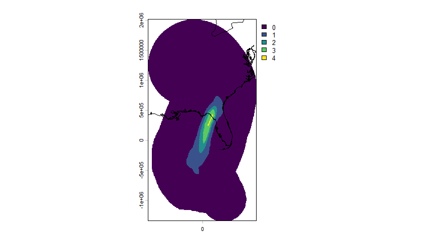
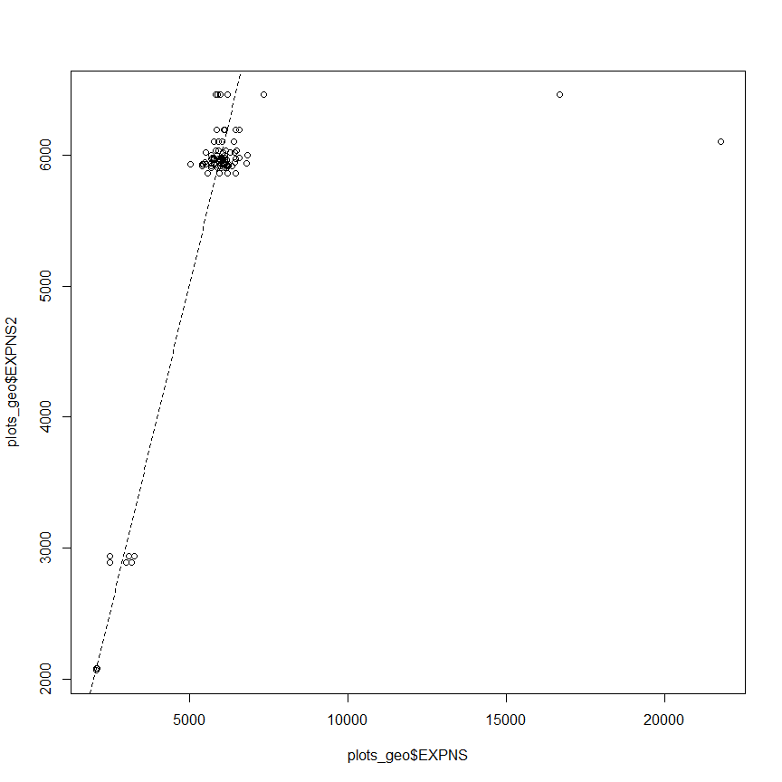
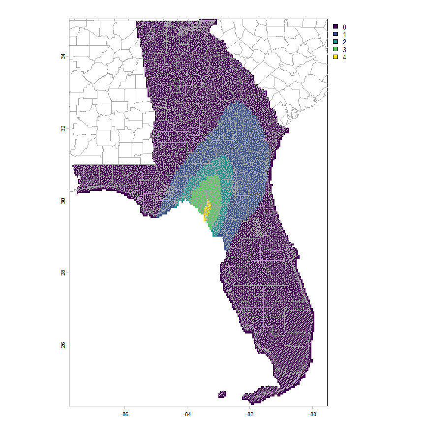

FIA-Post-Hurricane-Assessment
================
Ben Branoff & Andrés Baeza-Castro
2026-08-10

# FIA-Post-Hurricane-Assessment

Hurricane damage/loss estimates from collected plots after storms

Start by loading the plots from nims_srs_db. Here, using the DBI
library, which requires some initial setup for successful credentialed
connections to the db. Once setup, can connect to the “fiadb01p” data
base and access any tables you are authorized to access. Then, we can
use SQL queries passed as string arguments to retrieve the desired data.
Here we are asking for the Florida (132024, 132025) and Georgia (122024,
122025) evaluations since hurricane Helene. For now, we are only asking
for the plots, their conditions, and their associated strata variables.
Their trees and reference tables will be joined later.

``` r
library(DBI)
library(sf)
library(knitr)
library(kableExtra)
myconn <- dbConnect(odbc::odbc(), "fiadb01p", timeout = 10) # function change w/DBI
vars = paste0("select p.cn,p.prev_plt_cn,p.plot_status_cd,p.invyr,p.eval_grp,p.statecd,p.countycd,p.measyear,p.measmon,p.measday,pa.actual_lat,pa.actual_lon,",
                    "c.condid,c.cond_status_cd,c.owncd,c.fortypcd,c.condprop_unadj,c.prop_basis,",
              "ps.evalid,ps.estn_unit_cn,ps.adj_factor_macr,ps.adj_factor_subp,ps.expns,ps.P1POINTCNT,ps.P2POINTCNT,",
              "pps.stratum_cn,pc.totplots,pc2.nplots,",
              "PEU.p1pntcnt_eu,PEU.area_used ")
tabs = "from fs_nims_fiadb_srs.plotsnap p,fs_nims_fiadb_srs.sds_plot pa,fs_nims_fiadb_srs.cond c,fs_nims_fiadb_srs.pop_stratum ps,fs_nims_fiadb_srs.pop_plot_stratum_assgn pps,(select evalid,count(cn) as totplots from fs_nims_fiadb_srs.pop_plot_stratum_assgn where evalid in (122401,132401,122400,132400) group by evalid) pc,(select stratum_cn,count(cn) as nplots from fs_nims_fiadb_srs.pop_plot_stratum_assgn where evalid in (122401,132401,122400,132400) group by stratum_cn) pc2,fs_nims_fiadb_srs.POP_ESTN_UNIT PEU "
filts = paste0("where p.eval_grp in (122024,132024) 
and ps.evalid in (122401,132401,122400,132400)
and c.plt_cn = p.cn
and pa.plt_cn = p.cn
and pps.stratum_cn = ps.cn
and pps.plt_cn = p.cn
and pc.evalid=pps.evalid
and pc2.stratum_cn=ps.cn
and PEU.CN = PS.ESTN_UNIT_CN")
#and to_date(p.measyear || '-' || LPAD(p.measmon, 2, '0') || '-' || LPAD(p.measday, 2, '0')
#               default null on conversion error,
#               'YYYY-MM-DD') >= date '2024-09-26'") 
plots = dbGetQuery(myconn,paste0(vars,tabs,filts))
##  also, convert the plots to a spatial object
plots_geo <- st_as_sf(plots,coords=c("ACTUAL_LON","ACTUAL_LAT"),crs=4326)
plots |> head() |>
  kable(format='html')|>
  kable_styling() |>
  scroll_box(width='100%')
```

<div style="border: 1px solid #ddd; padding: 5px; overflow-x: scroll; width:100%; ">

<table class="table" style="margin-left: auto; margin-right: auto;">

<thead>

<tr>

<th style="text-align:left;">

CN
</th>

<th style="text-align:left;">

PREV_PLT_CN
</th>

<th style="text-align:right;">

PLOT_STATUS_CD
</th>

<th style="text-align:right;">

INVYR
</th>

<th style="text-align:right;">

EVAL_GRP
</th>

<th style="text-align:right;">

STATECD
</th>

<th style="text-align:right;">

COUNTYCD
</th>

<th style="text-align:right;">

MEASYEAR
</th>

<th style="text-align:right;">

MEASMON
</th>

<th style="text-align:right;">

MEASDAY
</th>

<th style="text-align:right;">

ACTUAL_LAT
</th>

<th style="text-align:right;">

ACTUAL_LON
</th>

<th style="text-align:right;">

CONDID
</th>

<th style="text-align:right;">

COND_STATUS_CD
</th>

<th style="text-align:right;">

OWNCD
</th>

<th style="text-align:right;">

FORTYPCD
</th>

<th style="text-align:right;">

CONDPROP_UNADJ
</th>

<th style="text-align:left;">

PROP_BASIS
</th>

<th style="text-align:right;">

EVALID
</th>

<th style="text-align:left;">

ESTN_UNIT_CN
</th>

<th style="text-align:right;">

ADJ_FACTOR_MACR
</th>

<th style="text-align:right;">

ADJ_FACTOR_SUBP
</th>

<th style="text-align:right;">

EXPNS
</th>

<th style="text-align:right;">

P1POINTCNT
</th>

<th style="text-align:right;">

P2POINTCNT
</th>

<th style="text-align:left;">

STRATUM_CN
</th>

<th style="text-align:right;">

TOTPLOTS
</th>

<th style="text-align:right;">

NPLOTS
</th>

<th style="text-align:right;">

P1PNTCNT_EU
</th>

<th style="text-align:right;">

AREA_USED
</th>

</tr>

</thead>

<tbody>

<tr>

<td style="text-align:left;">

718561858290487
</td>

<td style="text-align:left;">

282502266489998
</td>

<td style="text-align:right;">

1
</td>

<td style="text-align:right;">

2020
</td>

<td style="text-align:right;">

132024
</td>

<td style="text-align:right;">

13
</td>

<td style="text-align:right;">

125
</td>

<td style="text-align:right;">

2021
</td>

<td style="text-align:right;">

5
</td>

<td style="text-align:right;">

17
</td>

<td style="text-align:right;">

33.14180
</td>

<td style="text-align:right;">

-82.58348
</td>

<td style="text-align:right;">

1
</td>

<td style="text-align:right;">

1
</td>

<td style="text-align:right;">

46
</td>

<td style="text-align:right;">

962
</td>

<td style="text-align:right;">

0.966385
</td>

<td style="text-align:left;">

SUBP
</td>

<td style="text-align:right;">

132400
</td>

<td style="text-align:left;">

1898605053290487
</td>

<td style="text-align:right;">

0
</td>

<td style="text-align:right;">

1
</td>

<td style="text-align:right;">

6457.382
</td>

<td style="text-align:right;">

8594557
</td>

<td style="text-align:right;">

296
</td>

<td style="text-align:left;">

1898560228290487
</td>

<td style="text-align:right;">

6686
</td>

<td style="text-align:right;">

296
</td>

<td style="text-align:right;">

47313009
</td>

<td style="text-align:right;">

10522169
</td>

</tr>

<tr>

<td style="text-align:left;">

718561858290487
</td>

<td style="text-align:left;">

282502266489998
</td>

<td style="text-align:right;">

1
</td>

<td style="text-align:right;">

2020
</td>

<td style="text-align:right;">

132024
</td>

<td style="text-align:right;">

13
</td>

<td style="text-align:right;">

125
</td>

<td style="text-align:right;">

2021
</td>

<td style="text-align:right;">

5
</td>

<td style="text-align:right;">

17
</td>

<td style="text-align:right;">

33.14180
</td>

<td style="text-align:right;">

-82.58348
</td>

<td style="text-align:right;">

2
</td>

<td style="text-align:right;">

2
</td>

<td style="text-align:right;">

NA
</td>

<td style="text-align:right;">

NA
</td>

<td style="text-align:right;">

0.033615
</td>

<td style="text-align:left;">

SUBP
</td>

<td style="text-align:right;">

132400
</td>

<td style="text-align:left;">

1898605053290487
</td>

<td style="text-align:right;">

0
</td>

<td style="text-align:right;">

1
</td>

<td style="text-align:right;">

6457.382
</td>

<td style="text-align:right;">

8594557
</td>

<td style="text-align:right;">

296
</td>

<td style="text-align:left;">

1898560228290487
</td>

<td style="text-align:right;">

6686
</td>

<td style="text-align:right;">

296
</td>

<td style="text-align:right;">

47313009
</td>

<td style="text-align:right;">

10522169
</td>

</tr>

<tr>

<td style="text-align:left;">

718561858290487
</td>

<td style="text-align:left;">

282502266489998
</td>

<td style="text-align:right;">

1
</td>

<td style="text-align:right;">

2020
</td>

<td style="text-align:right;">

132024
</td>

<td style="text-align:right;">

13
</td>

<td style="text-align:right;">

125
</td>

<td style="text-align:right;">

2021
</td>

<td style="text-align:right;">

5
</td>

<td style="text-align:right;">

17
</td>

<td style="text-align:right;">

33.14180
</td>

<td style="text-align:right;">

-82.58348
</td>

<td style="text-align:right;">

1
</td>

<td style="text-align:right;">

1
</td>

<td style="text-align:right;">

46
</td>

<td style="text-align:right;">

962
</td>

<td style="text-align:right;">

0.966385
</td>

<td style="text-align:left;">

SUBP
</td>

<td style="text-align:right;">

132401
</td>

<td style="text-align:left;">

1898604855290487
</td>

<td style="text-align:right;">

0
</td>

<td style="text-align:right;">

1
</td>

<td style="text-align:right;">

6501.310
</td>

<td style="text-align:right;">

8594557
</td>

<td style="text-align:right;">

294
</td>

<td style="text-align:left;">

1898560251290487
</td>

<td style="text-align:right;">

6581
</td>

<td style="text-align:right;">

294
</td>

<td style="text-align:right;">

47313009
</td>

<td style="text-align:right;">

10522169
</td>

</tr>

<tr>

<td style="text-align:left;">

718561858290487
</td>

<td style="text-align:left;">

282502266489998
</td>

<td style="text-align:right;">

1
</td>

<td style="text-align:right;">

2020
</td>

<td style="text-align:right;">

132024
</td>

<td style="text-align:right;">

13
</td>

<td style="text-align:right;">

125
</td>

<td style="text-align:right;">

2021
</td>

<td style="text-align:right;">

5
</td>

<td style="text-align:right;">

17
</td>

<td style="text-align:right;">

33.14180
</td>

<td style="text-align:right;">

-82.58348
</td>

<td style="text-align:right;">

2
</td>

<td style="text-align:right;">

2
</td>

<td style="text-align:right;">

NA
</td>

<td style="text-align:right;">

NA
</td>

<td style="text-align:right;">

0.033615
</td>

<td style="text-align:left;">

SUBP
</td>

<td style="text-align:right;">

132401
</td>

<td style="text-align:left;">

1898604855290487
</td>

<td style="text-align:right;">

0
</td>

<td style="text-align:right;">

1
</td>

<td style="text-align:right;">

6501.310
</td>

<td style="text-align:right;">

8594557
</td>

<td style="text-align:right;">

294
</td>

<td style="text-align:left;">

1898560251290487
</td>

<td style="text-align:right;">

6581
</td>

<td style="text-align:right;">

294
</td>

<td style="text-align:right;">

47313009
</td>

<td style="text-align:right;">

10522169
</td>

</tr>

<tr>

<td style="text-align:left;">

718604277290487
</td>

<td style="text-align:left;">

219561114020004
</td>

<td style="text-align:right;">

1
</td>

<td style="text-align:right;">

2019
</td>

<td style="text-align:right;">

122024
</td>

<td style="text-align:right;">

12
</td>

<td style="text-align:right;">

75
</td>

<td style="text-align:right;">

2020
</td>

<td style="text-align:right;">

7
</td>

<td style="text-align:right;">

22
</td>

<td style="text-align:right;">

29.53527
</td>

<td style="text-align:right;">

-82.63805
</td>

<td style="text-align:right;">

1
</td>

<td style="text-align:right;">

1
</td>

<td style="text-align:right;">

31
</td>

<td style="text-align:right;">

403
</td>

<td style="text-align:right;">

1.000000
</td>

<td style="text-align:left;">

SUBP
</td>

<td style="text-align:right;">

122400
</td>

<td style="text-align:left;">

1970917140290487
</td>

<td style="text-align:right;">

0
</td>

<td style="text-align:right;">

1
</td>

<td style="text-align:right;">

6018.992
</td>

<td style="text-align:right;">

5927113
</td>

<td style="text-align:right;">

219
</td>

<td style="text-align:left;">

1970887827290487
</td>

<td style="text-align:right;">

7295
</td>

<td style="text-align:right;">

219
</td>

<td style="text-align:right;">

46098797
</td>

<td style="text-align:right;">

10252135
</td>

</tr>

<tr>

<td style="text-align:left;">

718604277290487
</td>

<td style="text-align:left;">

219561114020004
</td>

<td style="text-align:right;">

1
</td>

<td style="text-align:right;">

2019
</td>

<td style="text-align:right;">

122024
</td>

<td style="text-align:right;">

12
</td>

<td style="text-align:right;">

75
</td>

<td style="text-align:right;">

2020
</td>

<td style="text-align:right;">

7
</td>

<td style="text-align:right;">

22
</td>

<td style="text-align:right;">

29.53527
</td>

<td style="text-align:right;">

-82.63805
</td>

<td style="text-align:right;">

1
</td>

<td style="text-align:right;">

1
</td>

<td style="text-align:right;">

31
</td>

<td style="text-align:right;">

403
</td>

<td style="text-align:right;">

1.000000
</td>

<td style="text-align:left;">

SUBP
</td>

<td style="text-align:right;">

122401
</td>

<td style="text-align:left;">

1970917146290487
</td>

<td style="text-align:right;">

0
</td>

<td style="text-align:right;">

1
</td>

<td style="text-align:right;">

6102.590
</td>

<td style="text-align:right;">

5927113
</td>

<td style="text-align:right;">

216
</td>

<td style="text-align:left;">

1970895146290487
</td>

<td style="text-align:right;">

7033
</td>

<td style="text-align:right;">

216
</td>

<td style="text-align:right;">

46098797
</td>

<td style="text-align:right;">

10252135
</td>

</tr>

</tbody>

</table>

</div>

The above is a small subset, but there are around 8000 plots that have
been collected since the storm in Georgia and Florida.

Now, use the Cyclones package to recreate the winds for Helene and
create wind intensity zones. For now, Cyclones is only available on
Github, so an extra package (“remotes”) is required to install it. For
this workflow, the hurricane wind information is provided as part of the
download and there is no need to recalculate, but the process is
demonstrated anyways.

Below demonstrates how the above hurricane data was obtained. First the
Cyclones package is downloaded and installed and it is used to ingest
the necessary data and process into the wind fields we need.  
First, download the package and get the storm track information. This is
the foundation for being able to retrieve the winds (and rain and storm
surge).

``` r
##  install, only needed once
# install.packages('remotes')
# remotes::install_github("BBranoff/Cyclones@development")

library(Cyclones)
##  get the storm information
Helene <- get_storms(name="HELENE",season=2024,erddap=FALSE)
```

    ## Downloading IBTrACS from: https://www.ncei.noaa.gov/products/international-best-track-archive

``` r
Helene$HELENE_2024_NA_2024268N17278
```

    ## # A tibble: 45 × 29
    ##    ID       SID   USA_ATCF_ID SEASON NAME  BASIN ISO_TIME            LAT     LON
    ##    <chr>    <chr> <chr>       <chr>  <chr> <chr> <dttm>              <chr> <dbl>
    ##  1 HELENE_… 2024… AL092024    2024   HELE… NA    2024-09-23 12:00:00 17.2  -81.7
    ##  2 HELENE_… 2024… AL092024    2024   HELE… NA    2024-09-23 15:00:00 17.5  -81.8
    ##  3 HELENE_… 2024… AL092024    2024   HELE… NA    2024-09-23 18:00:00 17.8  -81.9
    ##  4 HELENE_… 2024… AL092024    2024   HELE… NA    2024-09-23 21:00:00 18.0  -82  
    ##  5 HELENE_… 2024… AL092024    2024   HELE… NA    2024-09-24 00:00:00 18.2  -82.2
    ##  6 HELENE_… 2024… AL092024    2024   HELE… NA    2024-09-24 03:00:00 18.4  -82.5
    ##  7 HELENE_… 2024… AL092024    2024   HELE… NA    2024-09-24 06:00:00 18.6  -82.8
    ##  8 HELENE_… 2024… AL092024    2024   HELE… NA    2024-09-24 09:00:00 18.9  -83.2
    ##  9 HELENE_… 2024… AL092024    2024   HELE… NA    2024-09-24 12:00:00 19.2  -83.7
    ## 10 HELENE_… 2024… AL092024    2024   HELE… NA    2024-09-24 15:00:00 19.3  -84.2
    ## # ℹ 35 more rows
    ## # ℹ 20 more variables: USA_SSHS <int>, STORM_SPEED <chr>, CONS_WIND <dbl>,
    ## #   CONS_PRES <dbl>, CONS_RMW <dbl>, CONS_ROCI <dbl>, CONS_POCI <dbl>,
    ## #   CONS_EYE <dbl>, CONS_R34_NE <dbl>, CONS_R50_NE <dbl>, CONS_R64_NE <dbl>,
    ## #   CONS_R34_SE <dbl>, CONS_R50_SE <dbl>, CONS_R64_SE <dbl>, CONS_R34_SW <dbl>,
    ## #   CONS_R50_SW <dbl>, CONS_R64_SW <dbl>, CONS_R34_NW <dbl>, CONS_R50_NW <dbl>,
    ## #   CONS_R64_NW <dbl>

Now, calculate the wind field. Here we just use a theoretical (Boose)
equation based on the maximum wind speed. We calculate the wind onto a
grid with a spatial resolution of 5km.

``` r
###  first, interpolate the spatial wind information to every 30 mins
Helene_extents <- make_extents(Helene,t_res=30)
```

    ## Building wind extents for  HELENE_2024_NA_2024268N17278  : % 0.4Building wind extents for  HELENE_2024_NA_2024268N17278  : % 0.8Building wind extents for  HELENE_2024_NA_2024268N17278  : % 1.2Building wind extents for  HELENE_2024_NA_2024268N17278  : % 1.6Building wind extents for  HELENE_2024_NA_2024268N17278  : % 2Building wind extents for  HELENE_2024_NA_2024268N17278  : % 2.4Building wind extents for  HELENE_2024_NA_2024268N17278  : % 2.8Building wind extents for  HELENE_2024_NA_2024268N17278  : % 3.2Building wind extents for  HELENE_2024_NA_2024268N17278  : % 3.6Building wind extents for  HELENE_2024_NA_2024268N17278  : % 4Building wind extents for  HELENE_2024_NA_2024268N17278  : % 4.3Building wind extents for  HELENE_2024_NA_2024268N17278  : % 4.7Building wind extents for  HELENE_2024_NA_2024268N17278  : % 5.1Building wind extents for  HELENE_2024_NA_2024268N17278  : % 5.5Building wind extents for  HELENE_2024_NA_2024268N17278  : % 5.9Building wind extents for  HELENE_2024_NA_2024268N17278  : % 6.3Building wind extents for  HELENE_2024_NA_2024268N17278  : % 6.7Building wind extents for  HELENE_2024_NA_2024268N17278  : % 7.1Building wind extents for  HELENE_2024_NA_2024268N17278  : % 7.5Building wind extents for  HELENE_2024_NA_2024268N17278  : % 7.9Building wind extents for  HELENE_2024_NA_2024268N17278  : % 8.3Building wind extents for  HELENE_2024_NA_2024268N17278  : % 8.7Building wind extents for  HELENE_2024_NA_2024268N17278  : % 9.1Building wind extents for  HELENE_2024_NA_2024268N17278  : % 9.5Building wind extents for  HELENE_2024_NA_2024268N17278  : % 9.9Building wind extents for  HELENE_2024_NA_2024268N17278  : % 10.3Building wind extents for  HELENE_2024_NA_2024268N17278  : % 10.7Building wind extents for  HELENE_2024_NA_2024268N17278  : % 11.1Building wind extents for  HELENE_2024_NA_2024268N17278  : % 11.5Building wind extents for  HELENE_2024_NA_2024268N17278  : % 11.9Building wind extents for  HELENE_2024_NA_2024268N17278  : % 12.3Building wind extents for  HELENE_2024_NA_2024268N17278  : % 12.6Building wind extents for  HELENE_2024_NA_2024268N17278  : % 13Building wind extents for  HELENE_2024_NA_2024268N17278  : % 13.4Building wind extents for  HELENE_2024_NA_2024268N17278  : % 13.8Building wind extents for  HELENE_2024_NA_2024268N17278  : % 14.2Building wind extents for  HELENE_2024_NA_2024268N17278  : % 14.6Building wind extents for  HELENE_2024_NA_2024268N17278  : % 15Building wind extents for  HELENE_2024_NA_2024268N17278  : % 15.4Building wind extents for  HELENE_2024_NA_2024268N17278  : % 15.8Building wind extents for  HELENE_2024_NA_2024268N17278  : % 16.2Building wind extents for  HELENE_2024_NA_2024268N17278  : % 16.6Building wind extents for  HELENE_2024_NA_2024268N17278  : % 17Building wind extents for  HELENE_2024_NA_2024268N17278  : % 17.4Building wind extents for  HELENE_2024_NA_2024268N17278  : % 17.8Building wind extents for  HELENE_2024_NA_2024268N17278  : % 18.2Building wind extents for  HELENE_2024_NA_2024268N17278  : % 18.6Building wind extents for  HELENE_2024_NA_2024268N17278  : % 19Building wind extents for  HELENE_2024_NA_2024268N17278  : % 19.4Building wind extents for  HELENE_2024_NA_2024268N17278  : % 19.8Building wind extents for  HELENE_2024_NA_2024268N17278  : % 20.2Building wind extents for  HELENE_2024_NA_2024268N17278  : % 20.6Building wind extents for  HELENE_2024_NA_2024268N17278  : % 20.9Building wind extents for  HELENE_2024_NA_2024268N17278  : % 21.3Building wind extents for  HELENE_2024_NA_2024268N17278  : % 21.7Building wind extents for  HELENE_2024_NA_2024268N17278  : % 22.1Building wind extents for  HELENE_2024_NA_2024268N17278  : % 22.5Building wind extents for  HELENE_2024_NA_2024268N17278  : % 22.9Building wind extents for  HELENE_2024_NA_2024268N17278  : % 23.3Building wind extents for  HELENE_2024_NA_2024268N17278  : % 23.7Building wind extents for  HELENE_2024_NA_2024268N17278  : % 24.1Building wind extents for  HELENE_2024_NA_2024268N17278  : % 24.5Building wind extents for  HELENE_2024_NA_2024268N17278  : % 24.9Building wind extents for  HELENE_2024_NA_2024268N17278  : % 25.3Building wind extents for  HELENE_2024_NA_2024268N17278  : % 25.7Building wind extents for  HELENE_2024_NA_2024268N17278  : % 26.1Building wind extents for  HELENE_2024_NA_2024268N17278  : % 26.5Building wind extents for  HELENE_2024_NA_2024268N17278  : % 26.9Building wind extents for  HELENE_2024_NA_2024268N17278  : % 27.3Building wind extents for  HELENE_2024_NA_2024268N17278  : % 27.7Building wind extents for  HELENE_2024_NA_2024268N17278  : % 28.1Building wind extents for  HELENE_2024_NA_2024268N17278  : % 28.5Building wind extents for  HELENE_2024_NA_2024268N17278  : % 28.9Building wind extents for  HELENE_2024_NA_2024268N17278  : % 29.2Building wind extents for  HELENE_2024_NA_2024268N17278  : % 29.6Building wind extents for  HELENE_2024_NA_2024268N17278  : % 30Building wind extents for  HELENE_2024_NA_2024268N17278  : % 30.4Building wind extents for  HELENE_2024_NA_2024268N17278  : % 30.8Building wind extents for  HELENE_2024_NA_2024268N17278  : % 31.2Building wind extents for  HELENE_2024_NA_2024268N17278  : % 31.6Building wind extents for  HELENE_2024_NA_2024268N17278  : % 32Building wind extents for  HELENE_2024_NA_2024268N17278  : % 32.4Building wind extents for  HELENE_2024_NA_2024268N17278  : % 32.8Building wind extents for  HELENE_2024_NA_2024268N17278  : % 33.2Building wind extents for  HELENE_2024_NA_2024268N17278  : % 33.6Building wind extents for  HELENE_2024_NA_2024268N17278  : % 34Building wind extents for  HELENE_2024_NA_2024268N17278  : % 34.4Building wind extents for  HELENE_2024_NA_2024268N17278  : % 34.8Building wind extents for  HELENE_2024_NA_2024268N17278  : % 35.2Building wind extents for  HELENE_2024_NA_2024268N17278  : % 35.6Building wind extents for  HELENE_2024_NA_2024268N17278  : % 36Building wind extents for  HELENE_2024_NA_2024268N17278  : % 36.4Building wind extents for  HELENE_2024_NA_2024268N17278  : % 36.8Building wind extents for  HELENE_2024_NA_2024268N17278  : % 37.2Building wind extents for  HELENE_2024_NA_2024268N17278  : % 37.5Building wind extents for  HELENE_2024_NA_2024268N17278  : % 37.9Building wind extents for  HELENE_2024_NA_2024268N17278  : % 38.3Building wind extents for  HELENE_2024_NA_2024268N17278  : % 38.7Building wind extents for  HELENE_2024_NA_2024268N17278  : % 39.1Building wind extents for  HELENE_2024_NA_2024268N17278  : % 39.5Building wind extents for  HELENE_2024_NA_2024268N17278  : % 39.9Building wind extents for  HELENE_2024_NA_2024268N17278  : % 40.3Building wind extents for  HELENE_2024_NA_2024268N17278  : % 40.7Building wind extents for  HELENE_2024_NA_2024268N17278  : % 41.1Building wind extents for  HELENE_2024_NA_2024268N17278  : % 41.5Building wind extents for  HELENE_2024_NA_2024268N17278  : % 41.9Building wind extents for  HELENE_2024_NA_2024268N17278  : % 42.3Building wind extents for  HELENE_2024_NA_2024268N17278  : % 42.7Building wind extents for  HELENE_2024_NA_2024268N17278  : % 43.1Building wind extents for  HELENE_2024_NA_2024268N17278  : % 43.5Building wind extents for  HELENE_2024_NA_2024268N17278  : % 43.9Building wind extents for  HELENE_2024_NA_2024268N17278  : % 44.3Building wind extents for  HELENE_2024_NA_2024268N17278  : % 44.7Building wind extents for  HELENE_2024_NA_2024268N17278  : % 45.1Building wind extents for  HELENE_2024_NA_2024268N17278  : % 45.5Building wind extents for  HELENE_2024_NA_2024268N17278  : % 45.8Building wind extents for  HELENE_2024_NA_2024268N17278  : % 46.2Building wind extents for  HELENE_2024_NA_2024268N17278  : % 46.6Building wind extents for  HELENE_2024_NA_2024268N17278  : % 47Building wind extents for  HELENE_2024_NA_2024268N17278  : % 47.4Building wind extents for  HELENE_2024_NA_2024268N17278  : % 47.8Building wind extents for  HELENE_2024_NA_2024268N17278  : % 48.2Building wind extents for  HELENE_2024_NA_2024268N17278  : % 48.6Building wind extents for  HELENE_2024_NA_2024268N17278  : % 49Building wind extents for  HELENE_2024_NA_2024268N17278  : % 49.4Building wind extents for  HELENE_2024_NA_2024268N17278  : % 49.8Building wind extents for  HELENE_2024_NA_2024268N17278  : % 50.2Building wind extents for  HELENE_2024_NA_2024268N17278  : % 50.6Building wind extents for  HELENE_2024_NA_2024268N17278  : % 51Building wind extents for  HELENE_2024_NA_2024268N17278  : % 51.4Building wind extents for  HELENE_2024_NA_2024268N17278  : % 51.8Building wind extents for  HELENE_2024_NA_2024268N17278  : % 52.2Building wind extents for  HELENE_2024_NA_2024268N17278  : % 52.6Building wind extents for  HELENE_2024_NA_2024268N17278  : % 53Building wind extents for  HELENE_2024_NA_2024268N17278  : % 53.4Building wind extents for  HELENE_2024_NA_2024268N17278  : % 53.8Building wind extents for  HELENE_2024_NA_2024268N17278  : % 54.2Building wind extents for  HELENE_2024_NA_2024268N17278  : % 54.5Building wind extents for  HELENE_2024_NA_2024268N17278  : % 54.9Building wind extents for  HELENE_2024_NA_2024268N17278  : % 55.3Building wind extents for  HELENE_2024_NA_2024268N17278  : % 55.7Building wind extents for  HELENE_2024_NA_2024268N17278  : % 56.1Building wind extents for  HELENE_2024_NA_2024268N17278  : % 56.5Building wind extents for  HELENE_2024_NA_2024268N17278  : % 56.9Building wind extents for  HELENE_2024_NA_2024268N17278  : % 57.3Building wind extents for  HELENE_2024_NA_2024268N17278  : % 57.7Building wind extents for  HELENE_2024_NA_2024268N17278  : % 58.1Building wind extents for  HELENE_2024_NA_2024268N17278  : % 58.5Building wind extents for  HELENE_2024_NA_2024268N17278  : % 58.9Building wind extents for  HELENE_2024_NA_2024268N17278  : % 59.3Building wind extents for  HELENE_2024_NA_2024268N17278  : % 59.7Building wind extents for  HELENE_2024_NA_2024268N17278  : % 60.1Building wind extents for  HELENE_2024_NA_2024268N17278  : % 60.5Building wind extents for  HELENE_2024_NA_2024268N17278  : % 60.9Building wind extents for  HELENE_2024_NA_2024268N17278  : % 61.3Building wind extents for  HELENE_2024_NA_2024268N17278  : % 61.7Building wind extents for  HELENE_2024_NA_2024268N17278  : % 62.1Building wind extents for  HELENE_2024_NA_2024268N17278  : % 62.5Building wind extents for  HELENE_2024_NA_2024268N17278  : % 62.8Building wind extents for  HELENE_2024_NA_2024268N17278  : % 63.2Building wind extents for  HELENE_2024_NA_2024268N17278  : % 63.6Building wind extents for  HELENE_2024_NA_2024268N17278  : % 64Building wind extents for  HELENE_2024_NA_2024268N17278  : % 64.4Building wind extents for  HELENE_2024_NA_2024268N17278  : % 64.8Building wind extents for  HELENE_2024_NA_2024268N17278  : % 65.2Building wind extents for  HELENE_2024_NA_2024268N17278  : % 65.6Building wind extents for  HELENE_2024_NA_2024268N17278  : % 66Building wind extents for  HELENE_2024_NA_2024268N17278  : % 66.4Building wind extents for  HELENE_2024_NA_2024268N17278  : % 66.8Building wind extents for  HELENE_2024_NA_2024268N17278  : % 67.2Building wind extents for  HELENE_2024_NA_2024268N17278  : % 67.6Building wind extents for  HELENE_2024_NA_2024268N17278  : % 68Building wind extents for  HELENE_2024_NA_2024268N17278  : % 68.4Building wind extents for  HELENE_2024_NA_2024268N17278  : % 68.8Building wind extents for  HELENE_2024_NA_2024268N17278  : % 69.2Building wind extents for  HELENE_2024_NA_2024268N17278  : % 69.6Building wind extents for  HELENE_2024_NA_2024268N17278  : % 70Building wind extents for  HELENE_2024_NA_2024268N17278  : % 70.4Building wind extents for  HELENE_2024_NA_2024268N17278  : % 70.8Building wind extents for  HELENE_2024_NA_2024268N17278  : % 71.1Building wind extents for  HELENE_2024_NA_2024268N17278  : % 71.5Building wind extents for  HELENE_2024_NA_2024268N17278  : % 71.9Building wind extents for  HELENE_2024_NA_2024268N17278  : % 72.3Building wind extents for  HELENE_2024_NA_2024268N17278  : % 72.7Building wind extents for  HELENE_2024_NA_2024268N17278  : % 73.1Building wind extents for  HELENE_2024_NA_2024268N17278  : % 73.5Building wind extents for  HELENE_2024_NA_2024268N17278  : % 73.9Building wind extents for  HELENE_2024_NA_2024268N17278  : % 74.3Building wind extents for  HELENE_2024_NA_2024268N17278  : % 74.7Building wind extents for  HELENE_2024_NA_2024268N17278  : % 75.1Building wind extents for  HELENE_2024_NA_2024268N17278  : % 75.5Building wind extents for  HELENE_2024_NA_2024268N17278  : % 75.9Building wind extents for  HELENE_2024_NA_2024268N17278  : % 76.3Building wind extents for  HELENE_2024_NA_2024268N17278  : % 76.7Building wind extents for  HELENE_2024_NA_2024268N17278  : % 77.1Building wind extents for  HELENE_2024_NA_2024268N17278  : % 77.5Building wind extents for  HELENE_2024_NA_2024268N17278  : % 77.9Building wind extents for  HELENE_2024_NA_2024268N17278  : % 78.3Building wind extents for  HELENE_2024_NA_2024268N17278  : % 78.7Building wind extents for  HELENE_2024_NA_2024268N17278  : % 79.1Building wind extents for  HELENE_2024_NA_2024268N17278  : % 79.4Building wind extents for  HELENE_2024_NA_2024268N17278  : % 79.8Building wind extents for  HELENE_2024_NA_2024268N17278  : % 80.2Building wind extents for  HELENE_2024_NA_2024268N17278  : % 80.6Building wind extents for  HELENE_2024_NA_2024268N17278  : % 81Building wind extents for  HELENE_2024_NA_2024268N17278  : % 81.4Building wind extents for  HELENE_2024_NA_2024268N17278  : % 81.8Building wind extents for  HELENE_2024_NA_2024268N17278  : % 82.2Building wind extents for  HELENE_2024_NA_2024268N17278  : % 82.6Building wind extents for  HELENE_2024_NA_2024268N17278  : % 83Building wind extents for  HELENE_2024_NA_2024268N17278  : % 83.4Building wind extents for  HELENE_2024_NA_2024268N17278  : % 83.8Building wind extents for  HELENE_2024_NA_2024268N17278  : % 84.2Building wind extents for  HELENE_2024_NA_2024268N17278  : % 84.6Building wind extents for  HELENE_2024_NA_2024268N17278  : % 85Building wind extents for  HELENE_2024_NA_2024268N17278  : % 85.4Building wind extents for  HELENE_2024_NA_2024268N17278  : % 85.8Building wind extents for  HELENE_2024_NA_2024268N17278  : % 86.2Building wind extents for  HELENE_2024_NA_2024268N17278  : % 86.6Building wind extents for  HELENE_2024_NA_2024268N17278  : % 87Building wind extents for  HELENE_2024_NA_2024268N17278  : % 87.4Building wind extents for  HELENE_2024_NA_2024268N17278  : % 87.7Building wind extents for  HELENE_2024_NA_2024268N17278  : % 88.1Building wind extents for  HELENE_2024_NA_2024268N17278  : % 88.5Building wind extents for  HELENE_2024_NA_2024268N17278  : % 88.9Building wind extents for  HELENE_2024_NA_2024268N17278  : % 89.3Building wind extents for  HELENE_2024_NA_2024268N17278  : % 89.7Building wind extents for  HELENE_2024_NA_2024268N17278  : % 90.1Building wind extents for  HELENE_2024_NA_2024268N17278  : % 90.5Building wind extents for  HELENE_2024_NA_2024268N17278  : % 90.9Building wind extents for  HELENE_2024_NA_2024268N17278  : % 91.3Building wind extents for  HELENE_2024_NA_2024268N17278  : % 91.7Building wind extents for  HELENE_2024_NA_2024268N17278  : % 92.1Building wind extents for  HELENE_2024_NA_2024268N17278  : % 92.5Building wind extents for  HELENE_2024_NA_2024268N17278  : % 92.9Building wind extents for  HELENE_2024_NA_2024268N17278  : % 93.3Building wind extents for  HELENE_2024_NA_2024268N17278  : % 93.7Building wind extents for  HELENE_2024_NA_2024268N17278  : % 94.1Building wind extents for  HELENE_2024_NA_2024268N17278  : % 94.5Building wind extents for  HELENE_2024_NA_2024268N17278  : % 94.9Building wind extents for  HELENE_2024_NA_2024268N17278  : % 95.3Building wind extents for  HELENE_2024_NA_2024268N17278  : % 95.7Building wind extents for  HELENE_2024_NA_2024268N17278  : % 96Building wind extents for  HELENE_2024_NA_2024268N17278  : % 96.4Building wind extents for  HELENE_2024_NA_2024268N17278  : % 96.8Building wind extents for  HELENE_2024_NA_2024268N17278  : % 97.2Building wind extents for  HELENE_2024_NA_2024268N17278  : % 97.6Building wind extents for  HELENE_2024_NA_2024268N17278  : % 98Building wind extents for  HELENE_2024_NA_2024268N17278  : % 98.4Building wind extents for  HELENE_2024_NA_2024268N17278  : % 98.8Building wind extents for  HELENE_2024_NA_2024268N17278  : % 99.2Building wind extents for  HELENE_2024_NA_2024268N17278  : % 99.6Building wind extents for    : % 100

``` r
###  then interpolate spatially as a raster
Helene_winds <- get_wind(Helene_extents,method="Boose",agg=TRUE,s_res=5000)
```

    ## processing wind for HELENE_2024 via boose

    ## 
    ## interpolating to desired frequency: % 2interpolating to desired frequency: % 5interpolating to desired frequency: % 7interpolating to desired frequency: % 9interpolating to desired frequency: % 11interpolating to desired frequency: % 14interpolating to desired frequency: % 16interpolating to desired frequency: % 18interpolating to desired frequency: % 20interpolating to desired frequency: % 23interpolating to desired frequency: % 25interpolating to desired frequency: % 27interpolating to desired frequency: % 30interpolating to desired frequency: % 32interpolating to desired frequency: % 34interpolating to desired frequency: % 36interpolating to desired frequency: % 39interpolating to desired frequency: % 41interpolating to desired frequency: % 43interpolating to desired frequency: % 45interpolating to desired frequency: % 48interpolating to desired frequency: % 50interpolating to desired frequency: % 52interpolating to desired frequency: % 55interpolating to desired frequency: % 57interpolating to desired frequency: % 59interpolating to desired frequency: % 61interpolating to desired frequency: % 64interpolating to desired frequency: % 66interpolating to desired frequency: % 68interpolating to desired frequency: % 70interpolating to desired frequency: % 73interpolating to desired frequency: % 75interpolating to desired frequency: % 77interpolating to desired frequency: % 80interpolating to desired frequency: % 82interpolating to desired frequency: % 84interpolating to desired frequency: % 86interpolating to desired frequency: % 89interpolating to desired frequency: % 91interpolating to desired frequency: % 93interpolating to desired frequency: % 95interpolating to desired frequency: % 98

``` r
##  get some boundaries, mostly for display
##  county boundaries
counties <- read_sf("/vsizip//vsicurl/https://naciscdn.org/naturalearth/10m/cultural/ne_10m_admin_2_counties.zip",
                        layer = "ne_10m_admin_2_counties")
usa <- counties|>filter(REGION_COD %in% c(12,13,47,45,37))|>group_by(REGION_COD)|>summarise()
###  The FIA state boundary is important because it determines the total size of the estimation unit
###  we use this to calculate the expansion factor
##   normally this is on the T drive but its copied to Github for easier access
FIAstates <- read_sf("https://github.com/BBranoff/FIA-Post-Hurricane-Assessment/raw/refs/heads/main/data/rs_states.gpkg")

library(terra)
plot(Helene_winds$boose$max_msw,main="Maximum Sustained Winds (m/s)")
plot(st_geometry(st_transform(usa,crs(Helene_winds$boose$max_msw))),add=TRUE)
```

<figure>

<figcaption aria-hidden="true">Fig 1. Hurricane Helene’s maximum
sustained winds in meters per second.</figcaption>
</figure>

We can then categorize the wind into the familiar Saffir-Simpson scale.
These categories will be our intensity zones and they will be the
on-the-fly strata that we use to calculate sub-complete evaluation
estimates.

``` r
###  classify the maximum wind speed into the Saffir-Simpson scale
Helene_Cat <- as.factor(classify(Helene_winds$max_msw,
                       matrix(c(0,33,0,
                                33,43,1,
                                43,50,2,
                                50,60,3,
                                60,70,4,
                                70,Inf,5),ncol=3,byrow=TRUE),include.lowest=TRUE))
plot(Helene_Cat,main="Wind Intensity Categories")
plot(st_geometry(st_transform(usa,crs(Helene_Cat))),add=TRUE)
```

<figure>

<figcaption aria-hidden="true">Fig 2. Hurricane Helene’s wind field,
categorized into intensity zones.</figcaption>
</figure>

The Helene hurricane data is now processed and ready for overlays with
the plots.

With the hurricane intensity areas defined, we can assign them to each
plot. We also need to define the area of each wind zone. These will be
our artificial ‘strata’, and we will need to know the total area in
order to calculate the expansion factors. This is done two ways. The
first is using vectors (shapefiles) of the strata and the ‘st_area()’
function to calculate the areas. The second is using the raster image
and counting the number of pixels in each strata, then multiplying by
the resolution to get total area.

``` r
###  first, mask out the areas outside of our interest
Helene_Cat <- trim(mask(Helene_Cat,st_transform(FIAstates|>filter(STATEFP %in% c(12,13)),crs(Helene_Cat))))
#Helene_Cat100 <- project(Helene_Cat,rast(ext=ext(Helene_Cat),crs=crs(Helene_Cat),res=c(100,100)))
# Helene_Cat_vect <- st_as_sf(as.polygons(Helene_Cat))|>st_intersection(FIAstates|>filter(STATEFP %in% c(12,13))|>st_transform(crs(Helene_Cat)))%>%
#   mutate(VectArea.m = st_area(.),
#          VectArea.ac=VectArea.m/4046.86)|>
#   group_by(STATEFP)|>
#   mutate(statearea.ac=sum(VectArea.ac))

##  the raster area approach to pixel counting
##  important to do this while the raster is in projected, not geographic, coordinates
##  also important to do by state, as this is how the evaluation is done
# Areas12 <- table(values(mask(Helene_Cat,st_transform(FIAstates|>filter(STATEFP==12),crs(Helene_Cat)))))
# Areas13 <- table(values(mask(Helene_Cat,st_transform(FIAstates|>filter(STATEFP==13),crs(Helene_Cat)))))
# Areas <- rbind(data.frame(Areas12)|>mutate(STATECD=12),
#                data.frame(Areas13)|>mutate(STATECD=13)) |>
#   rename(npixels=Freq)|>
#   mutate(area.raster.m = npixels*res(Helene_Cat)[1]*res(Helene_Cat)[2],
#          area.raster.ac = area.raster.m/4046.86)|>
#   group_by(STATECD)|>
#   mutate(state_tot_pixels=sum(npixels),
#          state_tot_pixels_area = sum(area.raster.ac))|>
#   left_join(Helene_Cat_vect|>
#               st_drop_geometry()|>
#               mutate(STATECD=as.numeric(STATEFP)),by=join_by(STATECD,Var1==max_msw))|>
#   st_drop_geometry()|>ungroup()|>
#   ##  compare to FIA state total areas from the ESTN_UNITs
#   left_join(plots |> 
#               group_by(EVALID,EVAL_GRP)|>
#               mutate(totFIAplots=length(unique(CN)))|>
#               distinct(ESTN_UNIT_CN,.keep_all=TRUE)|>
#               group_by(EVAL_GRP,EVALID,totFIAplots)|>summarise(totFIAarea=sum(AREA_USED))|>
#               filter((EVAL_GRP ==122024&EVALID==122401)|(EVAL_GRP==122025&EVALID==122501)|(EVAL_GRP==132025&EVALID==132501)|(EVAL_GRP==132024&EVALID==132401))|>
#               mutate(STATECD=as.numeric(substr(EVALID,1,2)))|>ungroup()|>distinct(STATECD,totFIAarea,totFIAplots),
#             by=join_by(STATECD))
# 
# Areas

# ###  check with the units on file
# FIAunits<- read_sf("//usda.net/fs/FS/RD/SRS/Science/FIA/Collaboration/SRS_GIS_Layers/SRS/srs_unit.shp") |>
#   filter(WU >100 & WU<140)|>
#   mutate(STATECD = substr(WU,1,2))
# ###  need the national forests as well
# forests <- read_sf("C:/Users/BenjaminBranoff/Downloads/BdyAdm_LSRS_AdministrativeForest/S_USA.BdyAdm_LSRS_AdministrativeForest.shp")|> 
#   filter(FORESTNAME %in% c("Chattahoochee-Oconee National Forests","National Forests in Florida"))
# ###  combine for all ESTIMATION UNITS in analysis
# FLGAunits <- rbind(st_difference(FIAunits |> rename(Unit=WU)|>select(Unit,STATECD),
#                    st_union(forests|> rename(Unit=FORESTNAME)|>select(Unit,STATECD))),
#                    forests|> rename(Unit=FORESTNAME)|>select(Unit,STATECD))|>
#   ## calculate area
#   st_transform(crs(Helene_Cat)) |>
#   st_as_sf() %>%
#   mutate(EU_Area.ac = as.numeric(st_area(.))/4046.86,
#          EU_nPixels=zonal(Helene_Cat,vect(.),fun="notNA")$max_msw)
# 
# dist_threshold <- 10000 # e.g., 1000 meters
# strataPixels <- lapply(unique(plots_geo$STRATUM_CN),function(x){
#  r= plots_geo |> filter(STRATUM_CN==x) |>
#     st_transform(crs(Helene_Cat))%>%
#     rasterize(field='STRATUM_CN',Helene_Cat500)
#   sum(!is.na(values(r)))
# })
# EU_pixels <- sum(!is.na(values(plots_geo |>
#     st_transform(crs(Helene_Cat))%>%
#     rasterize(field='STRATUM_CN',Helene_Cat500))))
# strata <-plots_geo |> 
#  distinct(STRATUM_CN)|>
#   mutate(nPixels=unlist(strataPixels))
# 
# strata <- plots_geo |> group_by(STRATUM_CN)|>
#   summarise(do_union=TRUE) %>%
#   st_concave_hull(.,ratio=0.01)|>
#   st_as_sf() %>%
#   st_transform(crs(Helene_Cat))%>%
#   mutate(area.ac=as.numeric(st_area(.))/4046.86)%>%
#   mutate(nPixels=zonal(Helene_Cat,vect(.),fun="notNA")$max_msw)
# unitPixels <- lapply(unique(plots_geo$ESTN_UNIT_CN),function(x){
#  r= plots_geo |> filter(ESTN_UNIT_CN==x) |>
#     st_transform(crs(Helene_Cat))%>%
#     rasterize(field='ESTN_UNIT_CN',Helene_Cat500)
#   sum(!is.na(values(r)))
# })
# units<-plots_geo |> 
#  distinct(ESTN_UNIT_CN)|>
#   mutate(nPixels_EU=unlist(unitPixels))
# 
# units <- plots_geo |> group_by(ESTN_UNIT_CN)|>
#   summarise(do_union=TRUE) %>%
#   st_concave_hull(.,ratio=0.5)|>
#   st_as_sf() %>%
#   st_transform(crs(Helene_Cat))%>%
#   mutate(area_EU.ac=as.numeric(st_area(.))/4046.86)%>%
#   mutate(nPixels_EU=zonal(Helene_Cat,vect(.),fun="notNA")$max_msw)


####  the weighting for the EXPNS calculation can be approximated closesly by the 
####  plot ratio, instead of the pixel ratio that the offical calculation uses
plots_geo <- plots_geo |>
  mutate(PixelRatio=P1POINTCNT/P1PNTCNT_EU)|>
  group_by(ESTN_UNIT_CN)|>
  mutate(ESTN_UNIT_nPlots = sum(P2POINTCNT[!duplicated(STRATUM_CN)]))|>
  ungroup()|>
  #left_join(strata|>st_drop_geometry(),by=join_by(STRATUM_CN))|>
  #left_join(units|>st_drop_geometry(),by=join_by(ESTN_UNIT_CN))|>
  group_by(STRATUM_CN)|>
  mutate(nplots=length(unique(CN)),
         plotratio = nplots/ESTN_UNIT_nPlots, 
         EXPNS2 = plotratio*(AREA_USED/nplots))

plot(plots_geo$PixelRatio,plots_geo$plotratio)
abline(a=0,b=1,lty=2)
```

<figure>

<figcaption aria-hidden="true">Fig 3. Hurricane Helene’s wind zones with
the plots overlayed. Plots are assigned their respective wind zones and
their expansion factors come from the total area of each wind zone
divided by the number of plots in each zone.</figcaption>
</figure>

``` r
###  this is the key to approximating the EXPNS
plot(plots_geo$EXPNS,plots_geo$EXPNS2)
abline(a=0,b=1,lty=2)
```

<figure>

<figcaption aria-hidden="true">Fig 3. Hurricane Helene’s wind zones with
the plots overlayed. Plots are assigned their respective wind zones and
their expansion factors come from the total area of each wind zone
divided by the number of plots in each zone.</figcaption>
</figure>

``` r
###  project onto geographic coordinates
Helene_Cat <- project(Helene_Cat,"epsg:4326")
plot(Helene_Cat)
###  overlay the plots
plot(st_geometry(st_as_sf(plots_geo,coords=c("LON","LAT"),crs=4326)),add=TRUE,pch=19,cex=0.01,col="darkgrey")
plot(st_geometry(usa),add=TRUE,border="darkgrey")
plot(st_geometry(counties),add=TRUE,border="darkgrey")
```

<figure>

<figcaption aria-hidden="true">Fig 3. Hurricane Helene’s wind zones with
the plots overlayed. Plots are assigned their respective wind zones and
their expansion factors come from the total area of each wind zone
divided by the number of plots in each zone.</figcaption>
</figure>

We now have the plots and the areas associated with each wind zone. From
here, we can begin to assemble the necessary tables and calculate the
desired estimates.

Beginning with assembling the necessary tables. Forested area is likely
the most straight forward. We will get the forested acreage of each plot
and, using a custom expansion factor, estimate the total forested
acreage in each wind zone.

First, we need some helper functions to compare our estimates with
‘official’ numbers from FIA. We use the FIA EVALIDATOR API to do this.
These functions are provided here by following the below steps, but they
are taken directly from the [FIA EVALIDATOR API
instructions](https://apps.fs.usda.gov/fiadb-api/).

Now, extract the wind zones at each plot, calculate the new expansion
factor based on the area of each strata (wind zone) and then compute the
forested area for each zone.

As a proof of concept, we use the original expansion factor (EXPNS) and
sum everything within an EVAL_GRP. This should be equivalent to what is
computed by EVALIDATOR. To check, we use the API to retrieve the
EVALIDATOR estimate and compare it to ours. They are identical, meaning
we are calculating correctly for a full evaluation. We then try the same
calculation using EXPNS_new to estimate the areas for the custom wind
zones.

``` r
###  first, join the total 'strata' (wind zone) areas to the plot table
plots_geo$WindZone <- extract(Helene_Cat,plots_geo)$max_msw

###  try first regardless of windzone to test concept
###  simulating the SQL query from ref_pop_attribute
plot_summary_cust <- plots_geo |>
  st_drop_geometry()|>
  filter(EVAL_GRP %in% c(122024,132024),EVALID %in% c(122401,132401),
         COND_STATUS_CD == 1,!is.null(CONDPROP_UNADJ))|>
  mutate(Y_HID_ADJUSTED = if_else(PROP_BASIS=="MACR",CONDPROP_UNADJ*ADJ_FACTOR_MACR,CONDPROP_UNADJ*ADJ_FACTOR_SUBP))|>
  group_by(EVAL_GRP,EVALID,ESTN_UNIT_CN, STRATUM_CN, CN)|>
  summarise(Y_HID_ADJUSTED=sum(Y_HID_ADJUSTED))|>
  ungroup()
```

    ## `summarise()` has grouped output by 'EVAL_GRP', 'EVALID', 'ESTN_UNIT_CN',
    ## 'STRATUM_CN'. You can override using the `.groups` argument.

``` r
phase_summary_cust <- plot_summary_cust |>
  group_by(EVAL_GRP,STRATUM_CN, ESTN_UNIT_CN, EVALID)|>
  summarise(YSUM_HD=sum(Y_HID_ADJUSTED),
          YSUM_HD_SQR=sum(Y_HID_ADJUSTED*Y_HID_ADJUSTED),
          plots_in_domain=n(),
          non_zero_plots=sum(!is.null(Y_HID_ADJUSTED)|Y_HID_ADJUSTED>0))
```

    ## `summarise()` has grouped output by 'EVAL_GRP', 'STRATUM_CN', 'ESTN_UNIT_CN'.
    ## You can override using the `.groups` argument.

``` r
phase1_summary_cust <- plots_geo |>
  st_drop_geometry()|>
  distinct(STRATUM_CN,.keep_all=TRUE)|>
  group_by(EVAL_GRP,EVALID,ESTN_UNIT_CN)|>
  mutate( W_H=P1POINTCNT/sum(P1POINTCNT),
          total_area=unique(AREA_USED),
          N=sum(P2POINTCNT),
          N_H=P2POINTCNT)|>
  ungroup()
phase_join_cust <- phase1_summary_cust |>
  left_join(phase_summary_cust,by=join_by(STRATUM_CN,EVAL_GRP,EVALID,ESTN_UNIT_CN))
estimate <-phase_join_cust |>
  mutate(YSUM_HD=if_else(is.na(YSUM_HD),0,YSUM_HD),
         YSUM_HD_SQR=if_else(is.na(YSUM_HD_SQR),0,YSUM_HD_SQR)) |>
  group_by(EVAL_GRP,EVALID,ESTN_UNIT_CN,total_area,N) |>
  summarise(estimate=sum(YSUM_HD*EXPNS),
            estimate_cust=sum(YSUM_HD*EXPNS2),
            total_plots=unique(N),
            domain_plots=sum(plots_in_domain,na.rm=TRUE),
            non_zero_plots=sum(non_zero_plots,na.rm=TRUE),
            var_of_estimate = unique(total_area) * unique(total_area) / total_plots*
               ((sum(W_H * N_H *
                     (((YSUM_HD_SQR / N_H) -
                     ((YSUM_HD / N_H) *
                     ((YSUM_HD / N_H)))) /
                     (N_H - 1)))) +
               1 / total_plots *
               (sum((1 - W_H) * N_H *
                     (((YSUM_HD_SQR / N_H) -
                     ((YSUM_HD / N_H) *
                     (YSUM_HD / N_H))) /
                     (N_H - 1))))))|>
  ungroup()
```

    ## `summarise()` has grouped output by 'EVAL_GRP', 'EVALID', 'ESTN_UNIT_CN',
    ## 'total_area'. You can override using the `.groups` argument.

``` r
###  our custom estimate versus EVALIDATOR
EVALID_122024 <- fiadb_api_GET(url="https://apps.fs.usda.gov/fiadb-api/fullreport?snum=02&wc=122024&outputFormat=NJSON")
EVALID_132024 <- fiadb_api_GET(url="https://apps.fs.usda.gov/fiadb-api/fullreport?snum=02&wc=132024&outputFormat=NJSON")

estimate |> filter(EVAL_GRP %in% c(122024,132024),EVALID %in% c(122401,132401))|>
  group_by(EVAL_GRP)|>
  summarise(estimate_orig=sum(estimate),
          estimate_cust=sum(estimate_cust),
          variance_orig=sum(var_of_estimate))|>
  mutate(EVALIDATORacres = as.numeric(c(EVALID_122024$totals$ESTIMATE,EVALID_132024$totals$ESTIMATE)),
         EVALIDATORvariance= as.numeric(c(EVALID_122024$totals$VARIANCE,EVALID_132024$totals$VARIANCE)))|>
  kable(format='html')|>
  kable_styling() |>
  scroll_box(width='100%')
```

<div style="border: 1px solid #ddd; padding: 5px; overflow-x: scroll; width:100%; ">

<table class="table" style="margin-left: auto; margin-right: auto;">

<thead>

<tr>

<th style="text-align:right;">

EVAL_GRP
</th>

<th style="text-align:right;">

estimate_orig
</th>

<th style="text-align:right;">

estimate_cust
</th>

<th style="text-align:right;">

variance_orig
</th>

<th style="text-align:right;">

EVALIDATORacres
</th>

<th style="text-align:right;">

EVALIDATORvariance
</th>

</tr>

</thead>

<tbody>

<tr>

<td style="text-align:right;">

122024
</td>

<td style="text-align:right;">

16679484
</td>

<td style="text-align:right;">

16304828
</td>

<td style="text-align:right;">

22576857060
</td>

<td style="text-align:right;">

16679484
</td>

<td style="text-align:right;">

22576857060
</td>

</tr>

<tr>

<td style="text-align:right;">

132024
</td>

<td style="text-align:right;">

24088910
</td>

<td style="text-align:right;">

24163312
</td>

<td style="text-align:right;">

18771758533
</td>

<td style="text-align:right;">

24088910
</td>

<td style="text-align:right;">

18771758533
</td>

</tr>

</tbody>

</table>

</div>

This is equivalent to the following calls directly to the DB\>

``` r
library(DBI)
library(sf)
library(knitr)
library(kableExtra)
phase1_summ <- "SELECT PEV.CN EVAL_CN,
                       PEG.EVAL_GRP,
                       PEG.EVAL_GRP_DESCR,
                       PEG.CN POP_EVAL_GRP_CN,
                       POP_STRATUM.ESTN_UNIT_CN,
                       POP_STRATUM.EXPNS,
                       POP_STRATUM.CN POP_STRATUM_CN,
                       P1POINTCNT /
                        (SELECT SUM(STR.P1POINTCNT)
                          FROM fs_nims_fiadb_srs.POP_STRATUM STR
                         WHERE STR.ESTN_UNIT_CN = POP_STRATUM.ESTN_UNIT_CN) W_H,
                       (SELECT SUM(STR.P1POINTCNT)
                          FROM fs_nims_fiadb_srs.POP_STRATUM STR
                         WHERE STR.ESTN_UNIT_CN = POP_STRATUM.ESTN_UNIT_CN) N_PRIME,
                       P1POINTCNT N_PRIME_H,
                       (SELECT SUM(EU_S.AREA_USED)
                          FROM fs_nims_fiadb_srs.POP_ESTN_UNIT EU_S
                         WHERE EU_S.CN = POP_STRATUM.ESTN_UNIT_CN) TOTAL_AREA,
                       (SELECT SUM(STR.P2POINTCNT)
                          FROM fs_nims_fiadb_srs.POP_STRATUM STR
                         WHERE STR.ESTN_UNIT_CN = POP_STRATUM.ESTN_UNIT_CN) N,
                       POP_STRATUM.P2POINTCNT N_H
                  FROM fs_nims_fiadb_srs.POP_EVAL_GRP PEG
                  JOIN fs_nims_fiadb_srs.POP_EVAL_TYP PET
                    ON (PET.EVAL_GRP_CN = PEG.CN)
                  JOIN fs_nims_fiadb_srs.POP_EVAL PEV
                    ON (PEV.CN = PET.EVAL_CN)
                  JOIN fs_nims_fiadb_srs.POP_ESTN_UNIT PEU
                    ON (PEV.CN = PEU.EVAL_CN)
                  JOIN fs_nims_fiadb_srs.POP_STRATUM POP_STRATUM
                    ON (PEU.CN = POP_STRATUM.ESTN_UNIT_CN)
                 WHERE PEG.EVAL_GRP IN (122024)
                   AND PET.EVAL_TYP = 'EXPCURR'"
phase1_summ <- dbGetQuery(myconn,gsub("\\s+", " ", phase1_summ)) 
phase_summary <- "SELECT POP_STRATUM_CN,
       ESTN_UNIT_CN,
       EVAL_CN,
       SUM(Y_HID_ADJUSTED) YSUM_HD,
       SUM(Y_HID_ADJUSTED * Y_HID_ADJUSTED) YSUM_HD_SQR,
       COUNT(*) NUMBER_PLOTS_IN_DOMAIN,
       SUM(CASE
             WHEN Y_HID_ADJUSTED IS NULL THEN
              0
             WHEN Y_HID_ADJUSTED = 0 THEN
              0
             ELSE
              1
           END) NON_ZERO_PLOTS
  FROM (SELECT 2 ATTRIBUTE_NBR,
               SUM(COND.CONDPROP_UNADJ * CASE COND.PROP_BASIS
                     WHEN 'MACR' THEN
                      POP_STRATUM.ADJ_FACTOR_MACR
                     ELSE
                      POP_STRATUM.ADJ_FACTOR_SUBP
                   END) AS Y_HID_ADJUSTED,
               PEU.CN ESTN_UNIT_CN,
               PEV.CN EVAL_CN,
               POP_STRATUM.CN POP_STRATUM_CN,
               PLOT.CN PLT_CN
          FROM fs_nims_fiadb_srs.POP_EVAL_GRP PEG
          JOIN fs_nims_fiadb_srs.POP_EVAL_TYP PET
            ON (PET.EVAL_GRP_CN = PEG.CN)
          JOIN fs_nims_fiadb_srs.POP_EVAL PEV
            ON (PEV.CN = PET.EVAL_CN)
          JOIN fs_nims_fiadb_srs.POP_ESTN_UNIT PEU
            ON (PEV.CN = PEU.EVAL_CN)
          JOIN fs_nims_fiadb_srs.POP_STRATUM POP_STRATUM
            ON (PEU.CN = POP_STRATUM.ESTN_UNIT_CN)
          JOIN fs_nims_fiadb_srs.POP_PLOT_STRATUM_ASSGN POP_PLOT_STRATUM_ASSGN
            ON (POP_PLOT_STRATUM_ASSGN.STRATUM_CN = POP_STRATUM.CN)
          JOIN fs_nims_fiadb_srs.PLOT
            ON (POP_PLOT_STRATUM_ASSGN.PLT_CN = PLOT.CN)
          JOIN fs_nims_fiadb_srs.PLOTGEOM
            ON (PLOT.CN = PLOTGEOM.CN)
          JOIN fs_nims_fiadb_srs.COND
            ON (COND.PLT_CN = PLOT.CN)
         WHERE COND.COND_STATUS_CD = 1
           AND COND.CONDPROP_UNADJ IS NOT NULL
           AND PET.EVAL_TYP = 'EXPCURR'
           AND PEG.EVAL_GRP IN (122024)
           AND 1 = 1
         GROUP BY PEU.CN, PEV.CN, POP_STRATUM.CN, PLOT.CN) PLOT_SUMMARY
 GROUP BY POP_STRATUM_CN, ESTN_UNIT_CN, EVAL_CN"
phase_summary <- dbGetQuery(myconn,gsub("\\s+", " ",phase_summary)) 
phase_join <- phase1_summ |>
  left_join(phase_summary,by=join_by(POP_STRATUM_CN,EVAL_CN,ESTN_UNIT_CN))
phase_join <-phase_join |>
  mutate(YSUM_HD=if_else(is.na(YSUM_HD),0,YSUM_HD),
         YSUM_HD_SQR=if_else(is.na(YSUM_HD_SQR),0,YSUM_HD_SQR)) |>
  group_by(POP_EVAL_GRP_CN,EVAL_GRP,EVAL_GRP_DESCR,ESTN_UNIT_CN,TOTAL_AREA,N) |>
  summarise(estimate=sum(YSUM_HD*EXPNS),
            total_plots=unique(N),
            domain_plots=sum(NUMBER_PLOTS_IN_DOMAIN,na.rm=TRUE),
            non_zero_plots=sum(NON_ZERO_PLOTS,na.rm=TRUE),
            var_of_estimate = unique(TOTAL_AREA) * unique(TOTAL_AREA) / total_plots*
               ((sum(W_H * N_H *
                     (((YSUM_HD_SQR / N_H) -
                     ((YSUM_HD / N_H) *
                     ((YSUM_HD / N_H)))) /
                     (N_H - 1)))) +
               1 / total_plots *
               (sum((1 - W_H) * N_H *
                     (((YSUM_HD_SQR / N_H) -
                     ((YSUM_HD / N_H) *
                     (YSUM_HD / N_H))) /
                     (N_H - 1))))))
```
